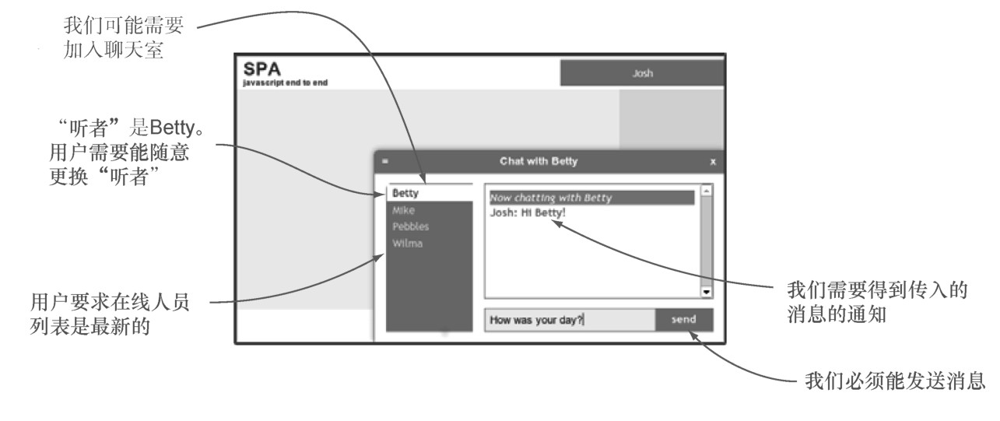

#### 
  6.1.1 设计方法和事件

我们知道希望chat对象提供即时通信的功能，但需要具体地确定这些功能是什么。考虑一下图6-2演示的单页应用实体模型（mockup），有一些关于chat的接口说明。

依据经验，我们知道需要初始化聊天室。我们也预料用户可能会更换听者 <a class="my_markdown" href="['#anchor23']">[23]</a>，并可能会向这个人发送消息。从对头像的讨论，我们知道用户可能会更新头像信息。用户不会是唯一驱动UI的源，因为我们预期其他人会加入和离开聊天室、发送和接收消息以及更改头像信息。基于以上分析，可以列出chat对象需要暴露的API。

提供加入或者离开聊天室的方法。

提供更换听者的方法。

提供向其他人发送消息的方法。

提供通知服务器用户更新了头像的方法。

当听者不管是何原因而有变化的时候，发布一个事件。比如，假如听者下线了或者用户选择了新的听者。

当不管是何原因而需要更改消息框的时候，发布一个事件。比如，假如用户发送或者接收消息。

当不管是何原因而导致在线人员列表发生变化，发布一个事件。比如，假如某人加入或者离开聊天室，或者任意用户移动了头像。

chat对象的API使用两种通信渠道。一种渠道是经典的“方法返回值”机制。这种渠道是同步的：数据以已知的序列传输。chat对象可能会调用外部方法，并将接收的信息作为返回值。其他代码可能会调用chat对象的公开方法，并从返回值中接收信息。

chat对象使用的另一种通信渠道是事件机制。这种渠道是异步的：事件可能会在任意时间发生，不管是不是chat对象的动作。chat对象会接收事件（像来自服务器的消息）和发布事件，供UI使用。

我们来设计chat对象，首先考虑的是同步方法。

1．设计chat的方法

正如在第5章讨论的，方法是公开暴露的函数，像spa.model.chat.get_chatee，可以用它来执行操作并同步返回数据。考虑到我们的需求，下面的方法列表似乎是正确的。

join()——加入聊天室。如果用户是匿名的，该方法应该终止并返回false。

get_chatee()——返回正在与之聊天的person对象。如果没有听者，则返回null。

set_chatee(<person_id>)——根据唯一的person_id，把person对象设置为听者。该方法应该发布spa-setchatee事件，携带的数据是听者信息。如果在线人员集合中找不到需要匹配的person对象，则把听者设置为null。如果请求的人员已经是听者了，则返回false。

send_message(<msg_text>)——向听者发送消息。应该发布spa-updatechat事件，携带的数据是消息信息。如果用户是匿名的或者听者为 null，该方法应该不做操作并返回false。

update_avatar(<update_avatar_map>)——更新person对象的头像信息。参数（update_avatar_map）应该包含person_id和css_map属性。

这些方法似乎能满足我们的需求。现在我们来更详细地思考一下chat应该发布的事件。

2．设计chat的事件

之前已经讨论过，事件是用来异步发布数据的。比如，如果接收到一条消息，chat对象将需要通知订阅的jQuery集合做出相应的变化，并提供更新显示所必需的数据。

我们预计在线人员集合和听者会经常变化。这些变化并不总是缘于用户的操作，比如，听者可能在任何时候发送消息。下面是要将这些变化传达给功能模块的事件。

spa-listchange当在线人员列表发生变化的时候，应该发布这个事件。携带的数据是更新的人员集合。

spa-setchatee当听者发生变化的时候，应该发布这个事件。携带的数据是包含旧听者和新听者的映射对象。

spa-updatechat当发送或者接收到新消息的时候，应该发布这个事件。携带的数据是消息信息的映射对象。

和在第5章里面的做法一样，我们将使用jQuery全局事件作为发布机制。现在已经仔细考虑了所需的方法和事件，我们继续来添加文档并实现它们。

