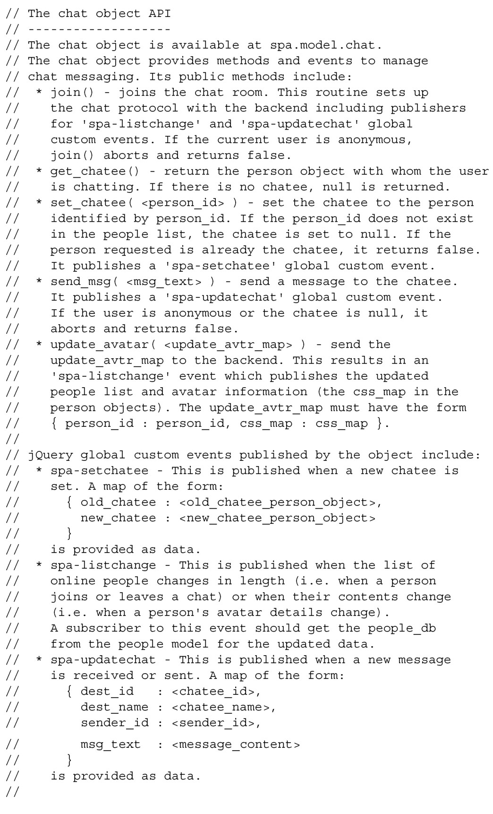

#### 
  6.1.2 给chat对象的API添加文档

现在我们把所有的计划合并为一个 API 规范，可以把该规范放在 Model 的代码中以供参考，见代码清单6-1。

代码清单6-1 chat 对象的API——spa/js/spa.model.js

现在已经完成了chat对象的规范，我们来实现它并测试它的API。之后，我们将修改Shell和功能模块，以便使用chat对象的API来提供新的功能。

