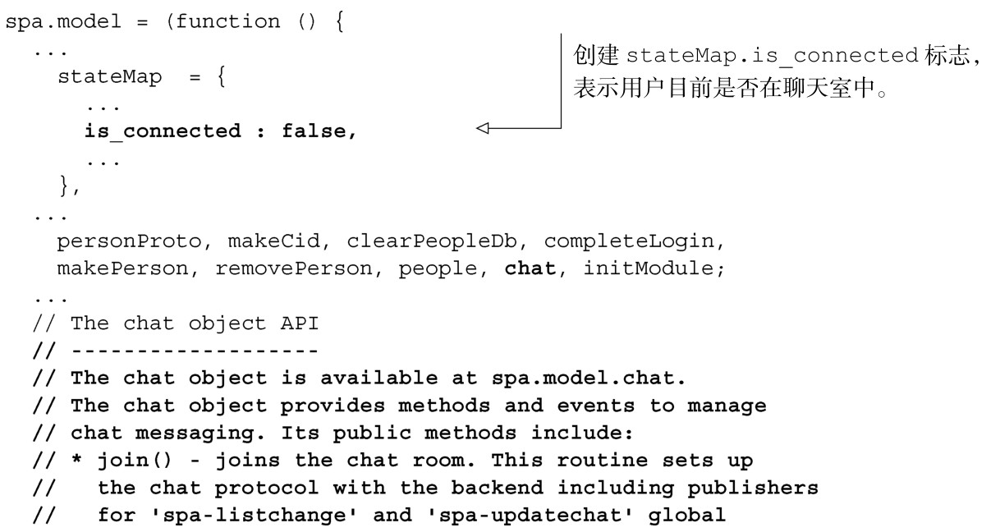
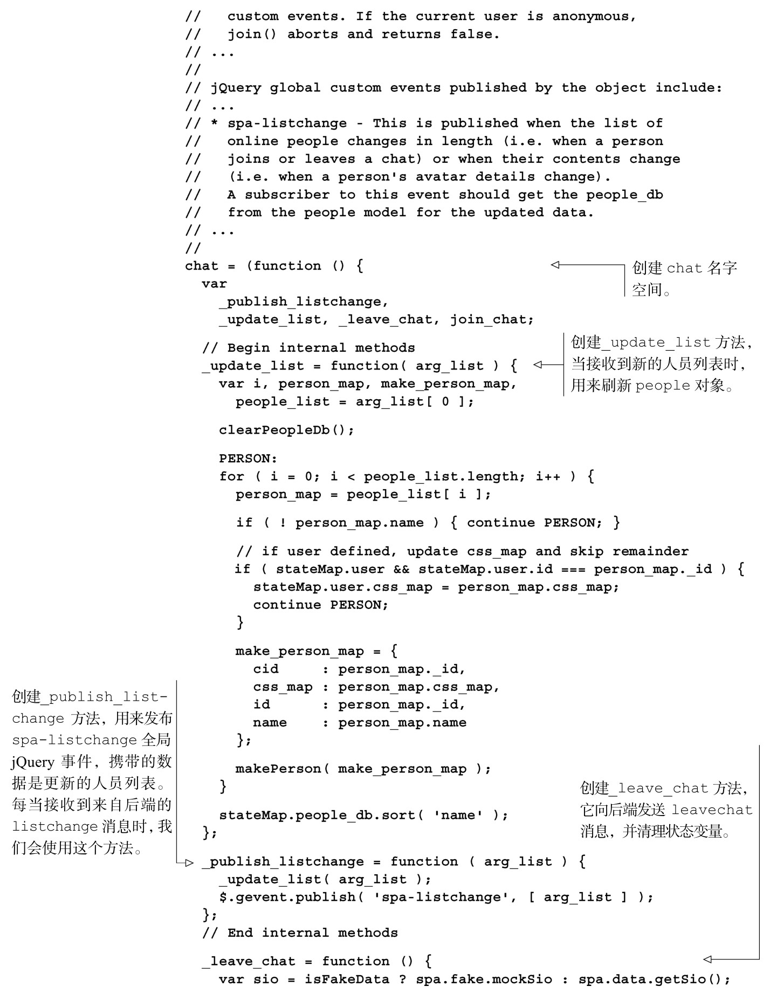
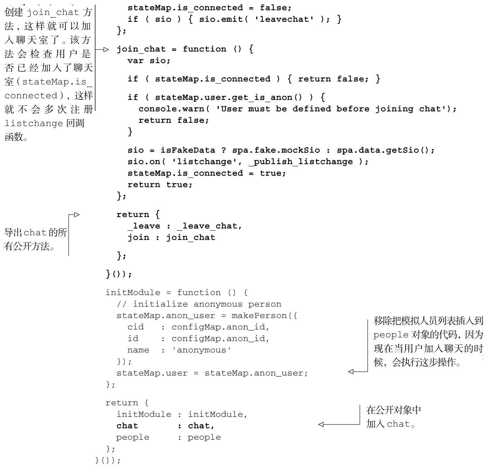

#### 
  6.2.1 先创建chat对象的join方法

在这一小节，我们将创建Model中的chat对象，以便可以：

使用spa.model.people.login(<username>)方法进行登入；

使用spa.model.chat.join()方法加入聊天室；

注册一个回调函数，每当Model从后端接收到listchange消息时，就发布spa-listchange事件。这表示用户列表发生了变化。

chat 对象将依赖 people 对象，以便登入和维护在线人员列表。它不允许匿名用户加入聊天室。我们来开始构建 Model中的 chat对象，如代码清单 6-2所示。更改部分以粗体显示。

代码清单6-2 开始构建chat 对象——spa/js/spa.model.js

这是chat对象的第一轮实现。我们没有添加更多的方法，而是希望对到目前为止所创建的方法进行测试。在下一小节，我们会更新Fake模块，模拟测试所需的和服务器的交互。

