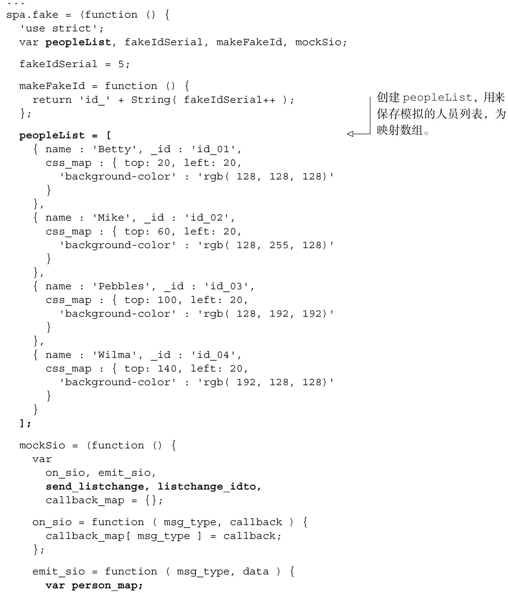
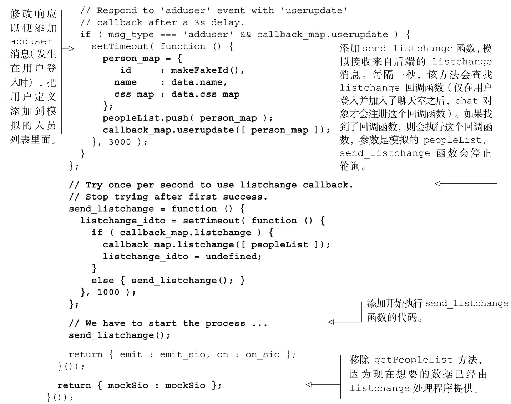

#### 
  6.2.2 更新Fake以响应chat.join

现在我们需要更新Fake模块，这样就可以模拟测试join方法所需的服务器响应。所需更改包括以下几项。

把已登入的用户列入模拟人员列表中。

模拟接收来自服务器的listchange消息。

第一步很简单：创建一个人员映射，把它添加到 Fake 维护的人员列表里面。第二步需要点技巧，所以请继续听我说完：仅在用户登入并加入了聊天室之后，chat对象才会给来自后端的listchange消息注册处理程序。因此，可以添加一个私有的send_listchange函数，仅当注册了这个处理程序的时候才发送模拟的人员列表。我们来进行这些更改，如代码清单6-3所示。更改部分以粗体显示。

代码清单6-3 更新Fake，模拟加入聊天室的服务器消息——spa/js/spa.fake.js

现在已经完成了chat对象，我们来对它进行测试，和在第5章测试people对象的方式一样。

