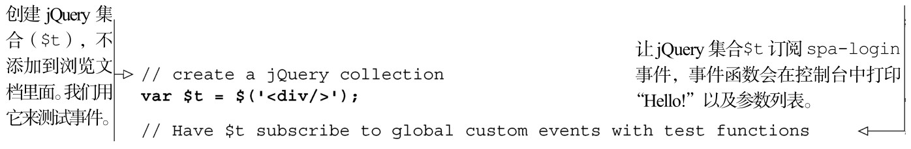
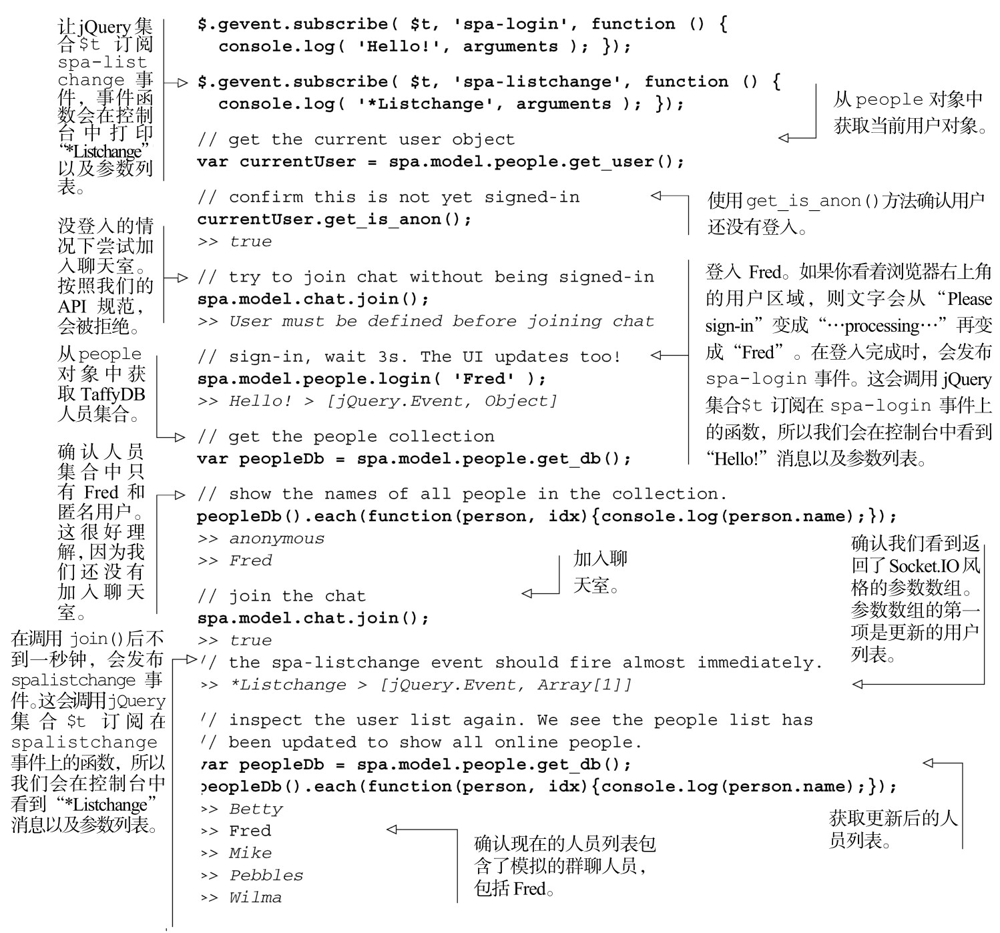

#### 
  6.2.3 测试chat.join方法

在继续构建chat对象之前，要确保到目前为止，实现的功能和预期的一样。首先，加载浏览文档（spa/spa.html），打开JavaScript控制台，并确保单页应用没有显示JavaScript错误。然后，使用控制台来测试方法，如代码清单6-4所示。粗体显示的是输入，斜体显示的是输出：

代码清单6-4 测试spa.model.chat.join()，不用UI 和服务器

我们已经完成并测试了chat对象的第一部分功能，可以登入、加入聊天室以及查看人员列表。现在我们希望chat对象可以发送和接收消息。

