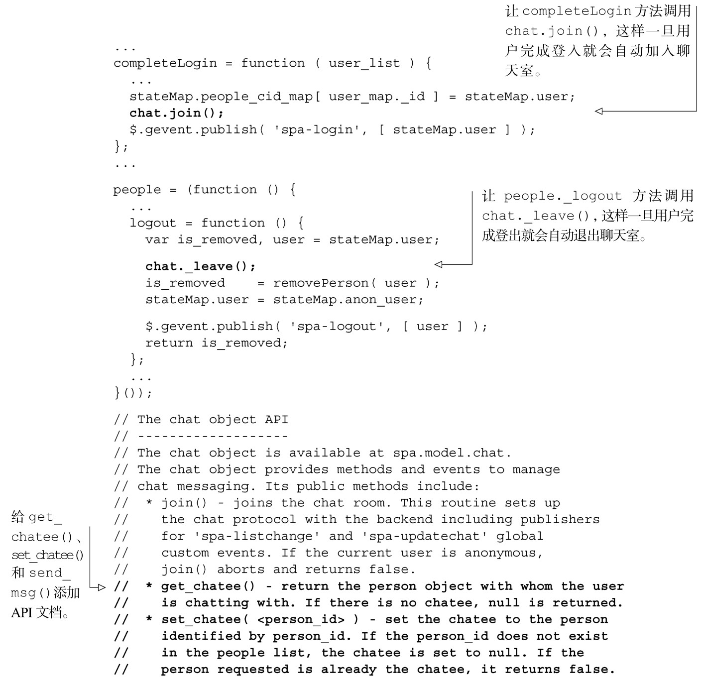
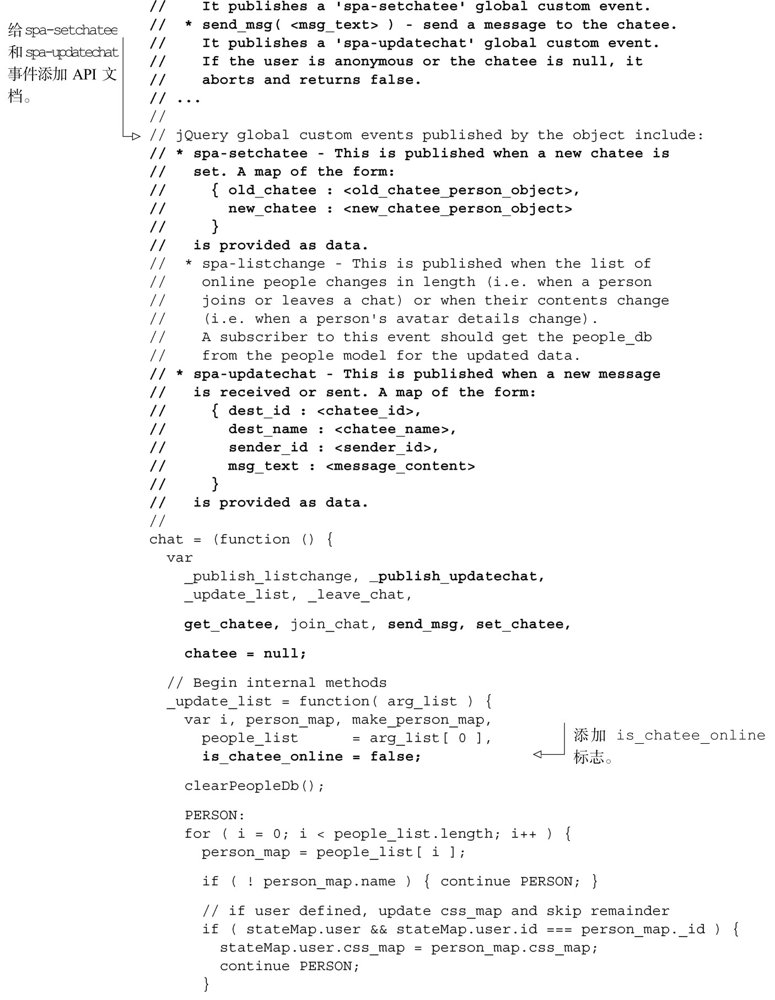
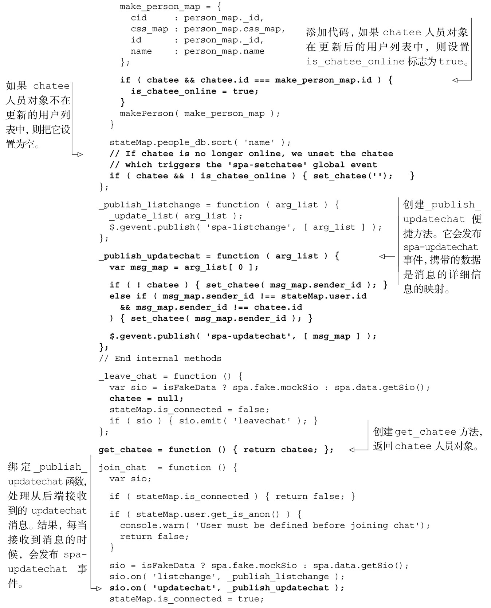
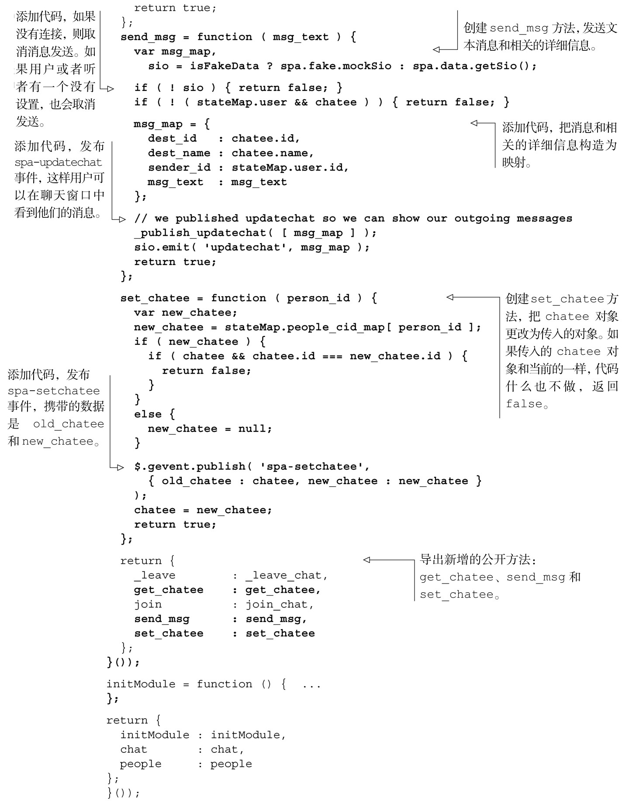

#### 
  6.2.4 给chat对象添加消息传输功能

发送和接收消息不像它们看上去那么简单。因为FedEx会告诉你，我们必须处理后勤工作：管理消息的传递和接收。我们需要：

维护听者的记录；

发送消息的时候带上元数据（metadata）信息，比如发送者的ID、发送者的名字以及接收者的ID；

优雅地处理用户给离线人员发送消息的潜在情况；

当从后端接收到消息时，发布jQuery全局事件，这样jQuery集合就可以订阅这些事件，并按照这些事件调用相应的函数。

首先我们来更新Model，如代码清单6-5所示。更改部分以粗体显示。

代码清单6-5 给Model 添加消息传输功能——spa/js/spa.model.js

我们已经完成了对chat对象的第二轮实现，添加了消息传输的功能。和以前一样，在添加更多的功能之前，我们希望检查一下工作。在下一小节，我们将更新 Fake 模块，模拟和服务器的交互。

