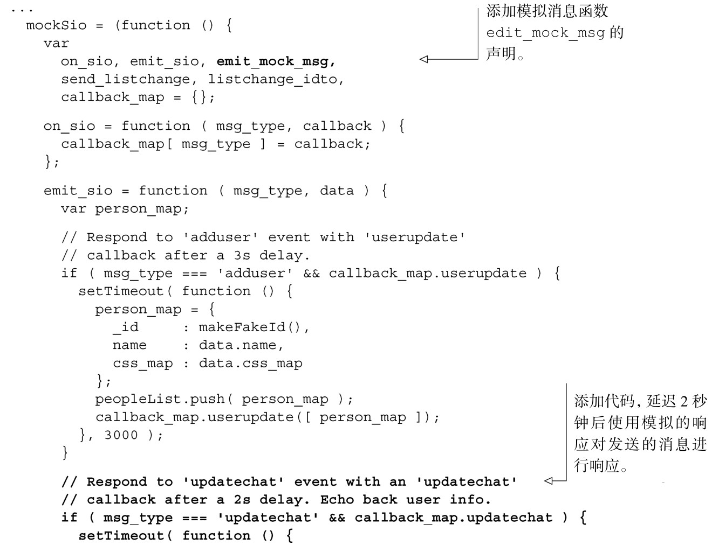
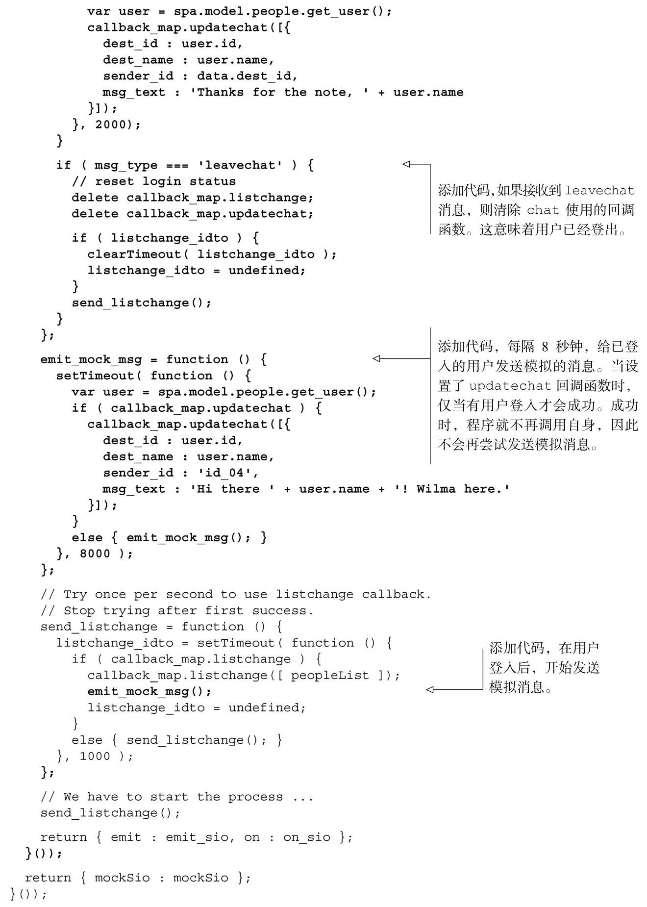

#### 
  6.2.5 更新Fake，模拟消息传输功能

现在我们需要更新 Fake 模块，这样它就可以模拟所需的服务器响应，以便测试消息传输方法。要做的更改包括以下几项。

模拟发出的updatechat消息的响应，响应内容是来自当前听者的updatechat消息。

模拟来自Wilma的未经请求的updatechat消息。

模拟发出的leavechat消息的响应。当用户登出的时候，会发送这个消息。可以在这个时候解除聊天消息回调函数的绑定。

我们来更新Fake模块，更改如代码清单6-6所示。更改部分以粗体显示。

代码清单6-6 向Fake 模块添加模拟的消息——spa/js/spa.fake.js

现在已经有了chat对象，也更新了Fake模块，我们可以测试消息传输功能了。

