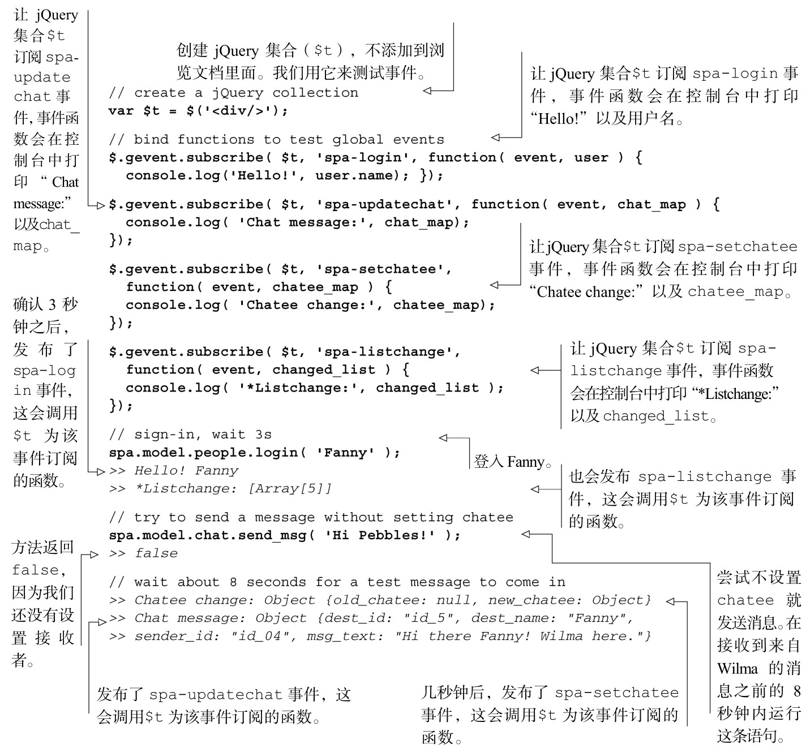
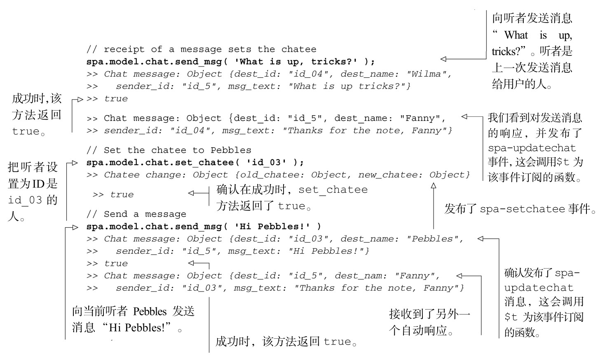

#### 
  6.2.6 测试chat的消息传输功能

现在可以测试设置听者、发送消息和接收消息。加载浏览文档（spa/spa.html），打开JavaScript 控制台，确保没有错误。然后可以进行测试，如代码清单 6-7 所示。粗体显示的是输入，斜体显示的是输出。

代码清单6-7 测试消息交换

chat对象快要构建完成了。现在需要做的是增加Avatar功能。一旦完成了这个功能，我们将会更新用户界面。

