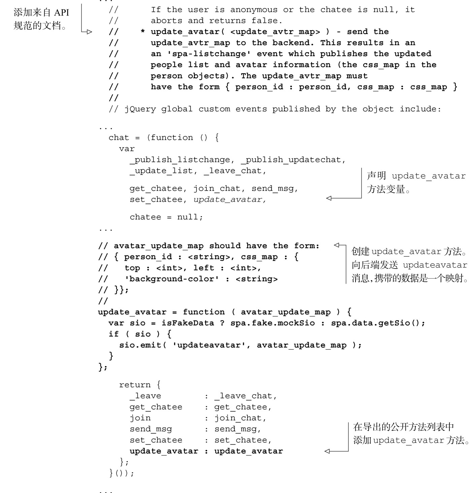

#### 
  6.3.1 给chat对象添加Avatar功能

为给 chat 对象添加头像功能所要做的更改，相对来说不算太多。我们只需要添加update_avatar方法，它会向后端发送一个updateavatar消息，携带的数据是一个映射：描述了哪个头像更改了以及是如何更改的。我们期望在更新头像的时候，后端会发送一个 listchange消息，处理这个消息的代码已经编写好了，并已测试通过。

我们来更新Model，如代码清单6-8所示。更改部分以粗体显示。

代码清单6-8 更新Model，添加头像功能——spa/js/spa.model.js

我们已经完成了chat对象的设计，添加了它的所有方法和事件。在下一小节，我们将更新Fake模块，模拟和服务器的交互，以便支持头像的功能。

