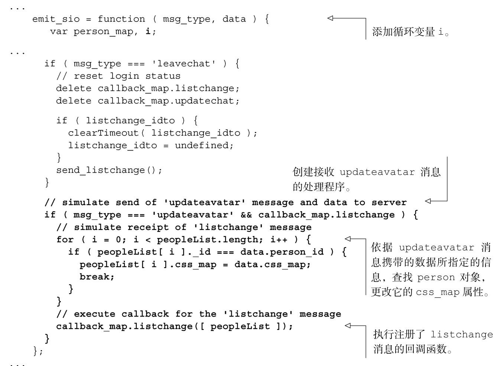

#### 
  6.3.2 修改Fake来模拟头像功能

我们下一步要做的是修改 Fake模块，以便每当用户把头像放到新的位置或者点击头像更换颜色的时候，向服务器发送 updateavatar 消息。当 Fake 接收到这个消息时，它应该：

模拟向服务器发送updateavatar消息；

模拟从服务器接收listchange消息，携带的数据是更新后的人员列表；

执行注册了listchange消息的回调函数，传入的参数是更新后的人员列表。

可以按照代码清单6-9所演示的来完成上面这三步操作。更改部分以粗体显示。

代码清单6-9 修改Fake，以便支持头像功能——spa/js/spa.fake.js

现在已经更新了chat对象和Fake，我们可以测试头像功能了。

