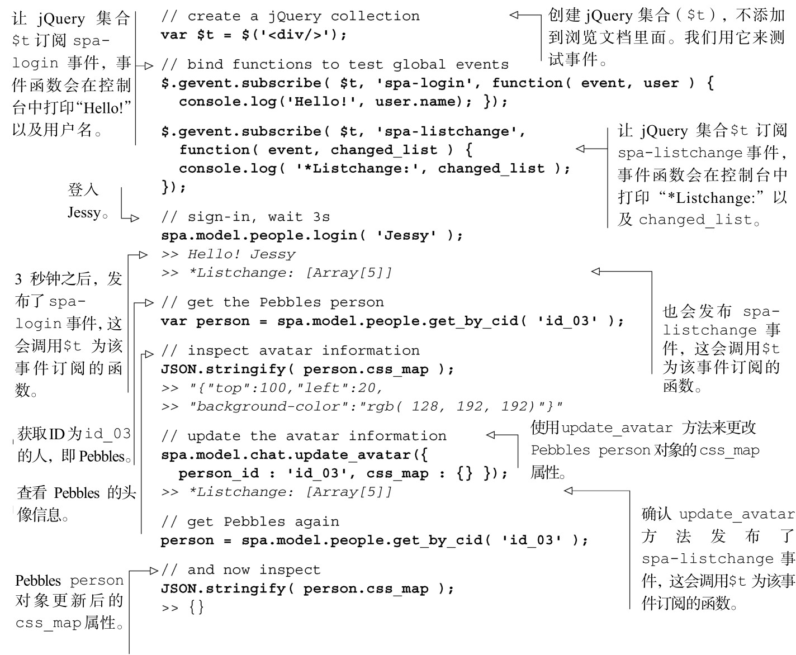

#### 
  6.3.3 测试头像功能

这是对Model的最后一些测试。再次加载浏览文档（spa/spa.html），确保单页应用仍然可以运行。打开JavaScript控制台，测试update_avatar方法，如代码清单6-10所示。粗体显示的是输入，斜体显示的是输出。

代码清单6-10 测试update_avatar 方法

我们已经完成了chat对象。和第5章的people对象一样，测试结果是令人放心的，可以把这些测试加到不用服务器和浏览器的测试集（test suite）里面。

