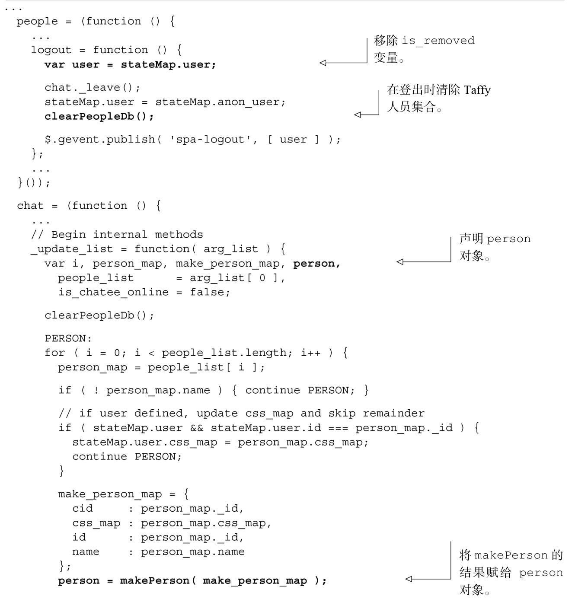
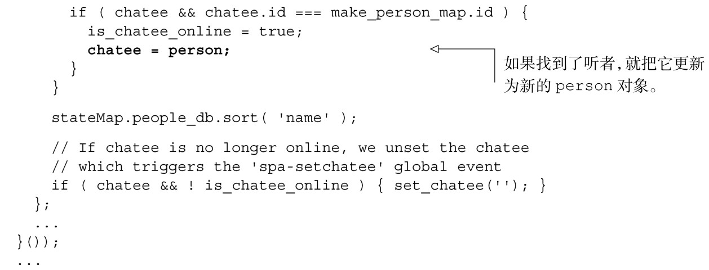

#### 
  6.3.4 测试驱动开发

所有那些热衷测试驱动开发（TDD）的狂热爱好者，看着所有这些手工测试，会想“天啊，为什么不把这放到一个可以自动运行的测试集里面？”我们自己也可以成为有理想的狂热爱好者，我们做到了。请查看附录B，看看如何使用Node.js将这一过程自动化。

事实上正是由于编写了测试集，我们发现了一些问题。大多数都是针对测试的，所以会把它们放到附录中去讨论。但有两个真正的 bug 需要修复：我们的登出机制并不正确，因为它没有正确地清除用户列表；在调用 spa.model.chat.update_avatar方法之后，没有正确地更新听者对象。我们来修复这两个问题，如代码清单6-11所示。更改部分以粗体显示。

代码清单6-11 修复登出和听者对象没有更新的问题——spa/js/spa.model.js

这是休息一下的好时机。本章的剩余部分，我们将回到UI，利用Model的chat和people对象的API来完成Chat功能模块。我们也将创建Avatar功能模块。

