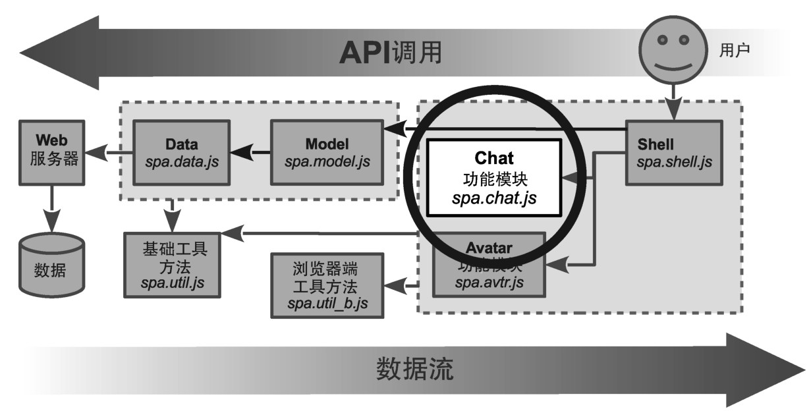
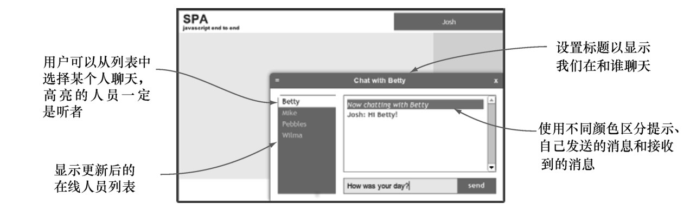

### 
  6.4 完成Chat功能模块

在这一节，我们将更新Chat功能模块，如图6-3所示。现在可以利用Model的chat和people对象，来模拟聊天的体验。我们来回顾一下之前模拟的Chat UI，决定如何对它进行修改，以便能和chat对象一起工作。图6-4演示了我们想要完成的功能。可以把这个模型概括为想在Chat功能模块中添加的一系列功能。这些功能包括以下几项。

更改聊天滑块的设计，引入人员列表。

当用户登入的时候，执行以下操作：加入聊天室、打开聊天滑块、更改聊天滑块的标题以及显示在线人员列表。

每当在线人员列表有变化时，就更新列表。

高亮在线人员列表中的听者，当列表有变化时，更新显示。

授权用户发送消息，从在线人员列表中选择一位听者。

显示来自消息记录中用户、其他人员和系统的消息。所有这些消息的颜色都是不同的，消息记录从下往上平滑滚动。

修改接口，支持触摸控件。

当用户登出的时候，执行以下操作：更改聊天滑块的标题、清除消息记录以及收起滑块。

我们先来更新JavaScript。

图6-4 我们希望的Chat UI

