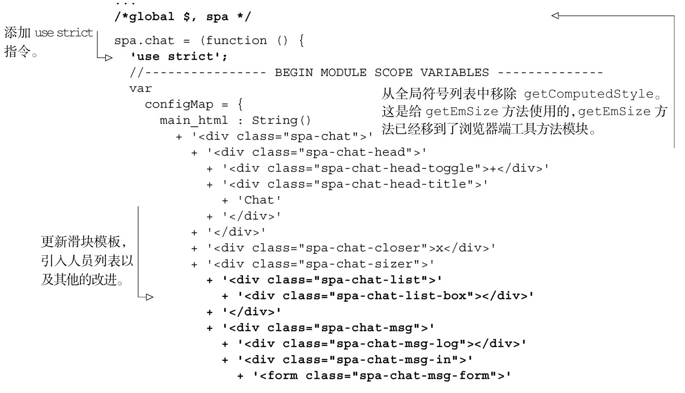
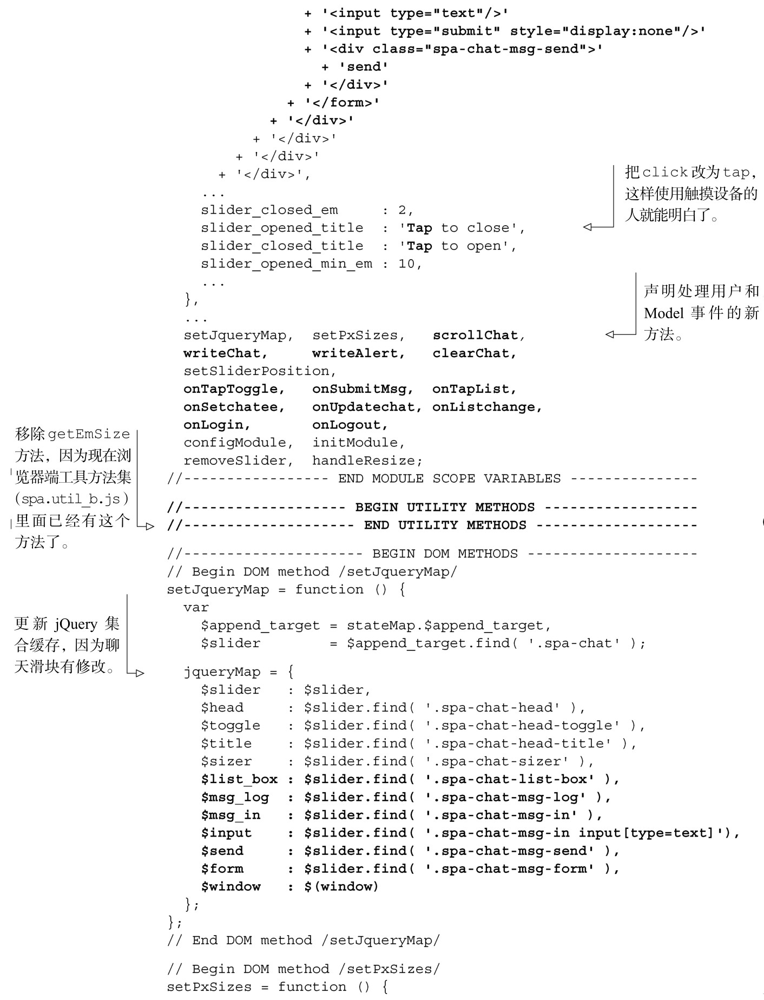
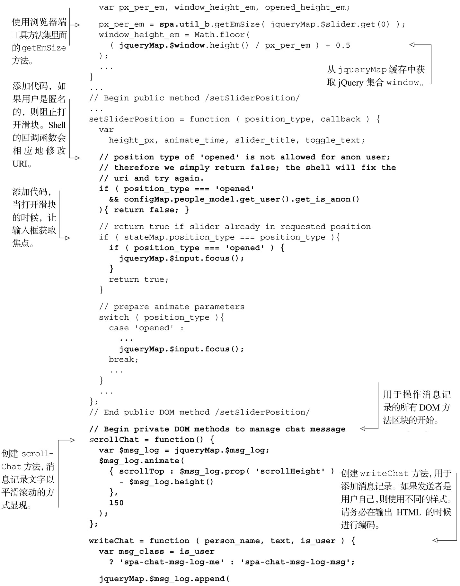
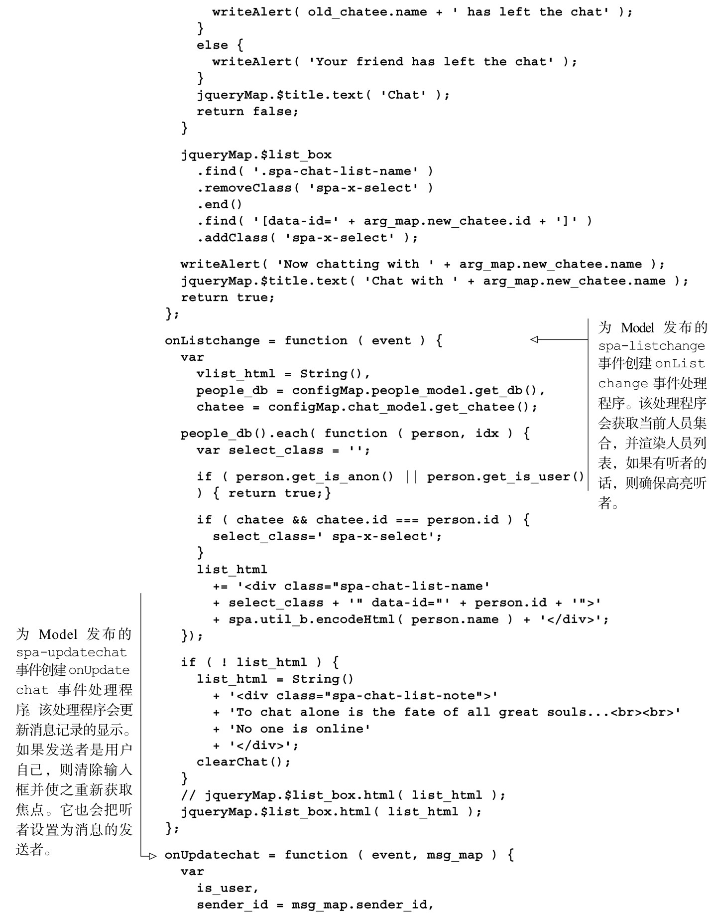
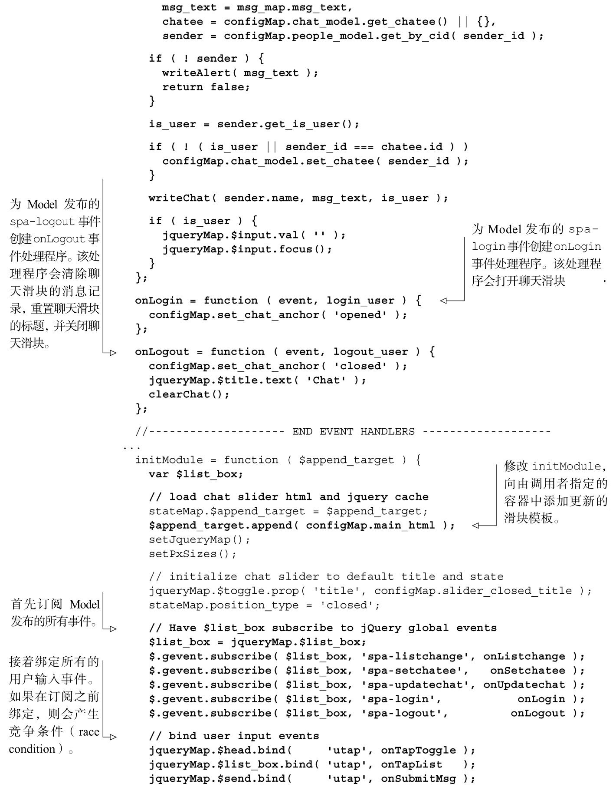
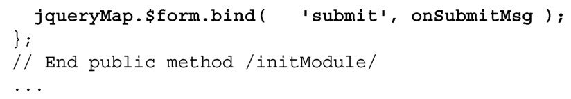

#### 
  6.4.1 更新Chat的JavaScript

为了添加刚才讨论的功能，我们需要更新Chat的JavaScript代码。主要更改包括以下几项。

修改HTML模板，引入人员列表。

创建scrollChat、writeChat、writeAlert和clearChat方法，用来管理消息记录。

创建用户输入事件处理程序，onTapList和onSubmitMsg，允许用户从人员列表中选择听者以及允许用户发送消息。要确保支持触摸事件。

创建onSetchatee方法，处理由Model发布的spa-setchatee事件。这会更改听者的展示，更改聊天滑块的标题以及在消息窗口中弹出一个系统警告框。

创建onListchange方法，处理由Model发布的spa-listchange事件。这会渲染人员列表，高亮听者。

创建onUpdatechat方法，处理由Model发布的spa-updatechat事件。这会显示用户、服务器或者其他人员发送的新消息。

创建onLogin和onLogout方法，处理由Model发布的spa-login和spa-logout事件。onLogin处理程序在用户登入的时候会打开聊天滑块。onLogout处理程序会清除消息记录、重置标题以及关闭聊天滑块。

订阅Model发布的所有事件，然后绑定所有的用户输入事件。

关于事件处理程序的命名

我们知道有些人会想“为什么方法名是onSetchatee而不是onSetChatee，这有没有理由？”嗯，这是有理由的。

我们对事件处理程序的命名规范是：on<Event>[<Modifier>]，Modifier 是可选项。这种命名方式通常没什么问题，因为绝大多数事件都是单音节的。比如onTap或者onTapAvatar。这样的规范很方便，这样对于正在处理的事件就一目了然了。

和所有的规范一样，总有会引起混乱的边界情况。比如，对于 onListchange，按照我们的规范：事件名是 listchange，而不是 listChange。因此 onListchange 是正确的，而onListChange是不正确的。对onSetchatee和onUpdatechat也同样适用。

我们来更新JavaScript文件，如代码清单6-12所示。更改部分以粗体显示。

代码清单6-12 更新Chat JavaScript 文件——spa/js/spa.chat.js

模板系统

我们的单页应用使用简单的字符串拼接来生成 HTML，这对于我们的目标是完全可以接受的。但有时候生成HTML会很复杂。这时可以考虑使用模板系统。

模板系统把数据转换为显示元素。根据开发人员所使用的指示元素生成的语言，可以大致地划分一下模板系统。嵌入式的模板系统，允许直接在模板中嵌入宿主语言（对于我们来说就是JavaScript）。工具式提供了特定领域的模板语言（DSL<a class="my_markdown" href="['#anchor25']">[25]</a>），不依赖宿主语言。

我们不推荐使用任何嵌入式模板系统，因为它们很容易把业务逻辑和显示逻辑混杂在一起。最流行的JavaScript嵌入式模板系统可能是underscore.js的模板方法，但还有很多其他的模板系统。

随着时间的推移，我们注意到在其他语言中，工具式模板系统往往是首选的。这可能是因为这些模板系统常常会鼓励清晰地分离显示逻辑和业务逻辑。对于单页应用来说，有很多很好的工具式模板系统。在写作本书的时候，流行的又经过全面测试的工具式模板系统包括Handlebars、Dust和Mustache。我们觉得它们都是值得考虑的模板系统。

现在已经有了JavaScript，我们来修改样式表，以便满足最新的修改。

