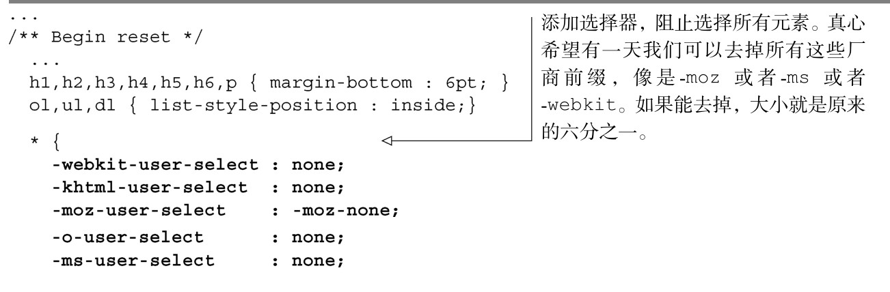
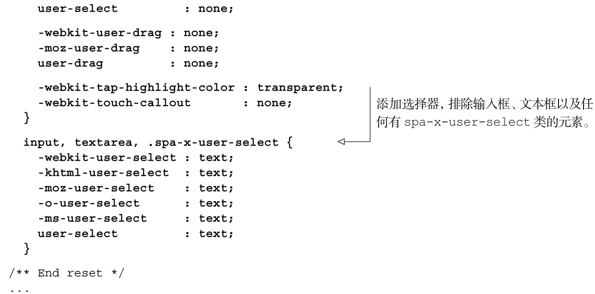
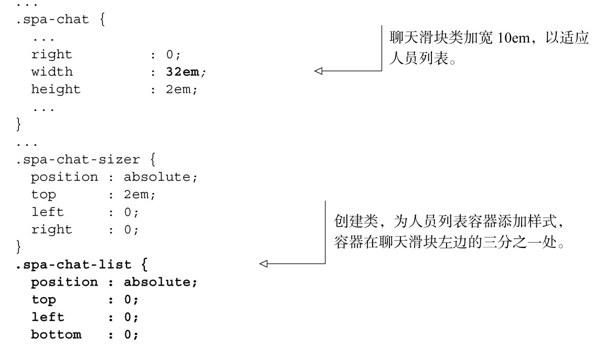
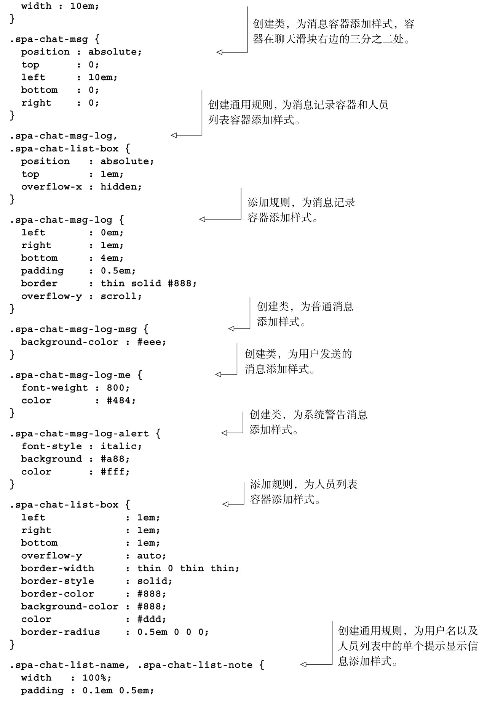
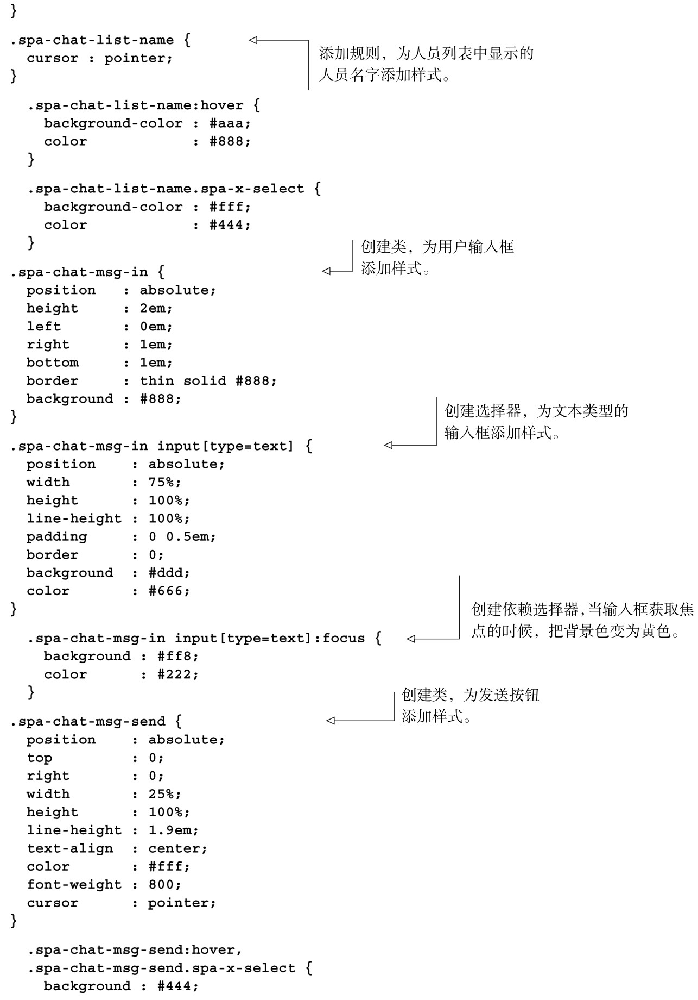

#### 
  6.4.2 更新样式表

现在我们将更新样式表，以便满足改进后的界面。首先我们希望更新根样式表，阻止选择绝大多数元素上的文字。这会解决一个很恼人的用户体验问题，在触摸设备上尤其明显。更新如代码清单6-13所示。更改部分以粗体显示。

代码清单6-13 更新根样式表——spa/css/spa.css

现在我们需要更新Chat样式表。主要更改包括以下几项。

给在线人员列表添加样式，使之显示在滑块的左边。

加大滑块的宽度，以适应人员列表。

给消息窗口添加样式。

移除所有的spa-chat-box*和spa-chat-msgs*的选择器。

给接收自用户、听者和系统的消息添加样式。

上述更新如代码清单6-14所示。更改部分以粗体显示。

代码清单6-14 更新Chat 的样式表——spa/css/spa.chat.css

现在已经有了样式表，我们来看一下更新后的Chat UI是多么漂亮。

