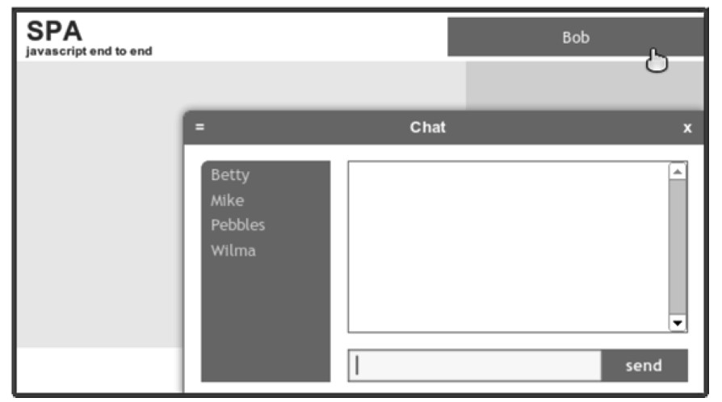
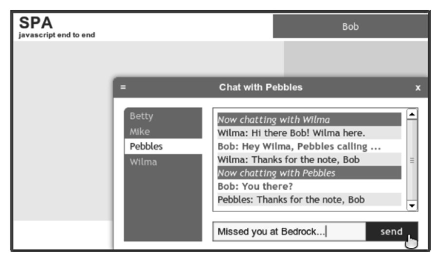

#### 
  6.4.3 测试Chat UI

当加载浏览文档（spa/spa.html）的时候，在页面右上角的用户区域可以看到“Please sign in”。当点击它时，可以和以前一样登入。用户区域会显示“... processing ...”3秒钟，然后会在用户区域显示用户名。到那时，会打开聊天滑块，界面看起来应如图6-5所示。

几秒钟之后，会收到来自Wilma的第一条消息。我们可以回复，然后选择Pebbles并向她发送消息。界面看起来应该和图6-6所示一样。

现在我们已经使用了Model的chat对象和people对象的API，在Chat功能模块中提供了所有希望有的功能。现在我们来添加Avatar功能模块。

