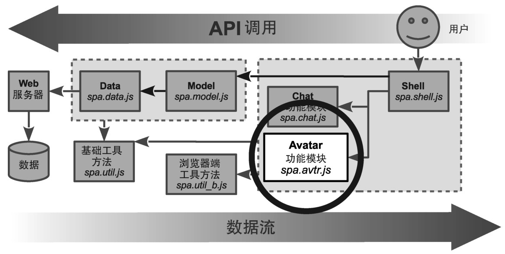
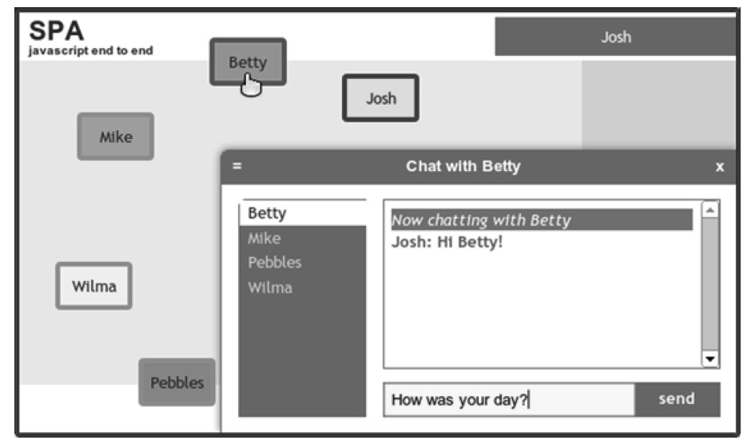

### 
  6.5 创建Avatar功能模块

在这一节中，我们将创建Avatar功能模块，如图6-7所示。

chat对象已经提供了管理头像信息的功能，只需要处理一些细节问题。我们来修改一下Avatar的UI，如图6-8所示。

每一位在线人员有一个盒子形状的头像，粗边框，他们的名字居中显示。蓝色边框表示是用户的头像。绿色边框是听者的头像。点击或者轻击头像时，它会变颜色。长按或者触摸头像后，它的外观会有所变化，可以把它拖到新的位置。

我们会使用开发功能模块的典型流程来开发Avatar模块。

创建功能模块的JavaScript文件，使用隔离的名字空间。

创建功能模块的样式表文件，以名字空间作为类的前缀。

更新浏览文档，引入新的JavaScript文件和样式表文件。

调整Shell，配置并初始化新模块。

在接下来的小节中，我们会按照上面的步骤来创建Avatar模块。

