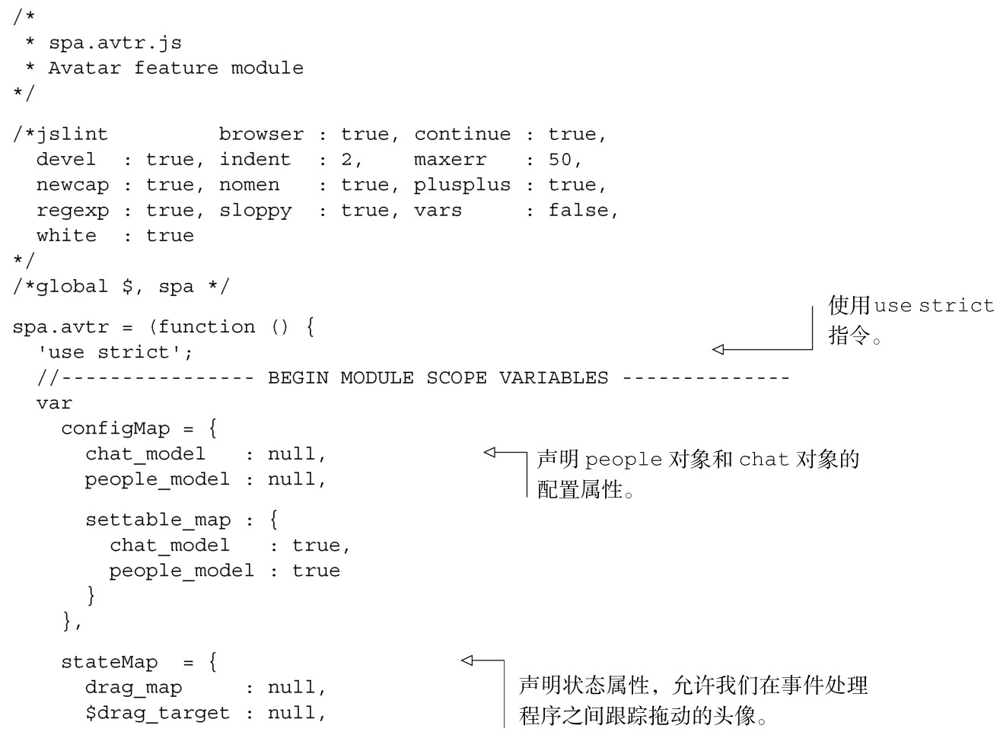
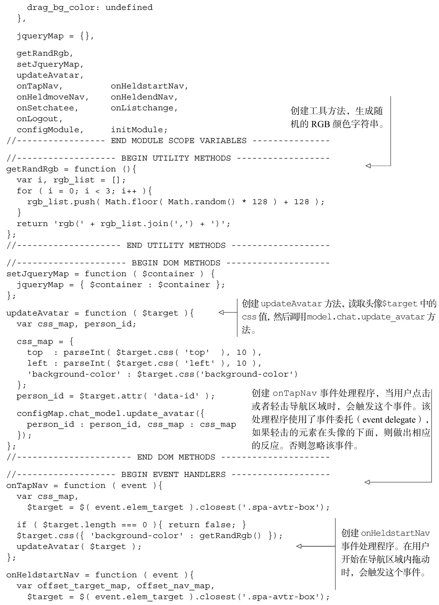
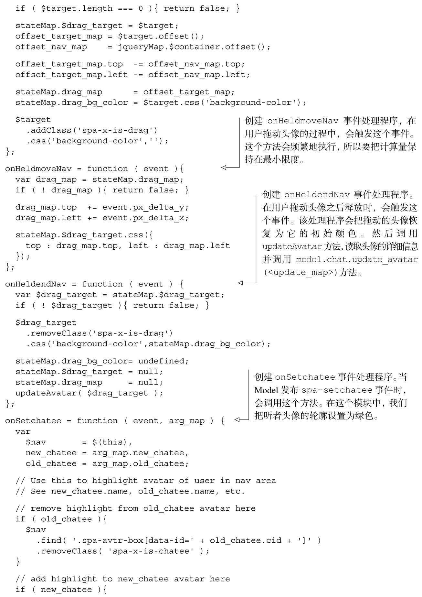
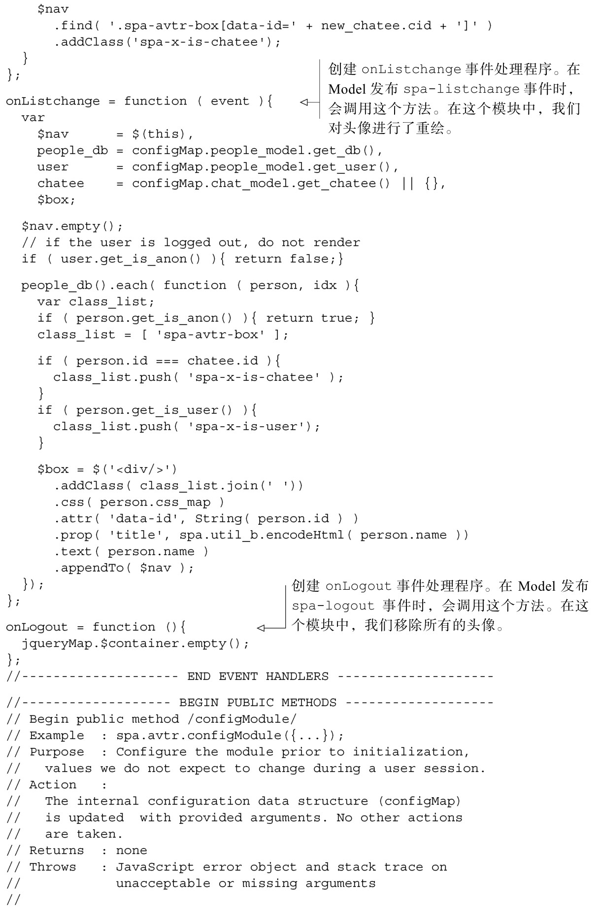
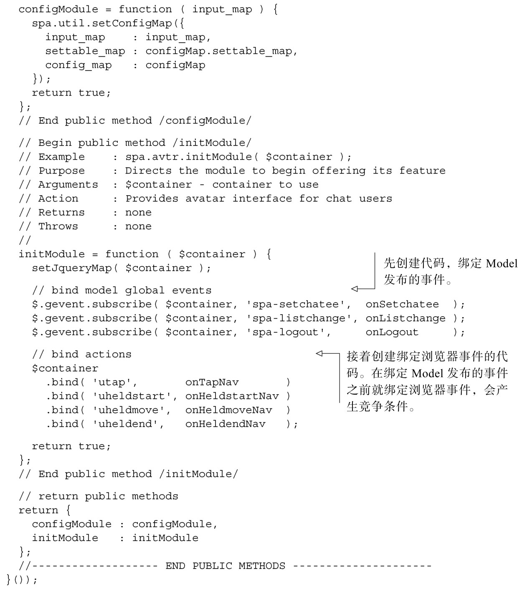

#### 
  6.5.1 创建Avatar的JavaScript

添加Avatar功能模块的第一步是创建JavaScript文件。由于该模块使用了很多和Chat模块一样的事件，我们可以复制一份spa/js/spa.chat.js，命名为spa/js/spa.avtr.js，然后再做相应的调整。代码清单6-15所示是最近刚完成的功能模块文件。因为该文件和Chat是如此的相像，我们就不做深入的讨论了。但有趣的部分已经添加了注释。

代码清单6-15 创建Avatar 的JavaScript文件——spa/js/spa.avtr.js

现在已经完成了模块的JavaScript部分，我们可以创建相应的样式表了。

