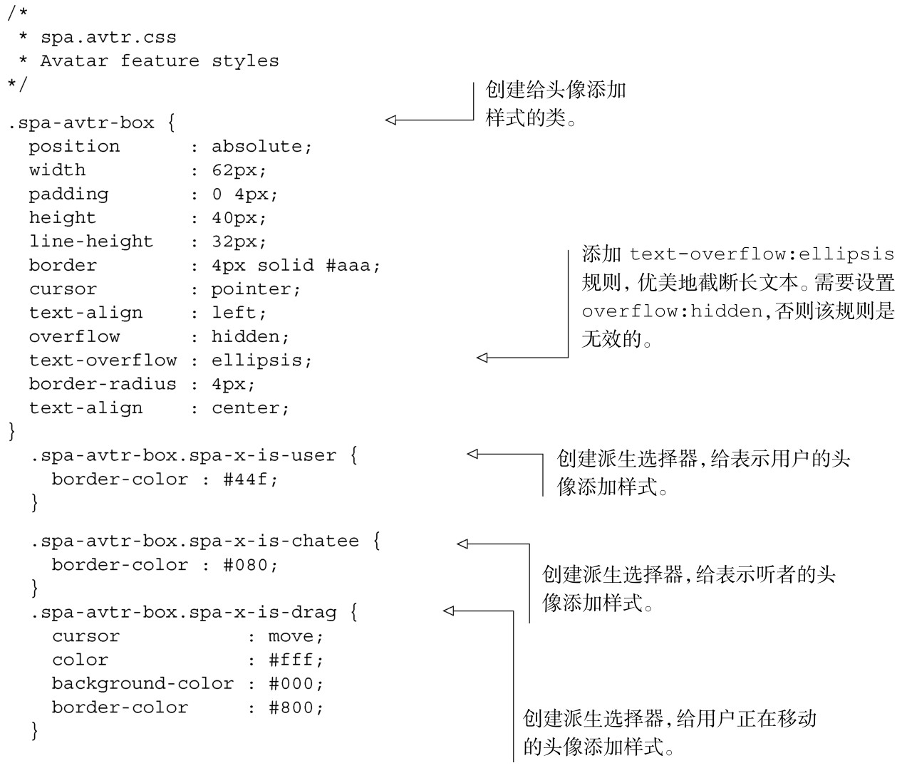

#### 
  6.5.2 创建Avatar的样式表

Avatar 模块以盒子图形来表示用户。可以定义单个类（spa-avtr-box），给盒子添加样式。然后可以修改这个类，高亮用户（ spa-x-is-user ）、高亮听者（spa-x-is-chatee）或者高亮正在被拖动的盒子（spa-x-is-drag）。代码清单6-16显示了这些选择器。

代码清单6-16 创建Avatar 样式表——spa/css/spa.avtr.css

模块文件已经完成了，现在还需要修改另外两个文件：Shell和浏览文档。

