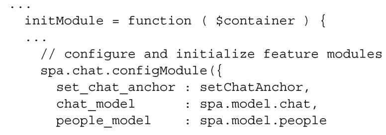
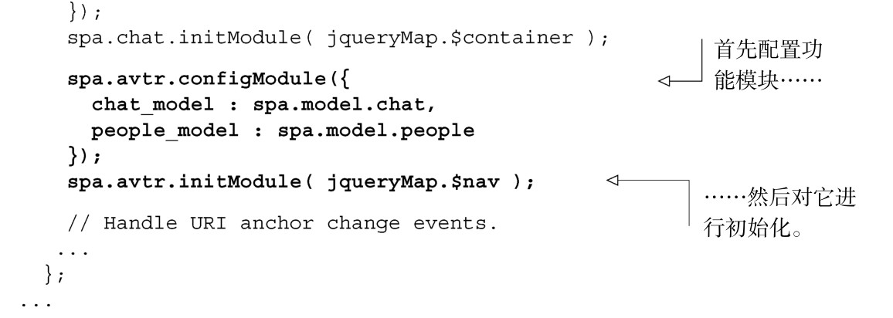
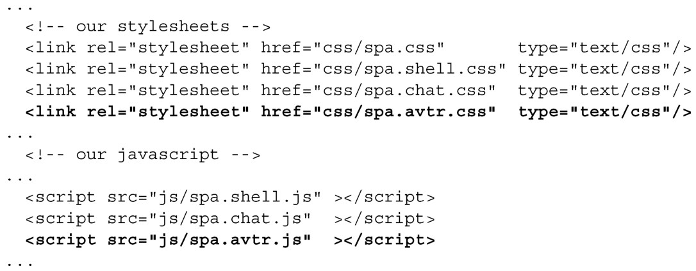

#### 
  6.5.3 更新Shell和浏览文档

如果想使用最近创建的功能模块，我们需要更新 Shell，对它进行配置和初始化，如代码清单6-17所示。

代码清单6-17 更新Shell，对Avatar 进行配置和初始化——spa/js/spa.shell.js

创建功能模块的最后一步是更新浏览文档，引入JavaScript和样式表文件。这一步在第5章已经完成了，但为了完整性起见，代码清单6-18再次显示了更改部分。

代码清单6-18 更新浏览文档，使用头像模块——spa/spa.html

Avatar功能模块的创建和集成已经完成了。现在我们来测试一下这个模块。

