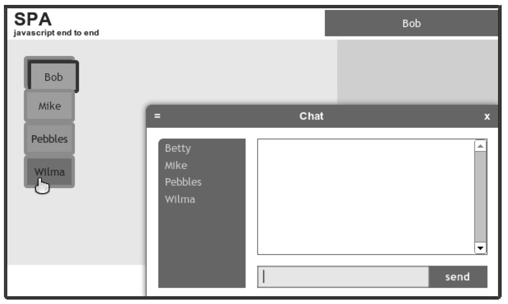
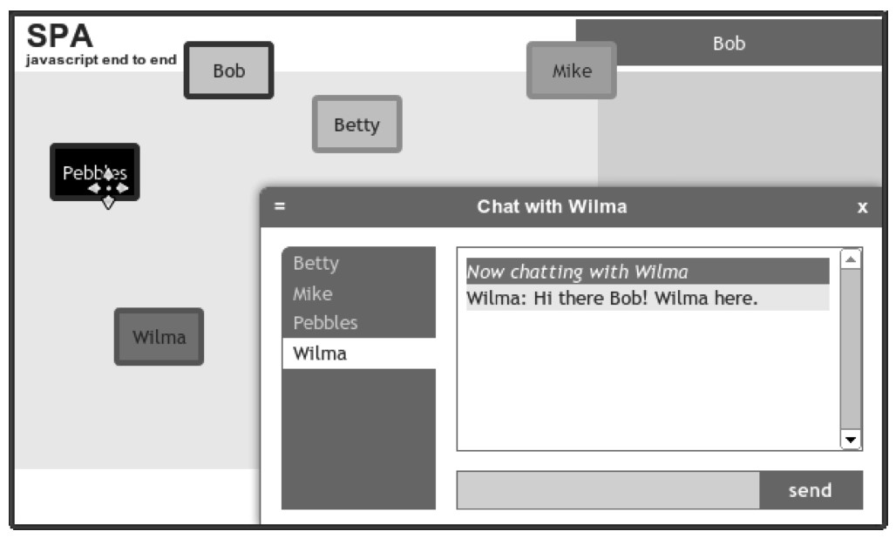

#### 
  6.5.4 测试Avatar功能模块

当加载浏览文档（spa/spa.html）时，我们会在页面的右上角的用户区域看到“Please sign in”。当点击它时，可以和以前一样登入。当打开聊天滑块时，我们会看到如图 6-9所示的界面。

现在我们可以试着拖动头像（开始时它们都在左上角），按住鼠标并拖动它们。轻击头像，颜色会有变化。轻击和拖动不一会儿之后，可能会看到类似图6-10所示的界面。蓝色边框的是用户头像，绿色边框的是听者头像，任何正在拖动的头像显示为“黑白红”色。

我们已经实现了在本章开始时讨论的所有功能。现在来考虑一下如何完成另一方面的工作，这是目前流行的话题，即数据绑定。

