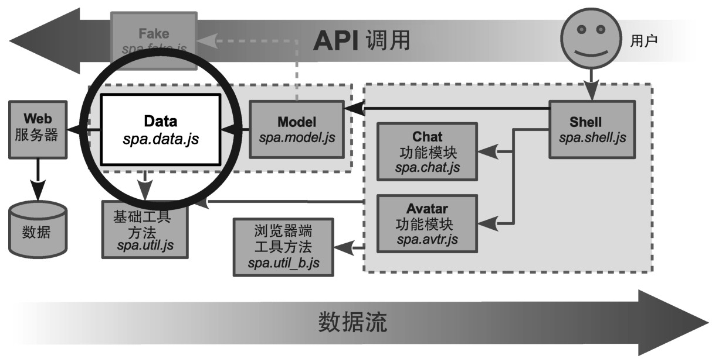
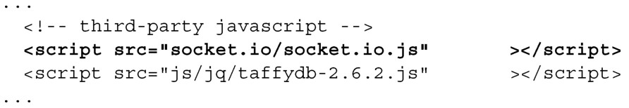
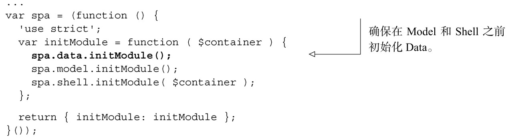
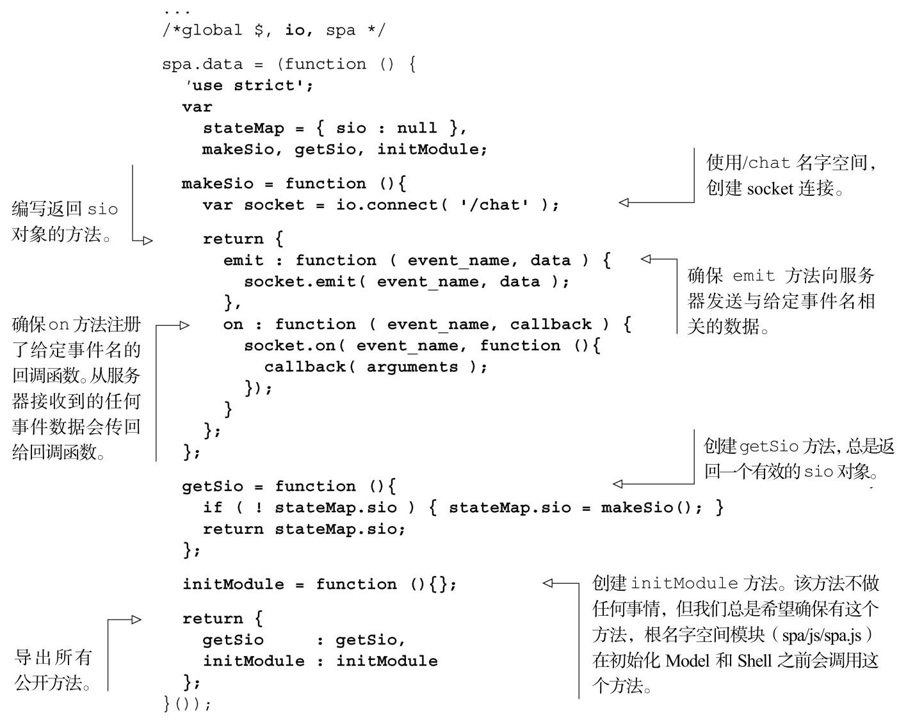
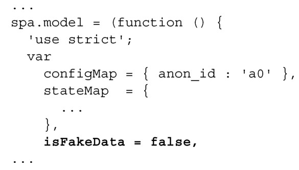

### 
  6.7 创建Data模块

在这一节中，我们会创建Data模块，如图6-11所示。

客户端会准备使用来自服务器的“真实”数据和服务，而不是 Fake 模块的数据和服务。在完成本小节的工作后，应用将不能运行，因为还没有需要的服务器功能。在第7章和第8章中会引入服务器功能。

我们需要在加载的库清单中添加Socket.IO库，因为这是消息传输机制。完成后的文件如代码清单6-19所示。更改部分以粗体显示：

代码清单6-19 在浏览文档中引入Socket.IO 库——spa/spa.html

我们希望确保在Model或者Shell模块之前初始化Data模块，如代码清单6-20所示。更改部分以粗体显示。

代码清单6-20 在根名字空间模块中初始化Data模块——spa/js/spa.js

接下来将更新Data模块，如清单6-21所示。这个模块管理架构中所有和服务器的连接，并且客户端和服务器之间通信的所有数据都会经过这个模块。这个模块所做的事情目前可能还不大清晰，但不要担心，下一章会更加详细地讲解Socket.IO。更改部分以粗体显示：

代码清单6-21 更新Data模块——spa/js/spa.data.js

最后一步使用服务器数据的准备工作是通知Model停止使用伪造的数据，如代码清单6-22所示。更改部分以粗体显示。

代码清单6-22 更新Model，使用“真实”数据——spa/js/spa.model.js

经过这最后的更改，当加载浏览文档（spa/spa.html）的时候，会发现我们的单页应用不能像之前一样工作了，在控制台中会看到错误信息。如果希望继承在没有服务器的情况下进行开发，可以很容易地“翻转一下开关”，把isFakeData赋为true<a class="my_markdown" href="['#anchor26']">[26]</a>。现在我们已经做好向单页应用添加服务器的准备。

