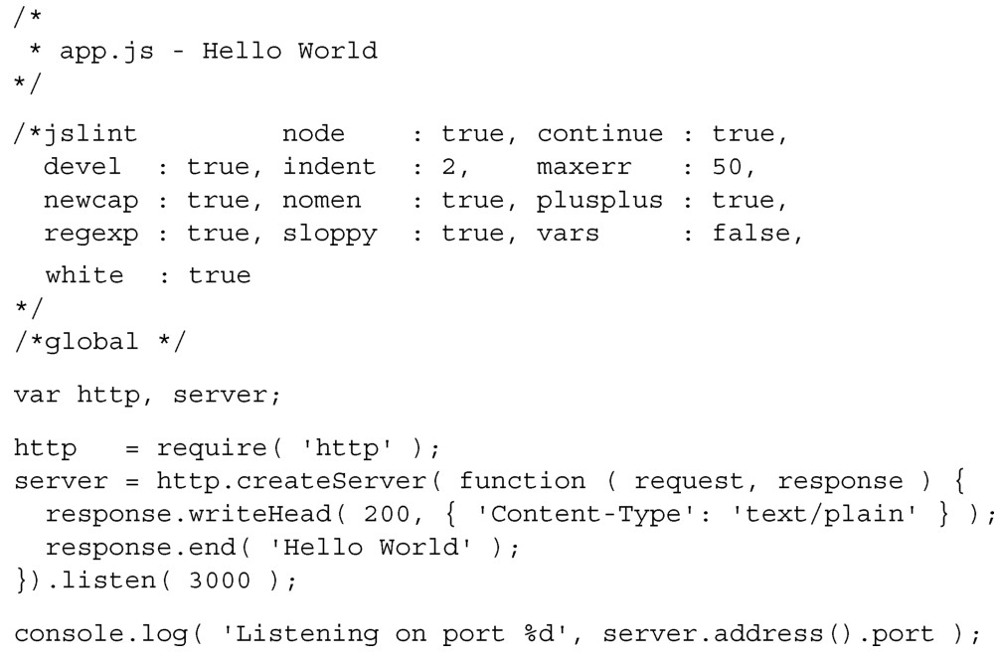
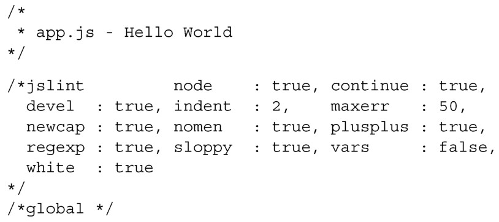
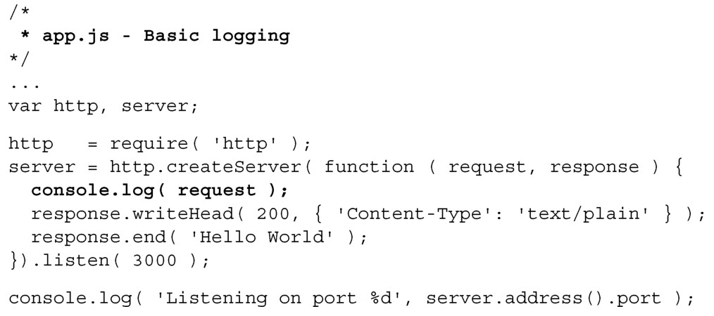
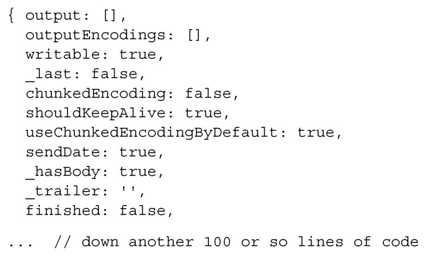
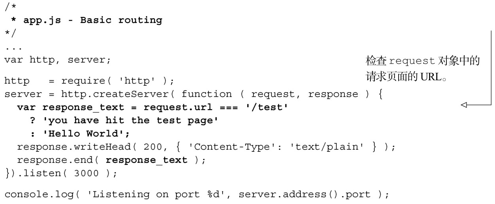

#### 
  7.2.2 使用Node.js创建‘Hello World’应用

打开Node.js网站（http://nodejs.org/#download），下载并安装Node.js。有很多种下载和安装Node.js的方法。如果你不熟悉命令行，最简单的方法是使用和你的操作系统对应的安装程序。

Node Package Manager，即npm，会随着Node.js一起安装。它和Perl 的CPAN、Ruby的gem或者Python的pip类似。它会按照我们的命令下载并安装包，同时会解析其中的依赖。这要比我们自己手工来做简单得多。现在已经安装好了Node.js和npm，我们来创建第一个服务器。Node.js网站（http://nodejs.org）有一个简单的Node Web 服务器的示例，我们就使用这个示例。先创建一个叫做webapp的目录，作为我们的工作目录。然后在里面创建文件app.js，代码如代码清单7-1所示。

代码清单7-1 创建简单的node 服务器应用——webapp/app.js

打开终端，进到保存app.js文件的目录，输入下面的命令来启动服务器：

你会看到Listening on port 3000。当我们打开Web浏览器（在同台电脑上）前往http://localhost:3000 的时候，在浏览器中会显示 Hello World。哇，这很简单嘛！仅仅用了七行代码就创建了一个服务器。我不知道你现在感觉如何，但是在几分钟之内就编写好了一个Web服务应用并使之运行起来，我很高兴。现在我们来看一下代码的含义。

第一部分是JSLint设置的标准头部。它会验证服务端的JavaScript，和客户端的写法一样：

下一行是声明要用到的模块作用域内的变量：

下一行是告诉Node.js引入http模块给该服务器应用使用。这和使用HTML的script标签来引入JavaScript文件给浏览器使用是一样的。http模块是Node.js的核心模块，用于创建HTTP服务器，我们把该模块保存到变量http中：

接下来使用http.createServer方法创建HTTP服务器。传入的是一个匿名函数，每当 Node.js 服务器接收到请求事件的时候，会调用该函数。该函数接收一个 request对象和一个response对象作为参数。request对象是客户端发送的HTTP请求：

在匿名函数内部，开始定义HTTP请求的响应。下一行使用response参数创建HTTP首部。200 HTTP响应码表示成功，并提供了属性为Content-Type值为text/plain的匿名对象。告诉浏览器返回信息内容的种类：

下一行使用response.end 方法，向客户端发送字符串'Hello World'，并让Node.js知道我们使用该响应来结束处理：

然后闭合匿名函数，并调用 createServer 方法。然后在 http 对象上链式调用listen方法。listen方法通知http对象监听3000端口：

最后一行代码，在该服务器应用启动的时候，会把括号中的内容打印到控制台中。可以使用先前创建的server对象的属性，报告所使用的端口号：

我们使用Node.js创建了一个非常基础的服务器。http.createServer方法中的传给匿名函数的request和response参数，值得花些时间来研究。我们先在代码清单7-2中打印request参数。新增的行以粗体显示。

代码清单7-2 在node 服务器应用中添加简单的日志——webapp/app.js

当重启Web应用后，在运行Node.js应用的终端，会看到打印出来的对象，如代码清单7-3所示。现在不用担心对象的结构，之后会来讨论需要知道的属性。

代码清单7-3 request 对象

request对象的一些值得注意的属性包括：

ondata——当服务器开始接收客户端的数据时（比如，设置了POST变量），会调用这个方法。这和大多数框架的从客户端获取内容的方法有本质的区别。我们将对它进行抽象，这样可以在一个变量里面获取完整的参数列表。

headers——请求的所有首部。

url——请求的页面url，不包括主机名。比如，http://singlepagewebapp.com/test的url值为/test。

method——发起请求所使用的方法：GET或者POST。

有了这些属性的知识，就可以开始编写代码清单7-4中基本的路由（router）。更改部分以粗体显示。

代码清单7-4 在node 服务器应用中添加简单的路由——webapp/app.js

我们可以继续编写自己的路由，对于简单的应用，这是一个合理的选择。然而，我们的服务器应用有更大的志向，想使用Node.js社区开发并测试过的框架。第一个要考虑的框架是Connect。

