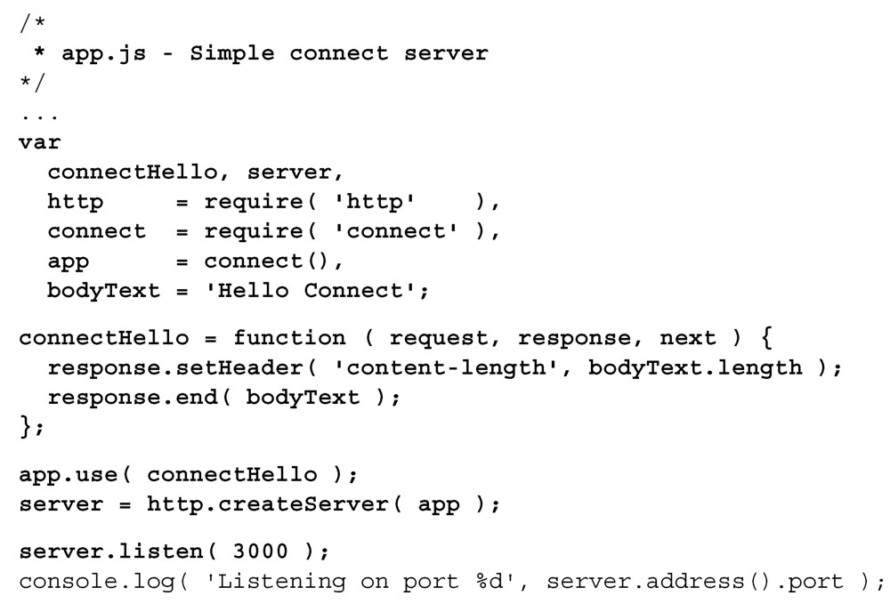

#### 
  7.2.3 安装并使用Connect

Connect 是一个可扩展的中间件框架，它向 Node.js Web 服务器添加基础功能，像是基本认证、会话管理、静态文件服务和表单处理。它不是唯一可用的框架，但它很简单，比较标准。Connect允许在收到请求和最终响应之间，注入中间件函数。通常，中间件函数会处理进入的请求，在上面执行一些操作，然后把该请求传给下一个中间件函数，或者使用response.end方法结束响应。

熟悉 Connect 和中间件模式的最佳方法就是使用它。确保工作目录是 webapp，然后安装Connect。在命令行输入以下命令：

这会创建 node_modules 文件夹，并会把 Connect 框架安装在这个文件夹里面。node_modules目录是放置Node.js应用所有模块的文件夹。npm会把模块安装在这个目录里面，当编写自己的模块时，也会把它们放在这个目录中。可以修改服务器应用，如代码清单7-5所示。更改部分以粗体显示。

代码清单7-5 修改node 服务器应用，使用Connect——webapp/app.js

Connect服务器的行为和上一小节的第一个node服务器非常相似。我们定义了第一个中间件函数connectHello，然后告诉Connect对象app，使用该方法作为它的唯一中间件函数。由于connectHello函数调用了response.end方法，所以它会结束服务器响应。我们在此基础上来添加更多的中间件。

