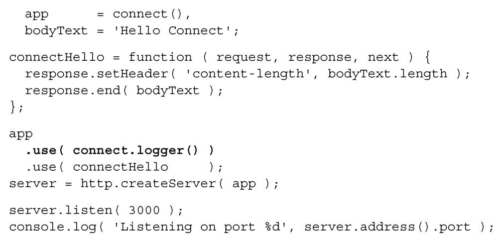
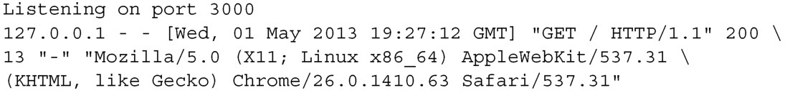

#### 
  7.2.4 添加Connect中间件

假设我们想每次有人访问页面时就记录日志。可以使用Connect内置的中间件函数。代码清单7-6添加了connect.logger()中间件函数。更改部分以粗体显示：

代码清单7-6 使用Connect，在node 服务器应用中添加日志功能——webapp/app.js

只要在connectHello中间件之前添加connect.logger()中间件即可。现在每次客户端向服务器应用发送HTTP请求的时候，第一个调用的中间件函数是connect.logger()，它会把日志信息打印在控制台上。下一个调用的中间件函数是我们定义的connectHello，和之前一样，向客户端发送Hello Connect并结束响应。当浏览器访问http://localhost:3000时，在Node.js的控制台应该会看到像下面一样的信息 <a class="my_markdown" href="['#anchor1']">[1]</a>：

尽管Connect的抽象层次比Node.js更高，但是我们想要更多的功能。该升级到Express了。

