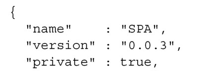
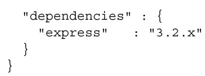
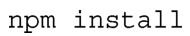
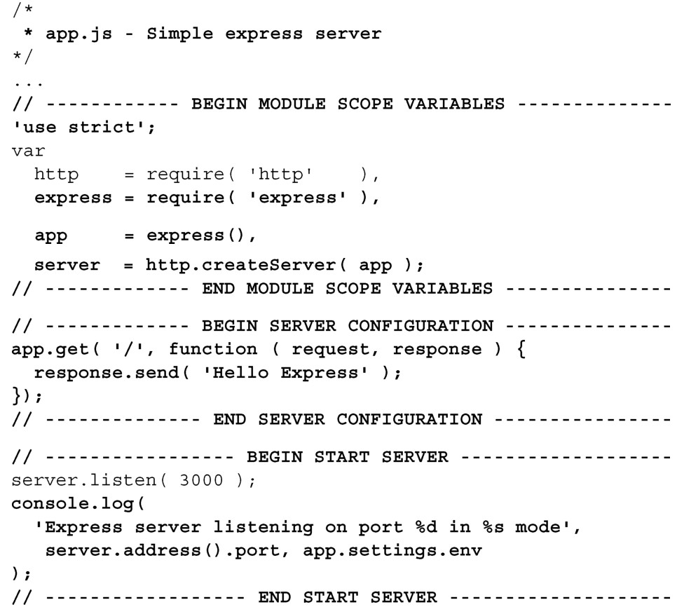
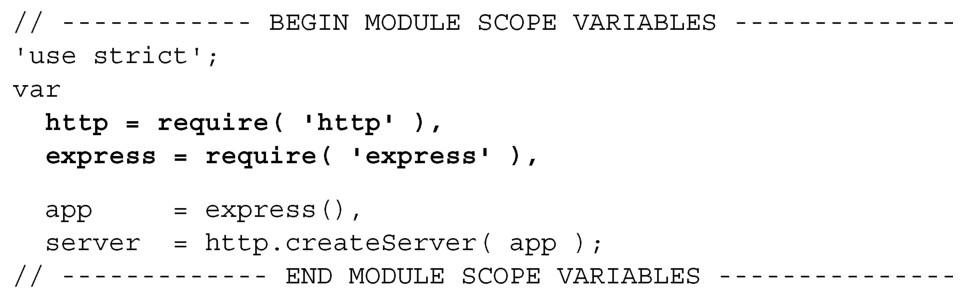
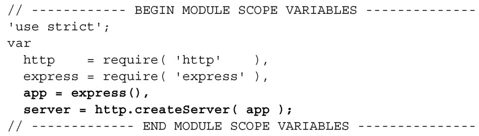
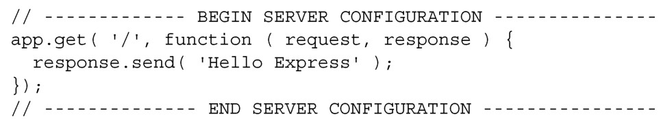
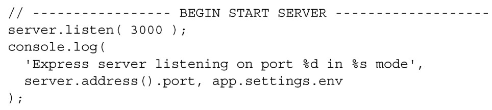

#### 
  7.2.5 安装并使用Express

Express是一个轻量级的Web框架，是在Sinatra（轻量级的Ruby Web框架）之后设计出来的。在单页应用中，不需要充分利用Express提供的每个功能，但它提供了比Connect更加丰富的功能集，事实上，它是构建在Connect之上的。

确保工作目录是webapp，然后安装Express。我们不用和安装Connect一样的命令行方式，而使用一个叫做package.json的清单文件（manifest file），告诉npm我们的应用要正确地运行起来所需的模块以及模块的版本。当在远程服务器上面安装应用的时候，或者当有人下载应用并在他们的机器上进行安装的时候，这就会很方便。我们来创建安装Express的package.json文件，如代码清单7-7所示。

代码清单7-7 创建npm 安装用的清单文件——webapp/package.json

name属性是应用名称，可以是我们想要的任意名字。version属性是应用的版本，应用使用主要版本、次要版本以及补丁版本的组合（<major>.<minor>.<patch>）。设置private属性为true，告诉 npm不要发布应用程序。最后，dependencies属性描述了想让npm安装的模块和模块的版本。这里只有一个express模块。我们先删除已经存在的webapp/node_modules目录，然后使用npm安装Express：

当使用上面的 npm 命令来添加新模块的时候，可以使用--save 选项来自动更新package.json，以便包含新模块。这样在开发期间就会很方便。也请注意，我们指定希望的Express版本是“3.2.x”，意思是想要的Express版本是3.2，使用最新的补丁版本。这是推荐的版本声明方式，因为补丁是修复bug或者是确保向后兼容的，很少会破坏API。

现在，为了使用Express，我们来编辑app.js。此次实现较为严格，使用'use strict'指令（pragma），加了些代码区块的分隔符，如代码清单7-8所示。更改部分以粗体显示。

代码清单7-8 使用Express 创建node 服务器应用——webapp/app.js

当看着上面的小示例的时候，可能不会立即表现出来为什么使用Express更加简单，所以我们挨行过一遍，看看是为什么。首先，加载 express和 http模块（粗体显示）：

然后使用express创建app对象。该对象有设置应用的路由和其他属性的方法。也创建了HTTP server 对象，之后会用到该对象（粗体显示）：

接下来使用app.get方法定义了应用的路由：

由于有像 get 这样的丰富方法集，Express 使得 Node.js 中的路由变得简单了。app.get的第一个参数是匹配请求URL的模式。比如，在开发过程中，如果浏览器请求了http://localhost:3000或者http://localhost:3000/，GET请求的字符串是“/”，它和模式匹配。第二个参数是回调函数，当匹配时就会执行。request和response对象是传给回调函数的参数。查询字符串参数可在request.params中获取。

第三个（也是最后一个）区块的代码会启动服务器，并向控制台打印日志：

现在已经有了能运行的Express应用，我们来添加一些中间件。

