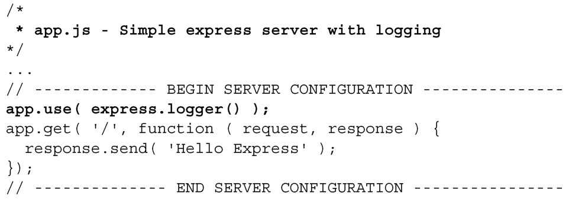
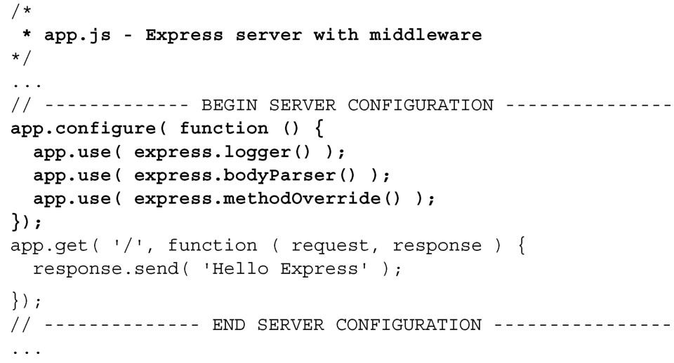

#### 
  7.2.6 添加Express中间件

由于Express是构建在Connect之上的，所以也可以使用相同的语法，调用并传递中间件。我们在应用中添加日志中间件，如代码清单 7-9 所示。更改部分以粗体显示。

代码清单7-9 向应用中添加Express 的日志中间件——webapp/app.js

因为 Express 提供了 Connect 的所有中间件方法，所以不需要引入 Connect。运行上面的代码，结果会把请求日志打印到控制台中，和上一小节的connect.logger一样。

可以使用Express的app.configure方法来组织中间件，如代码清单7-10所示。更改部分以粗体显示。

代码清单7-10 使用configure 方法来组织Express 中间件——webapp/app.js

上面的配置添加了两个新的中间件方法：bodyParser和methodOverride。bodyParser会对表单进行解码，之后会广泛使用。methodOverride用来创建RESTful服务。configure方法也可以根据运行应用的Node.js环境，对配置进行更改。

