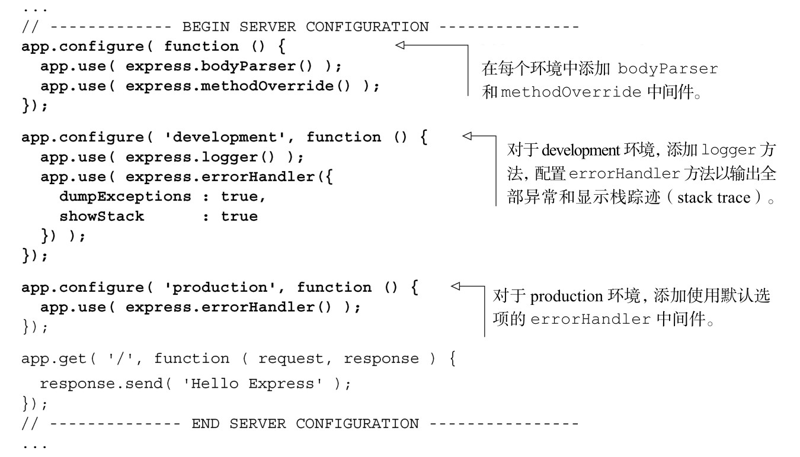

#### 
  7.2.7 Express的使用环境

Express 支持根据环境设置来切换配置的概念。环境设置有 development、testing、staging和 production。Express会读取 NODE_ENV环境变量，确定正在使用的是哪个环境，然后会相应地设置它的配置。如果你使用的是 Windows，可以像下面这样启动服务器应用：

如果使用的是Mac或者Linux，则可以像下面这样来设置：

如果使用的是其他操作系统，我们有百分百的把握你能搞定它。

在运行 Express 服务器应用的时候，环境名称可以使用任意字符串。如果没有设置NODE_ENV变量，则默认使用development。

我们修改一下应用，使之根据环境来进行自我调整。我们想在每个环境中都使用bodyParser和methodOverride中间件。在development环境中，想让应用记录HTTP请求和详细的错误。在production 环境，只想记录错误摘要，如代码清单7-11所示。更改部分以粗体显示。

代码清单7-11 使用Express 支持不同的环境——webapp/app.js

我们可以测试这些配置，以 development 模式（node app.js）运行应用程序，在浏览器中加载页面。你会在Node.js的控制台上看到输出日志。接下来，停止服务器，以production 模式（NODE_ENV=production node app.js）运行应用程序。当在浏览器中加载页面的时候，则不会有输出日志。

现在已经对Node.js、Connect和Express的基础知识有了很好的理解，我们转向更高级的路由方法。

