#### 
  7.3.1 用户对象的CRUD路由

CRUD操作（Create、Read、Update、Delete），是持久存储数据经常需要的主要操作。如果你需要进阶教程或者是头一次听说CRUD，Wikipedia对它有非常深入的讨论。

一个在 Web 应用程序中用来实现 CRUD 的常见设计模式称为 REST （Representational State Transfer）。REST 使用严格和定义明确的语义来定义动词 GET、POST、PUT、PATCH和DELETE做什么事情。如果你知道并喜欢REST，就务必要实现它，它是在分布式系统之间交换数据的完美有效的方法，Node.js甚至有很多模块想使用REST来解决问题。

我们已经实现了用户对象的基本CRUD路由，在下面的示例中决定不实现REST，这有几个理由。挑战之一是因为很多浏览器还没有实现原生的REST动词，所以经常是使用POST，通过表单或者首部传递额外的参数来实现PUT、PATCH和DELETE。这意味着开发人员不大容易识别请求使用的是什么动词，而必须在发送数据的首部中进行查找。REST也不能完美地映射成CRUD，尽管REST动词看上去和CRUD操作相似。最后，在处理状态码的时候，Web浏览器可以进行拦截。比如，浏览器可能会拦截302状态码，不把它传给单页应用客户端，它会尝试做“正确的事”并重定向到不同的资源。这可能不是我们一直想要的行为。

我们可以从列出所有的用户开始。

1．添加获取用户列表的路由

可以添加一个提供用户列表的简单路由。请注意我们把响应对象的 contentType设置为了json。这会设置首部，让浏览器知道响应是JSON格式的，如代码清单7-14所示。更改部分以粗体显示。

代码清单7-14 添加获取用户列表的路由——webapp/app.js

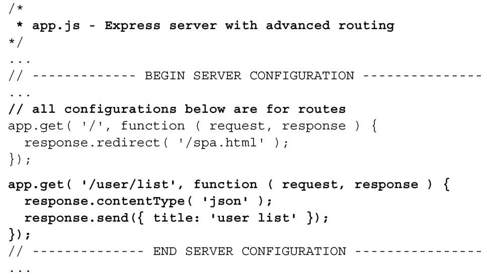
用户列表路由期望的是HTTP GET请求。如果是检索数据，这没什么问题。下一个路由，我们将使用POST请求，这样就可以向服务器发送大量的数据。

2．添加创建用户对象的路由

在添加创建用户对象的路由时，我们需要处理从客户端 POST 过来的数据。Express提供了简写方法app.post，它会处理和提供的模式所匹配的POST请求。可以把下面的代码添加到服务器应用里面，如代码清单7-15所示。更改部分以粗体显示：

代码清单7-15 添加创建用户对象的路由——webapp/app.js

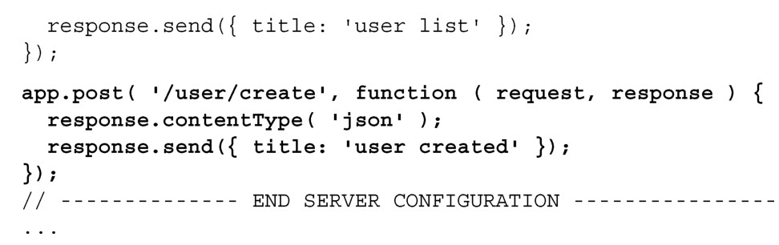
我们对POST过来的数据还没有做任何处理，在下一章会有介绍。如果在浏览器里面输入http://localhost:3000/user/create，会看到404错误，错误信息是：Cannot GET/user/create。这是因为浏览器发送的是GET请求，而路由只会处理POST请求。可以使用下面的命令行来创建用户：

服务器会返回：

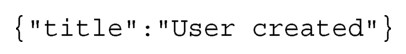
CURL和WGET

如果你使用的是Mac或者Linux系统，就可以绕开浏览器，使用curl来测试API。我们可以测试一下刚才创建的URL，向user/create发送POST请求：

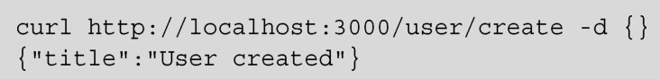
-d用来发送数据，空对象字面量则不发送数据。不用打开浏览器对路由进行测试，使用curl可以显著地节省开发时间。在命令提示符中输入curl–h，可以找到更多关于curl的功能。

使用wget也可以得到相同的结果：

在命令提示符中输入wget–h，可以找到更多关于wget的功能。

现在已经有了创建用户对象的路由，我们可以创建读取用户对象的路由。

3．添加读取用户对象的路由

读取用户对象的路由和创建用户对象的路由类似，只是使用 GET 方法，额外的参数通过URL传递：用户的ID。通过使用冒号定义路由路径中的参数来创建这个路由，如代码清单7-16所示。更改部分以粗体显示。

代码清单7-16 添加读取用户对象的路由——webapp/app.js

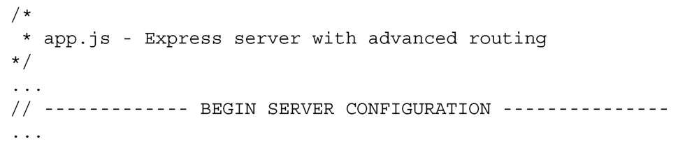
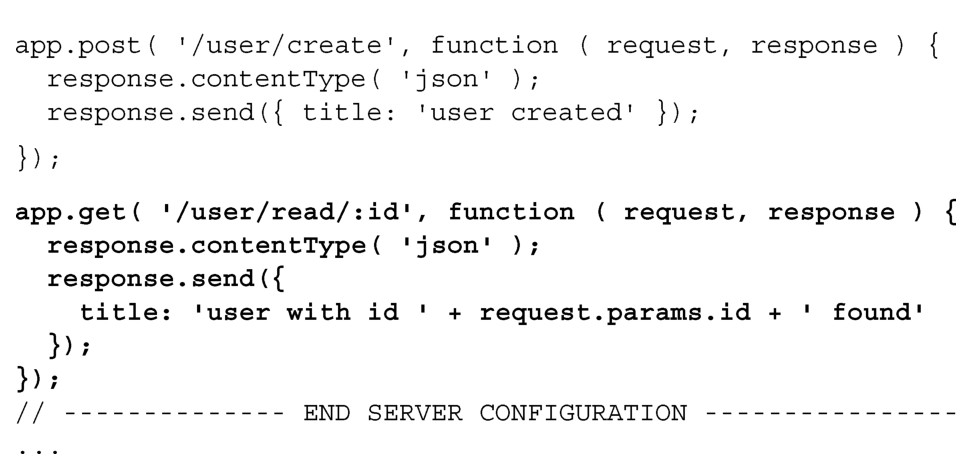
路由最后的用户:id 参数，可以通过 request.params 对象访问到。路由/user/read/:id使得可以通过访问request.params['id']或者request.params.id得到用户ID。如果请求URL是http://localhost:3000/user/read/12，则request.params.id的值为12。请试一试，也请注意不管id的值是什么，路由都会工作（只要id是有效的值，路由就会接受）。表7-1中有更多的示例。

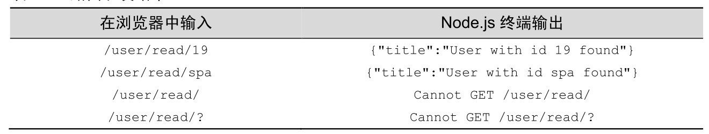
路由捕获任何值是件好事，但是如果ID总是数字会怎样？我们不想路由解释ID不是数字的路径。Express 提供了这样的功能，在路由定义中添加正则表达式[(0-9)]+，只接受包含数字的路径，如代码清单7-17所示。更改部分以粗体显示：

代码清单7-17 限制路由，ID 只为数字——webapp/app.js

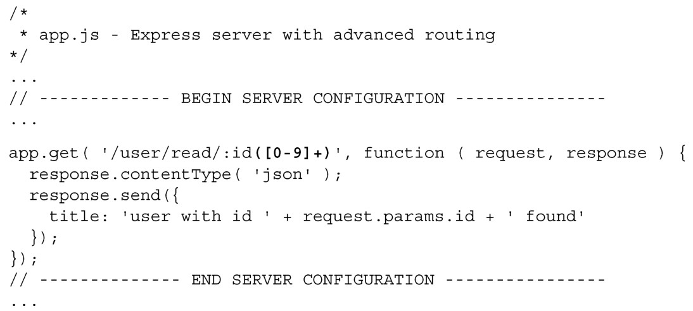
表7-2演示了只接受数字ID的路由。

4．添加更新或者删除用户的路由

这里的更新和删除用户的路由和读取用户的路由几乎是一样的，然而下一章中它们对用户对象的操作会非常不同。在代码清单 7-18 中，添加了更新和删除用户的路由。更改部分以粗体显示。

代码清单7-18 定义CRUD路由——webapp/app.js

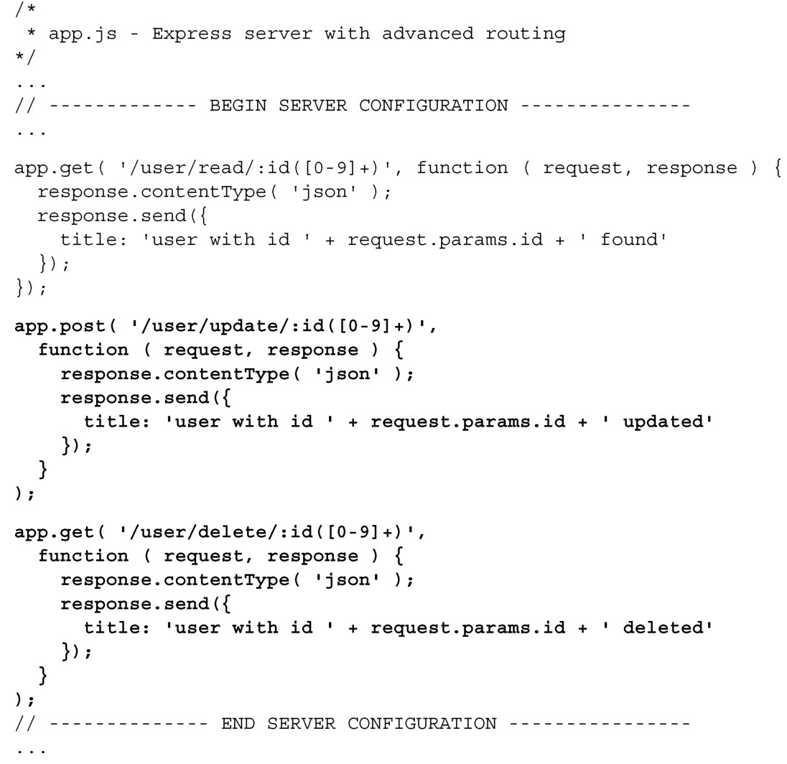
创建上面这些基本路由很容易，但是你可能已经注意到我们给每个响应都设置了contentType。这容易出错，也很低效，更好的方式是对用户CRUD操作的所有响应设置 contentType。理想的情况是创建一个路由，拦截所有到达的路由，把响应的contentType设置为json。我们面临两个复杂的问题。

（1）有一些请求使用GET方法，其他请求使用POST方法。

（2）在设置完响应的contentType之后，我们希望路由能和之前一样工作。

幸好Express提供了这样的功能。除了app.get和app.post方法之外，还有一个app.all方法，它会拦截路由，不管它们的方法类型是什么。Express通过指定和调用路由回调函数中的第三个参数，把控制流传回给路由，看看是否有其他路由匹配请求。按照惯例，第三个参数叫做next，它会立即把控制流传递给下一个中间件或者路由。在代码清单7-19中添加了app.all方法。更改部分以粗体显示。

代码清单7-19 使用app.all()方法来设置通用属性——webapp/app.js

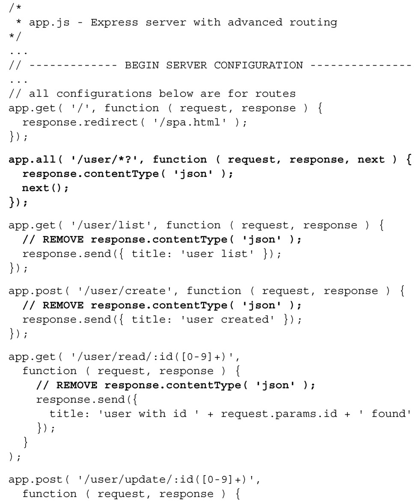
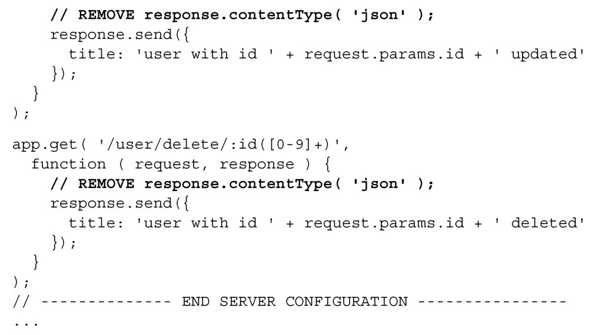
路由模式/user/*?中的*会匹配任何值，?表示可选。/user/*?会匹配下面的任意路由：

/user

/user/

/user/12

/user/spa

/user/create

/user/delete/12

现在已经有了用户路由，很容易想像随着对象种类的增加，路由的数量会爆炸式地增长。我们真的需要为每个对象定义五个新路由吗？很幸运，不用这样做。可以将这些路由通用化，把它们放到它们自己的模块里面。

