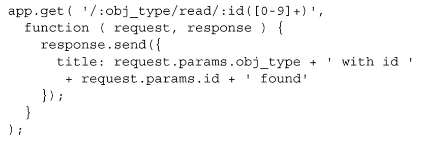
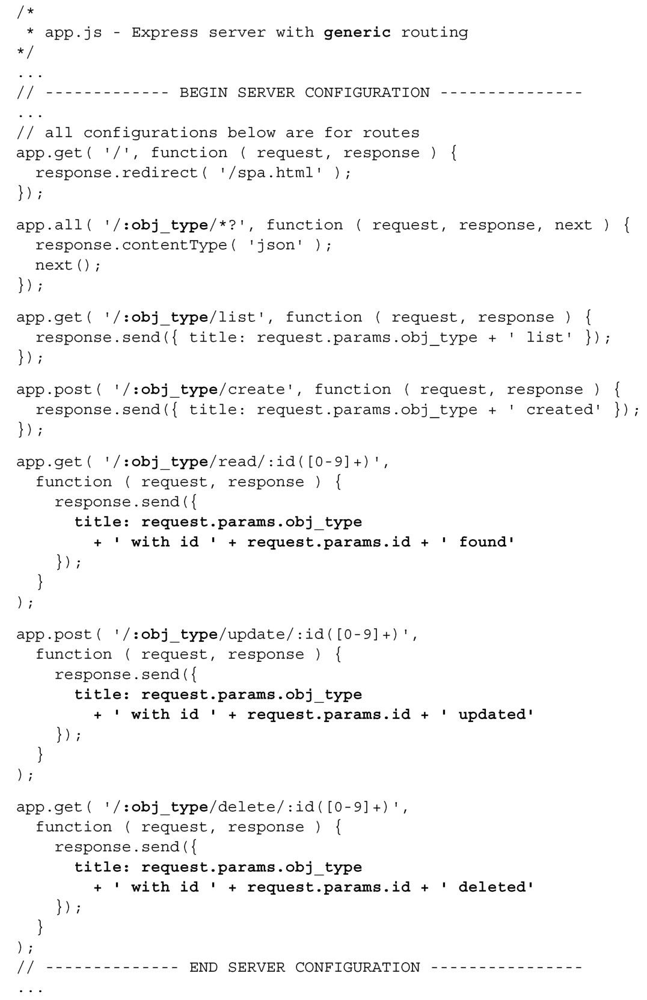
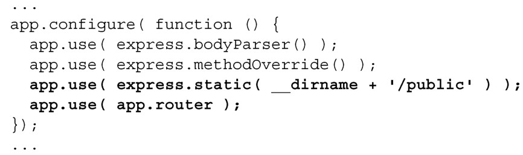

#### 
  7.3.2 通用CRUD路由

我们已经知道可以使用路由参数，接收来自客户端的内容，但是也可以利用它们把路由通用化。只需要告诉Express，使用部分的URI作为参数。下面这样就可以：

现在当请求/horse/read/12的时候，在请求参数request.params.obj_type中可以得到对象类型（horse），响应的 JSON 是{ title: "horse with id 12 found"}。把这一逻辑应用到其余的方法，代码清单7-20 是完成后的代码。所有的更改部分以粗体显示。

代码清单7-20 完成通用CRUD路由——webapp/app.js

现在启动应用（node app.js），在浏览器中打开 http://localhost:3000，会看到我们熟悉的单页应用，如图7-1所示。

这说明了静态文件配置允许浏览器读取所有的HTML、JavaScript和CSS文件。但也仍然可以访问CRUD API。如果在浏览器中输入http://localhost:3000/user/read/12，将看到下面的结果：

假使有个文件在<root_directory>/user/read/12（不要笑，你知道会发生这种事情）会怎么样？对于我们的情况，会返回文件，而不是CRUD响应。这是因为express.static中间件在添加路由之前就已添加，如下所示：

然而，如果把顺序倒过来，先添加路由，则会返回 CRUD 响应，而不是静态文件。这种做法的好处是对 CRUD 请求会更快，坏处是访问更加复杂多样的文件时会较慢。聪明的做法是把所有的 CRUD 请求放到像/api/1.0.0/这样的根名字下，这样动态内容和静态内容就被很好地分开了。

现在我们已经掌握了干净且通用的路由的基本知识，它能管理任何类型的对象。很明显，它没有考虑授权问题，稍后会讲到这个逻辑。首先，我们把所有的路由逻辑移到单独的模块里面。

