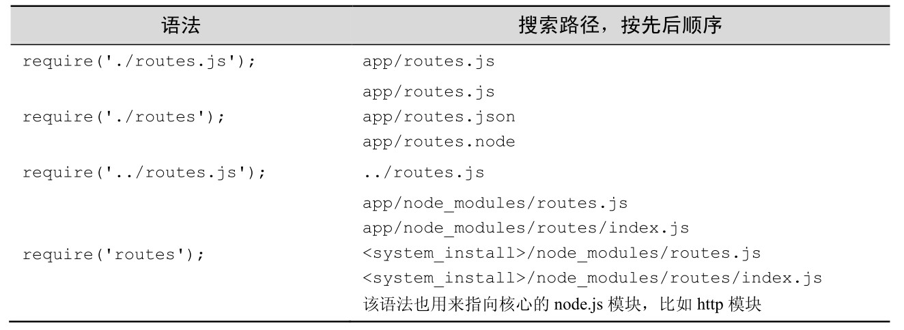
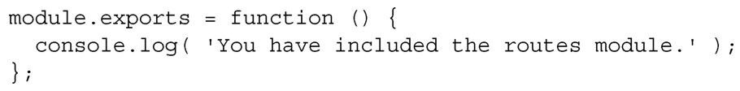
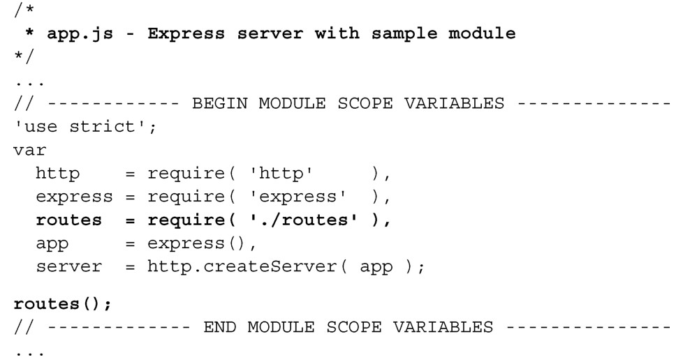
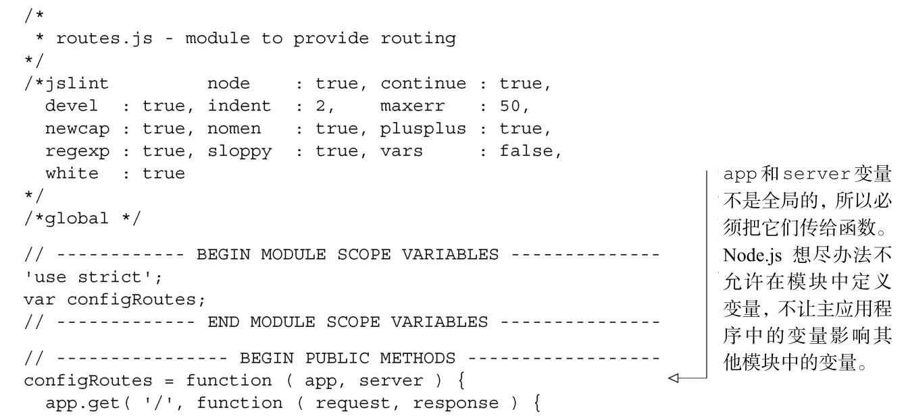
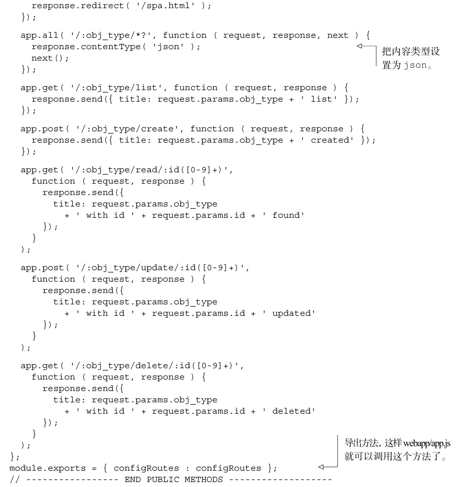
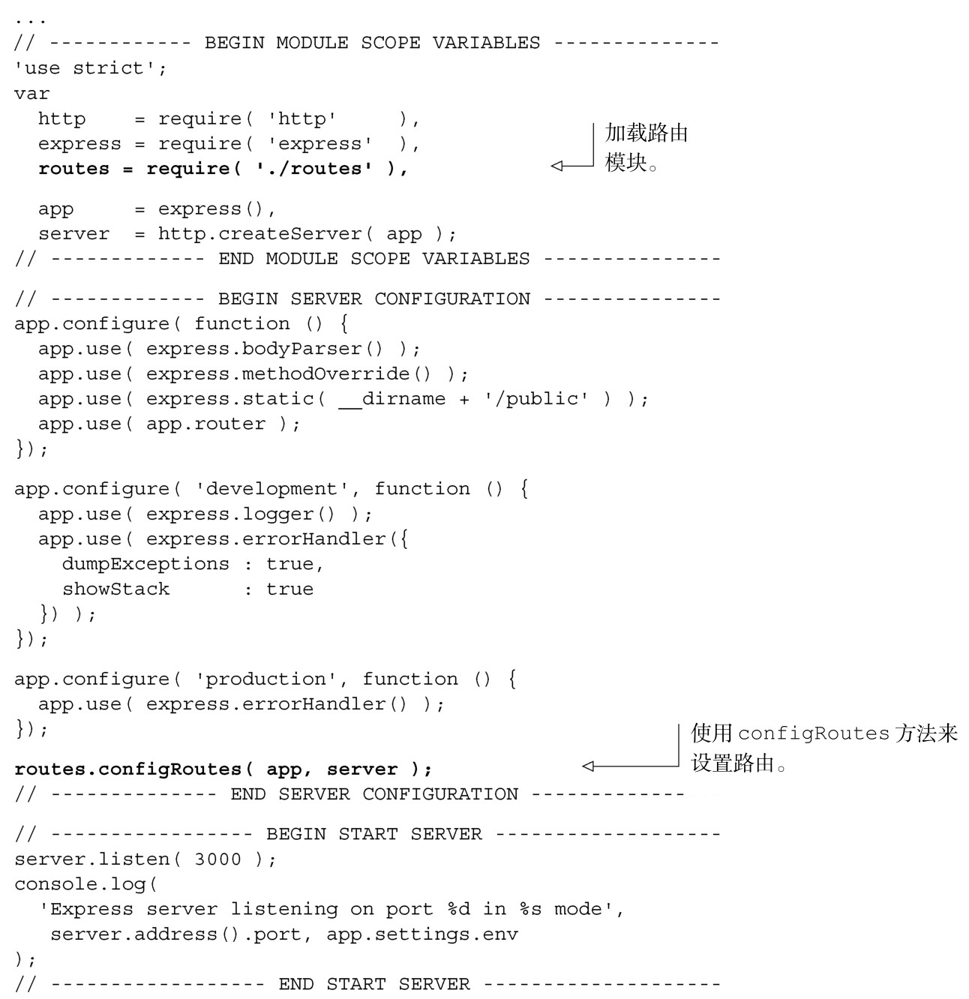

#### 
  7.3.3 把路由放到单独的Node.js模块里面

把所有的路由定义放到主 app.js 文件里面，就像和在客户端的 HTML 页面中直接编写JavaScript代码一样，会把应用变得杂乱无章，不能清晰地分离职责。先更详细地看一下Node.js的模块系统，它是Node.js引入模块代码的方法。

1．Node模块

Node模块是使用require函数加载的。

传给require的字符串指定了要加载的文件路径。有一些不同的语法规则需要记住，所以要有耐心。为方便起见，表7-3描述了这些规则。

在 node 模块内部，不需要客户端使用的自执行匿名函数，var 变量的作用域被限制在模块内，而不是在全局作用域中。node 模块中有个 module 对象。赋给module.exports属性的值是require方法的返回值。我们来创建路由模块，如代码清单7-21所示。

代码清单7-21 创建路由模块——webapp/routes.js

module.exports的值可以是任何数据类型，比如函数、对象、数组、字符串、数字或者布尔值。在上面的示例中，routes.js把module.exports的值设置为一个匿名函数。我们在app.js中使用require方法来引入routes.js，把返回值保存在routes变量中。然后可以调用返回的函数，如代码清单7-22所示。更改部分以粗体显示。

代码清单7-22 引入模块并使用返回值——webapp/app.js

当在命令提示符中输入node app.js 的时候，会看到下面的信息：

现在已经添加了路由模块，我们把路由配置移到这个模块里面。

2．把路由移到模块里面

在创建大型应用时，我们喜欢在主应用文件夹中的单独文件中定义路由。在更大型的有很多路由的应用中，可以在路由文件夹中定义路由，想要多少文件都可以。

由于接下来开发的是大型应用，我们在单页应用的根目录中创建routes.js文件，把已有的路由复制到module.exports函数里面。它看起来应和代码清单7-23一样。

代码清单7-23 把路由放到单独的模块中——webapp/routes.js

现在可以修改 webapp/app.js，使用路由模块，如代码清单 7-24 所示。更改部分以粗体显示。

代码清单7-24 更新服务器应用，使用外部路由——webapp/app.js

最后得到的是很干净的 app.js：加载需要的库模块、创建 Express 应用程序、配置中间件、添加路由，然后启动服务。它没有把数据持久化到数据库，没有真正对请求动作执行操作。在下一章安装完MongoDB并和Node.js应用连接起来之后，再来介绍这个功能。在做这项工作之前，我们先来看一下其他需要的功能。

