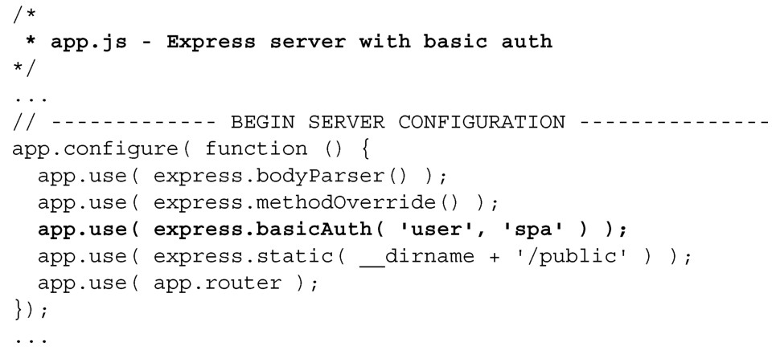
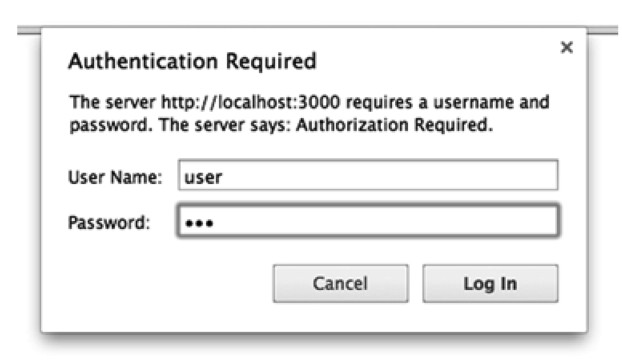

### 
  7.4 添加认证和授权

现在已经创建了在对象上执行 CRUD 操作的路由，我们还应该添加认证机制。可以选择自己努力编码来实现，或者是选择容易的方式：利用Express的另一个中间件。嗯，考虑考虑，选择哪一种呢？

基本认证

基本认证是HTTP/1.0和1.1标准中，定义当客户端发送请求的时候该如何提供用户名和密码，它通常被称为basic auth（基本认证）。请记住，中间件是按照在应用程序中的添加顺序进行调用的，所以如果希望应用程序对路由进行授权访问，就需要在添加路由中间件之前添加其他中间件。这很容易做到，如代码清单7-25所示。更改部分以粗体显示。

代码清单7-25 为服务器应用添加基本认证——webapp/app.js

在上面这个示例中，我们对应用程序进行了硬编码（hard-coded），期望的用户名是user，密码是spa。basicAuth也有第三个参数，它是一个函数，可以用来提供更加高级的机制，像在数据库查找用户详情。如果用户是有效的，这个函数应该返回true，当用户无效时返回 false。当重启服务器并重新加载浏览器的时候，它会打开如图7-2一样的警告对话框，在允许访问之前要求输入有效的用户名和密码。

如果输入了错误的密码，则会一直提示直到输入正确为止。按下 Cancel 按钮页面会显示Unauthorized。

在产品级应用中，不推荐使用基本认证。每个请求它都会发送纯文本的认证信息，安全专家称之为广泛攻击（large attack vector）<a class="my_markdown" href="['#anchor2']">[2]</a>。即使使用SSL（HTTPS）对传输进行加密，在客户端和服务器之间也只有一层安全保证。

现在使用自己的认证机制显得过时了。很多创业公司乃至更加知名的公司都在使用来自像Fackbook或者Google的第三方认证。有很多在线指南演示了如何集成这些服务，可以先从Node.js的Passport中间件入手。

