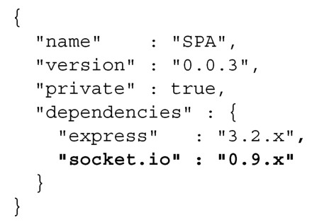
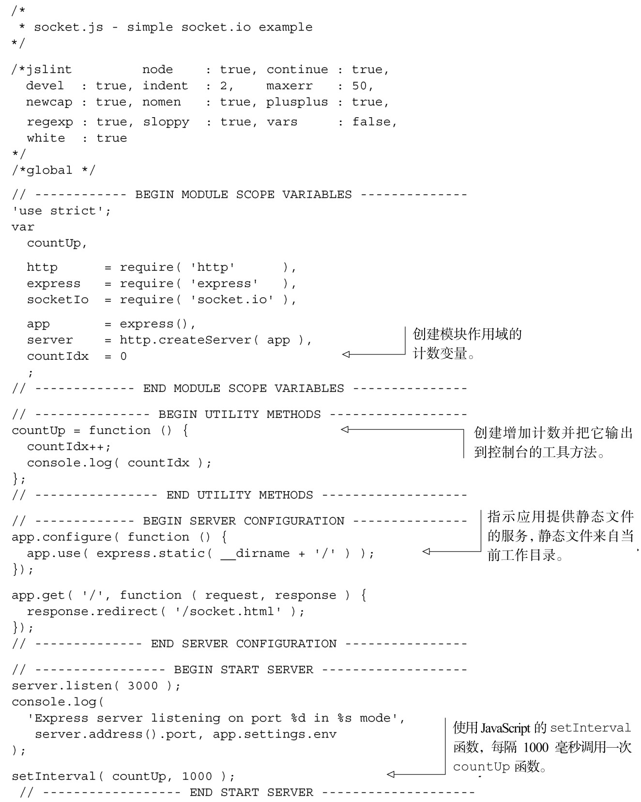
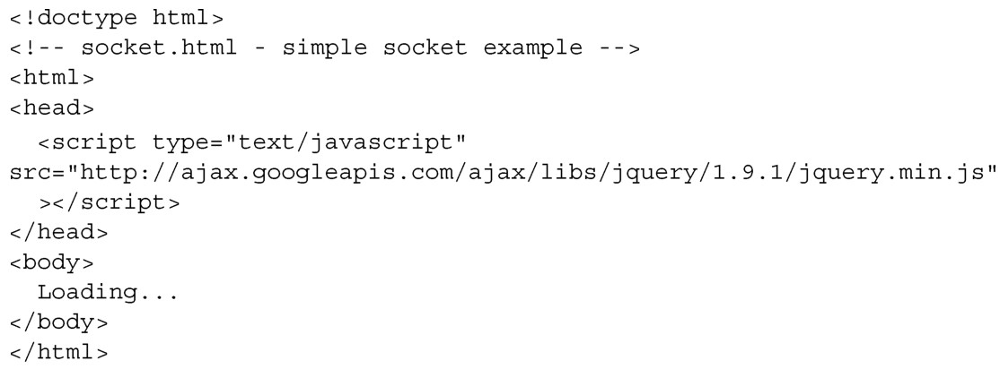
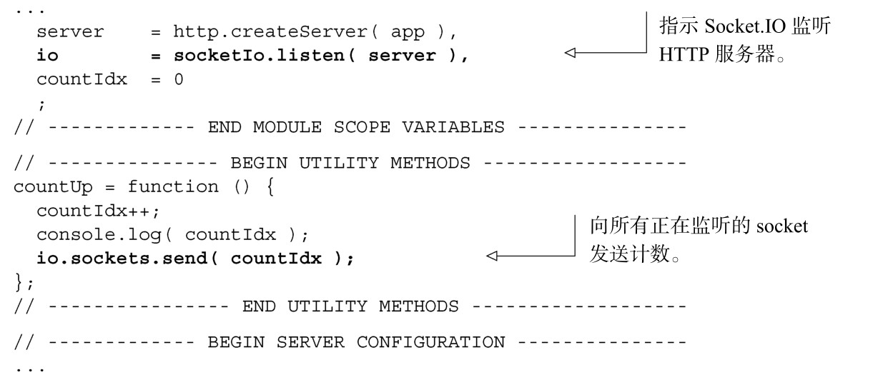
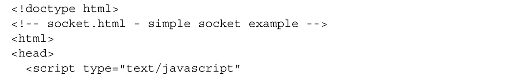
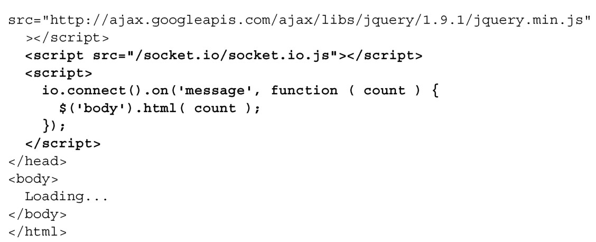

#### 
  7.5.1 简单的Socket.IO应用程序

我们来创建一个简单的Socket.IO应用，它会每隔一秒更新服务器的计数器，并把当前计数推送给已连接的客户端。可以通过更新 package.json 来安装 Socket.IO，如代码清单7-26所示。更改部分以粗体显示。

代码清单7-26 安装Socket.IO——webapp/package.json

现在可以运行npm install 命令，确保安装了Express和Socket.IO。

添加两个文件：名为webapp/socket.js的服务器应用和浏览文档webapp/socket.html。构建服务器应用，它可以提供静态文件的服务，并且有一个每秒钟数量加一的计时器。由于知道会使用Socket.IO，我们还会引入这个库。代码清单7-27演示了新的socket.js服务器应用。

代码清单7-27 先编写服务器应用——webapp/socket.js

当启动服务器时（node socket.js），我们看到在终端上会输出不断增加的数字。现在，我们创建webapp/socket.html来显示这个数字，如代码清单7-28所示。我们将引入jQuery，因为用它来获取body标签很简单。

代码清单7-28 创建浏览文档——webapp/socket.html

现在可以加载http://localhost:3000，页面几乎是空白的。让Socket.IO向客户端发送该信息只需在服务器应用中添加两行代码，如代码清单7-29所示。更改部分以粗体显示。

代码清单7-29 在服务器应用中添加Web socket——webapp/socket.js

启用Socket.IO，浏览文档只需要添加六行代码，如代码清单7-30所示。更改部分以粗体显示。

代码清单7-30 在浏览文档中添加Web socket——webapp/socket.html

在安装Socket.IO后就已提供JavaScript文件/socket.io/socket.io.js，所以不需要创建了。它也是一个“魔法”文件，实际上并不存在于服务器上面，所以不用去找它了。io.connect()返回一个 Socket.IO 连接，on 方法和 jQuery 中的 bind 方法类似，告诉Socket.IO连接监听某种类型的Socket.IO事件。在上面这个示例中，监听的是从连接过来的名为 message 的事件。然后使用 jQuery，更新 body 的内容为新的计数。你去服务器上找socket.io.js文件了，是不是？

如果在浏览器中打开 http://localhost:3000，会看到计数器在不断增加。当在另外一个浏览器标签中打开相同的地址时，会看到计数器在不断增加，数字和频率都一样，因为在服务器应用中，countIdx是模块作用域变量。

