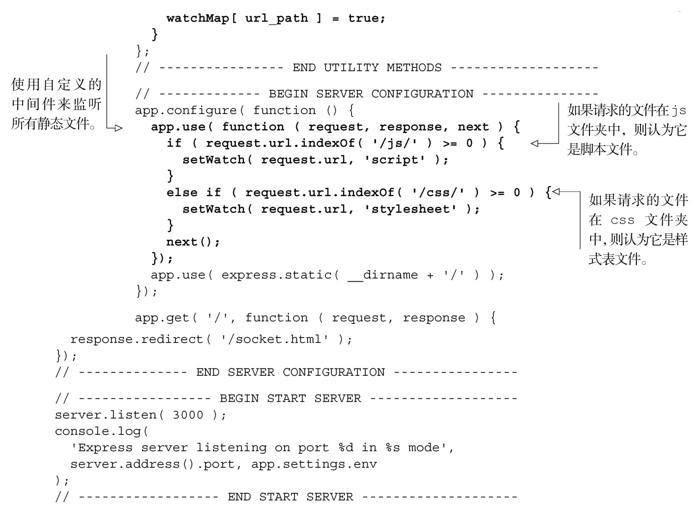
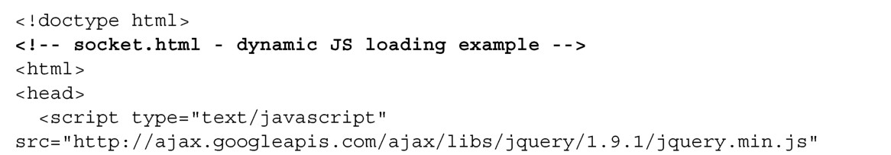
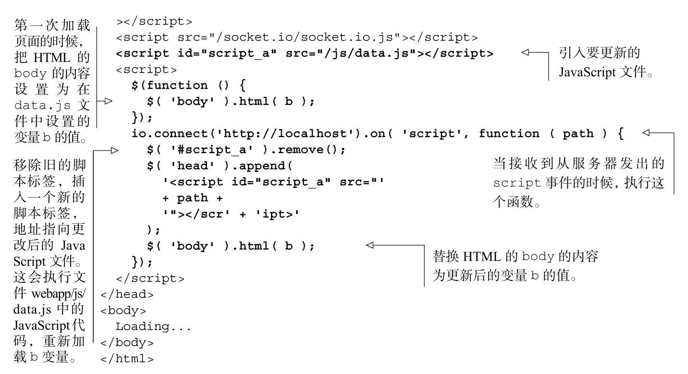

#### 
  7.5.3 使用Socket.IO更新JavaScript

单页应用的挑战之一是确保客户端软件和服务器应用相匹配。想象一下，如果Bobbie在她的浏览器中加载了我们的单页应用，五分钟之后我们更新了服务器应用。现在Bobbie遇到了问题，因为我们对服务器做了更新后，用的是一种新的数据格式，而 Bobbie 的单页应用仍然需要旧的数据格式。解决这一情况的一种方法是，在意识到数据格式过时的时候，强制Bobbie重新加载整个单页应用（比如说之后向她发送服务器更新的消息通告）。

但我们能够做得更加漂亮：可以选择性地只更新单页应用中发生变化的JavaScript文件，不用强制重新加载整个应用。

那么如何做这种神奇的更新呢？有三个问题需要考虑。

（1）监听JavaScript文件，能够检测到对它们的修改。

（2）通知客户端文件已经被更新。

（3）当客户端收到变化的通知时，更新客户端的JavaScript文件。

第一个问题，能够检测到对文件的修改，可以使用原生的node文件系统模块fs来完成这个功能。第二个是上一节讨论过的向浏览器发送Socket.IO通知的问题，而第三个更新客户端文件的问题，可以在接收到通知的时候，通过插入一个新的script标签来完成。我们可以更新上一个示例中的服务器应用，如代码清单7-31所示。更改部分以粗体显示。

代码清单7-31 更新服务器应用，以便监听文件——webapp/socket.js

现在已经准备好了服务器应用，我们来看一下客户端，先是要更新的JavaScript文件，然后是主页面文件。数据文件webapp/js/data.js包含一行代码，把一些文本赋给一个变量，如代码清单7-32所示。

代码清单7-32 创建数据文件——webapp/js/data.js

浏览文档需要的修改稍微多一些，如代码清单7-33所示。更改部分以粗体显示。

代码清单7-33 更新浏览文档——webapp/socket.html

现在是见证奇迹的时刻。首先，启动服务器应用（在命令行中输入node socket.js）。接着，打开浏览文档（webapp/socket.html）。在浏览器窗口中会看到SPA字样。然后编辑webapp/js/data.js文件，把SPA更改为the meaning of life is a rutabaga或者是其他同样精辟的评论。当我们返回到浏览器时，会看到显示由SPA变成了上面提到的精辟评论（不用重新加载浏览器）。可能会有几秒钟的延时，因为watchFile命令注意到文件变化可能需要这么长的时间<a class="my_markdown" href="['#anchor6']">[6]</a>。

