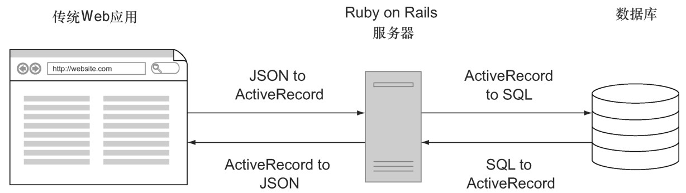
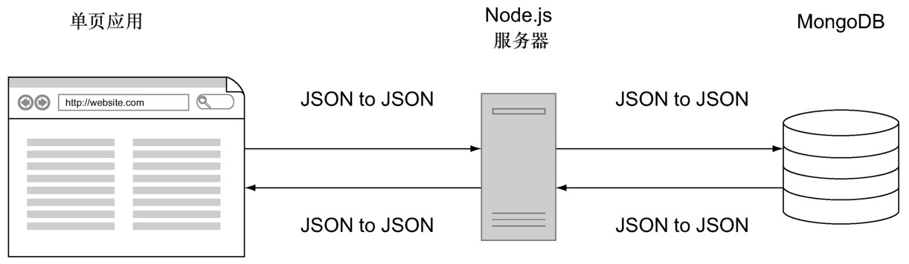

#### 
  8.1.2 消除数据转换

考虑一下使用MySQL/Ruby on Rails（或者mod_perl、PHP、ASP、Java 或 Python）和JavaScript编写的传统Web应用程序：在发送数据给客户端时，开发人员必须编写代码进行SQL->Active Record（活动记录）->JSON的转换，然后接收客户端返回的数据时，又必须进行JSON ->Active Record->SQL的转换（见图8-1）。这里涉及到了三种语言（SQL、Ruby、JavaScript），三种数据格式（SQL、Active Record、JSON）和四次数据转换。最好的一面是，这只是浪费了大量的服务器资源，这些资源本来可以用在别的地方。最坏的一面是，每次转换都有引入bug的机会，实现和维护就需要费很大的劲儿。

我们使用MongoDB、Node.js和原生的JavaScript单页应用，所以数据映射是这样的：向客户端发送数据时是 JSON -> JSON -> JSON，接收客户端返回的数据时是 JSON ->JSON -> JSON（见图8-2）。我们只使用一种语言（JavaScript），一种数据格式（JSON），没有数据转换。这使得复杂的系统变得很简单。

这种简洁的组织架构，在决定把应用逻辑放在哪一端的时候，也具有很大的灵活性。

