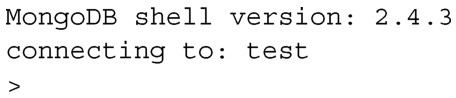
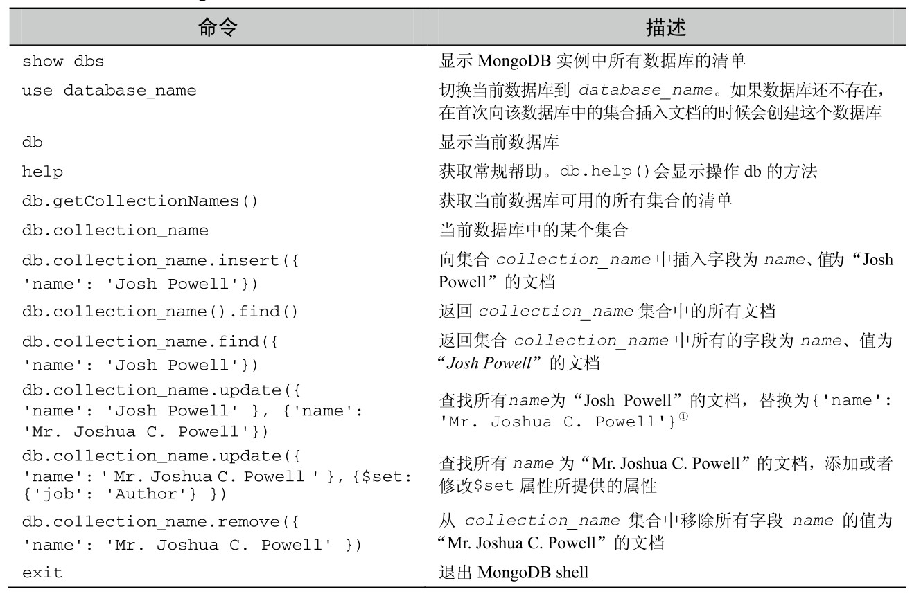

#### 
  8.2.3 开始使用MongoDB

开始使用MongoDB的好办法就是安装MongoDB，然后使用MongoDB的shell，操作集合和文档。首先，从MongoDB的网站（http://www.mongodb.org/downloads）下载安装MongoDB，然后启动mongodb服务器进程。启动的过程根据操作系统而不同，所以请查阅文档获取详细信息（http://docs.mongodb.org/manual/tutorial/manage-mongodb-processes/）。一旦启动了数据库，打开终端，输入mongo启动shell（Windows上请输入mongo.exe），会看到下面的信息：

在操作MongoDB的时候，要注意一个重要的概念，不用手动创建数据库或者集合：在需要它们的时候会自动创建它们。为了“创建”新的数据库，输入命令直接使用该数据库即可。为了“创建”集合，把文档直接插入集合即可。如果在查询的时候引用了一个不存在的集合，查询不会失败。就像集合存在一样，但是直到插入文档的时候才会真正地创建它。表8-1演示了一些常用操作。建议你按顺序进行测试，database_name请使用“spa”。

① 表述有误。update方法默认情况下只会更新找到的第一个文档。如需更新找到的全部文档，要设置multi参数为true。更多信息请参考http://docs.mongodb.org/manual/reference/method/db.collection. update/#db.collection.update。——译者注

当然，MongoDB 的功能要比表格中列出来的多得多。比如，有很多排序的方法、返回存在字段的子集、更新或者插入（upsert）文档、增加或者修改属性、操作一组文档、添加索引以及还有很多很多的功能。想更深入地研究MongoDB提供的所有功能，请查阅MongoDB in Action (Manning 2011)、在线MongoDB手册（http://docs.mongodb.org/manual/）、或者Little MongoDB Book（http://openmymind.net/mongodb.pdf）。现在已经运行过一些基本的MongoDB命令了，我们将应用和MongoDB连接起来。首先，我们需要准备项目文件。

