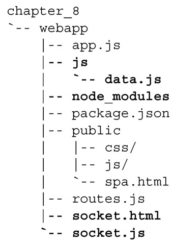
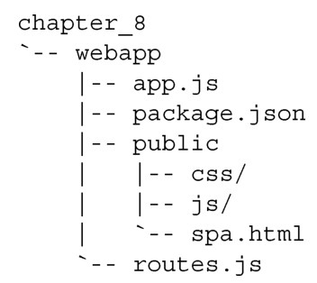

#### 
  8.3.1 准备项目文件

本章，我们在第7章已经完成的基础上进行开发。把第7章的整个文件结构复制到新的“chapter_8”目录里面，在新的目录中继续开发。代码清单8-1演示了复制完成后的文件结构。要移除的文件和目录以粗体显示。

代码清单8-1 复制第7章的文件

移除js目录、socket.html文件和socket.js文件。也把node_modules目录移除了，因为这在安装模块的时候会重新生成。更新过后的结构应如代码清单8-2所示。

代码清单8-2 移除不再需要的文件和目录

现在已经复制和整理了目录，我们做好在应用中添加MongoDB的准备了。第一步是安装MongoDB的驱动程序。

