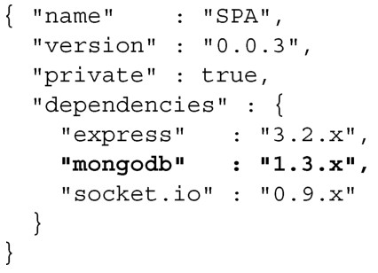
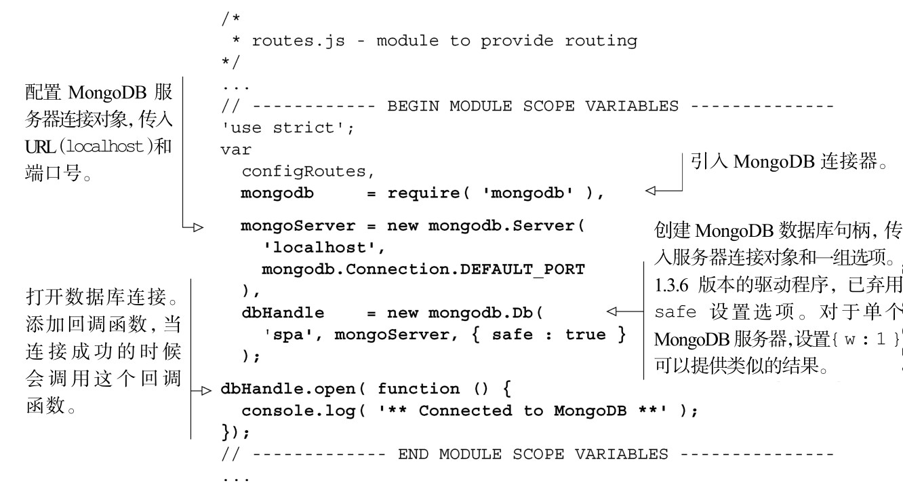
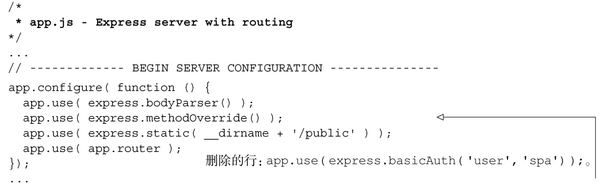

#### 
  8.3.2 安装并连接MongoDB

我们发现MongoDB的驱动程序，对于很多应用程序来说都是很好的解决方案。简单、快速并且容易理解。如果需要更多的功能，可以考虑使用Object Document Mapper (ODM)。ODM和经常用于关系型数据库的Object Relational Mapper(ORM)类似。还有一些可选方案，举几个来说：Mongoskin、Mongoose和Mongolia。

我们在应用中使用基本的MongoDB驱动程序，因为大多数的关联关系和更高层次的数据建模都放在客户端处理。我们不想要任何ODM的验证功能，因为我们将使用通用的JSON 模式验证器（schema validator）来验证文档结构。我们做出这个决定是因为 JSON模式验证器是和标准兼容的，在客户端和服务端都可以使用，而ODM验证目前只能用在服务端。

可以使用package.json来安装MongoDB驱动程序。和以前一样，指定模块的主要版本和次要版本，补丁版本使用最新的，如代码清单8-3所示。更改部分以粗体显示。

代码清单8-3 更新用于npm install 的清单——webapp/package.json

可以运行npm install来安装清单中的所有模块，包括MongoDB驱动程序。编辑routes.js文件，引入mongodb并启动连接，如代码清单8-4所示。更改部分以粗体显示。

代码清单8-4 打开MongoDB 连接——webapp/routes.js

也可以移除服务器应用中的基本认证，如代码清单8-5所示。

代码清单8-5 移除服务器应用中的基本认证——webapp/app.js

现在可以启动服务器应用（在命令提示符中输入node app.js），会看到下面的输出结果：

现在服务器应用已经连接了MongoDB，我们来探讨一下基本的CRUD操作。

