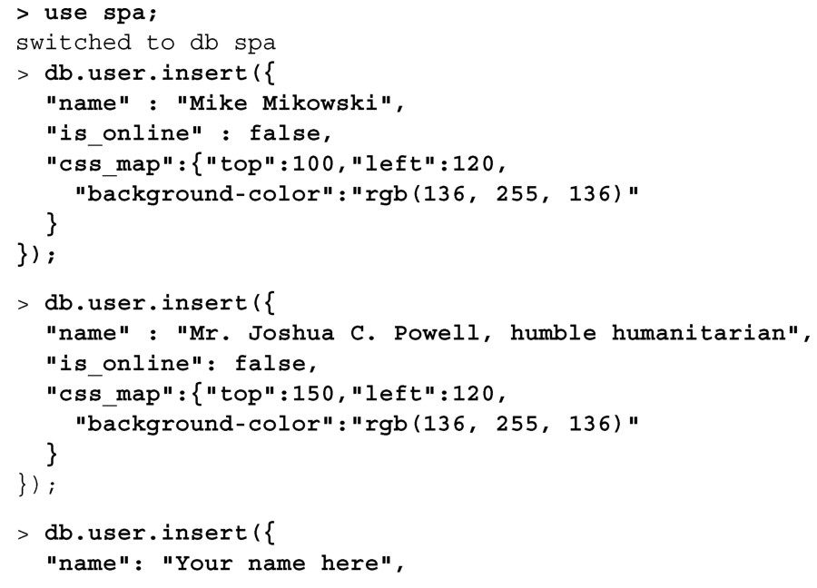
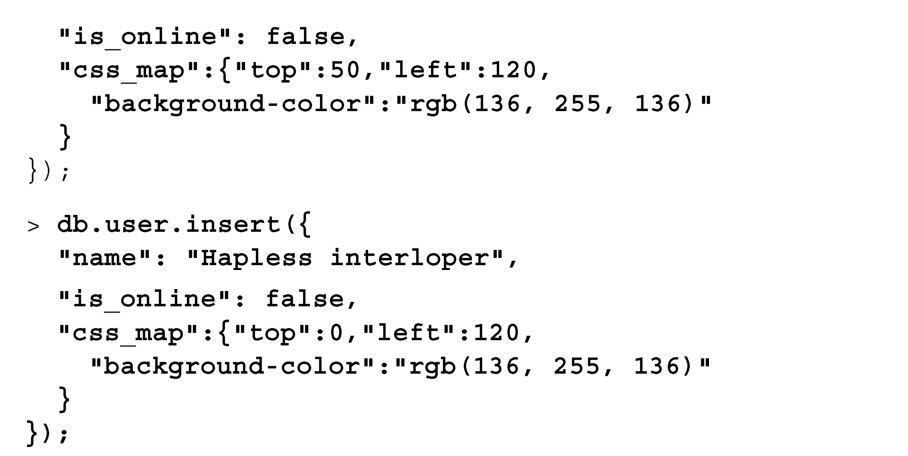
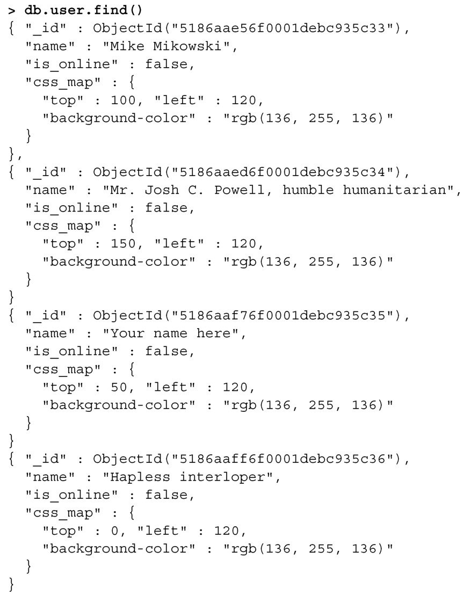
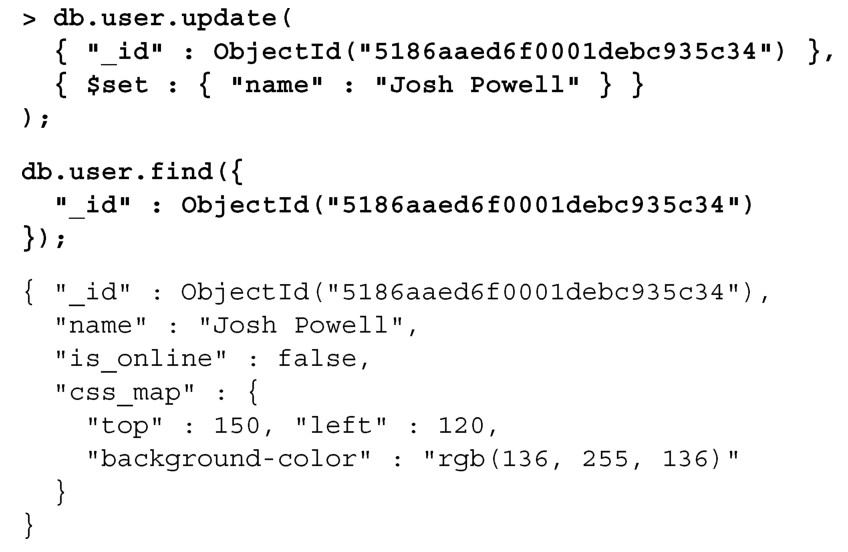
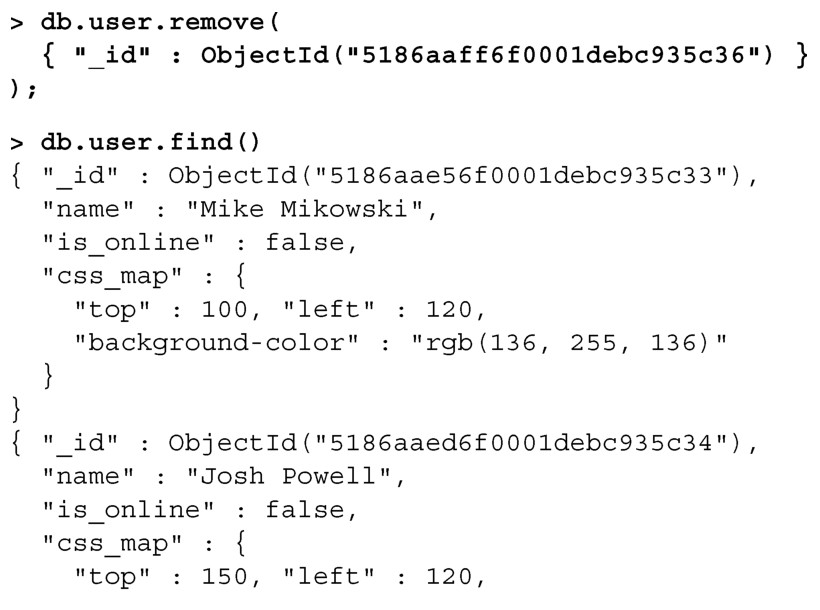
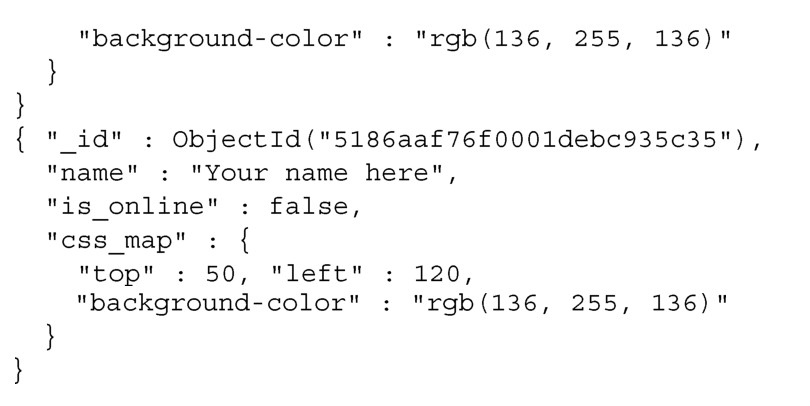

#### 
  8.3.3 使用MongoDB的CRUD方法

在进一步更新服务器应用之前，我们希望能熟练掌握MongoDB的CRUD方法。请打开终端，输入 mongo 启动 MongoDB shell。然后在集合中创建一些文档（使用 insert方法），如代码清单8-6所示。输入以粗体显示。

代码清单8-6 在MongoDB 中创建一些文档

可以读取这些文档，确保文档已被正确地添加（使用 find 方法），如代码清单 8-7所示。输入以粗体显示。

代码清单8-7 从MongoDB 中读取文档

注意，MongoDB会自动给所有插入的文档添加一个唯一的ID字段，名为_id。虽然其中一位作者的name字段很明显是正确的（尽管可能是轻描淡写），但是看起来过于正式。我们来删除自负的部分并更新文档（使用update方法），如代码清单8-8所示。输入以粗体显示。

代码清单8-8 更新MongoDB 中的文档

我们不禁注意到有一位hapless interloper（倒霉的闯入者）进入了数据库。就像Star Trek中的先遣登陆部队的红衣船员 <a class="my_markdown" href="['#anchor9']">[9]</a>，倒霉的闯入者在相关情节结束时不应该还活着。我们讨厌打破传统，所以让我们立即除掉这位闯入者并删除文档（使用remove方法），如代码清单8-9所示。输入以粗体显示。

代码清单8-9 从MongoDB 中删除文档

现在我们已经使用MongoDB控制台，完成了Create-Read-Update-Delete操作。我们来更新服务器应用，以便支持这些操作。

