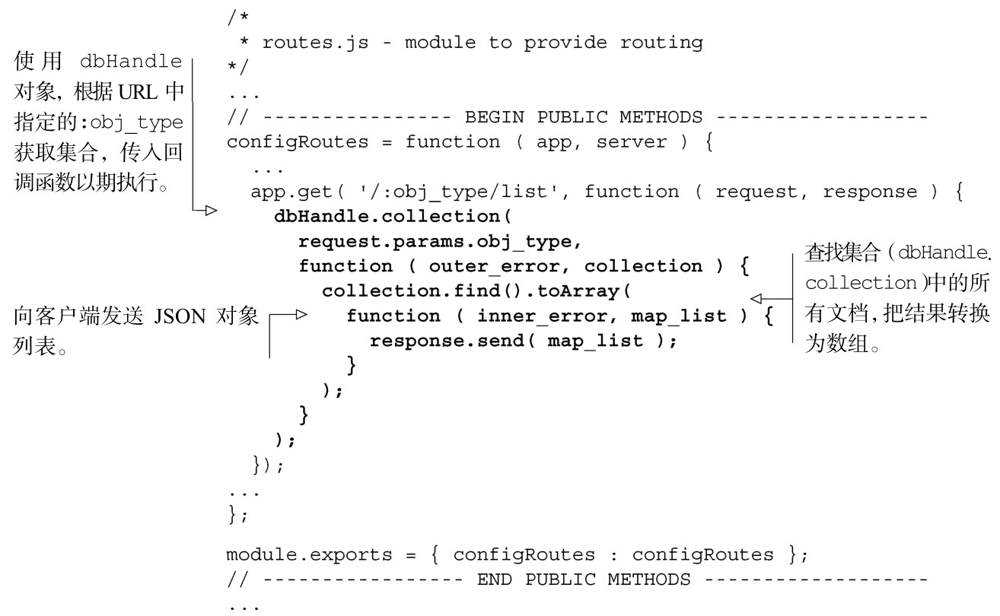
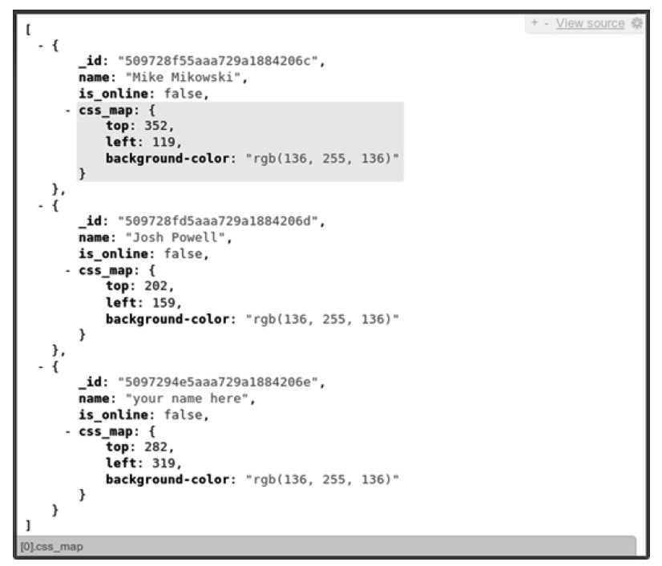
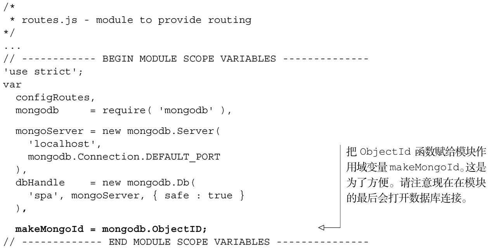
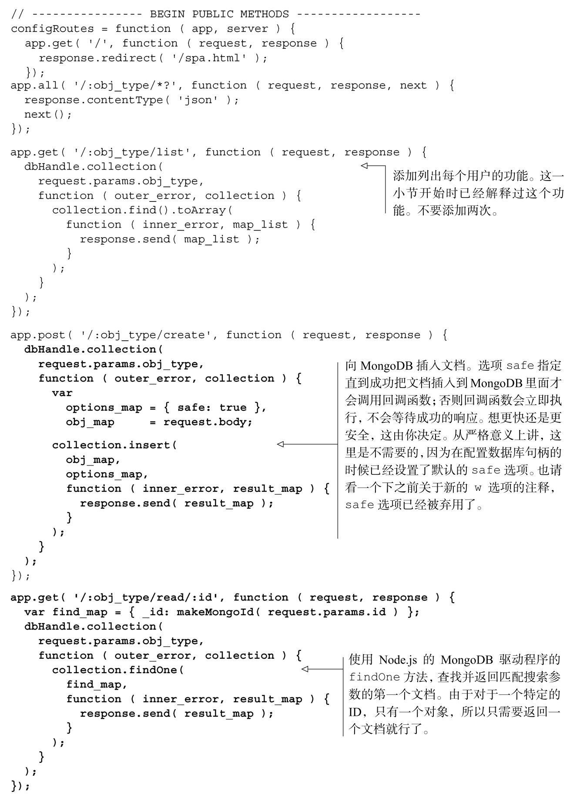
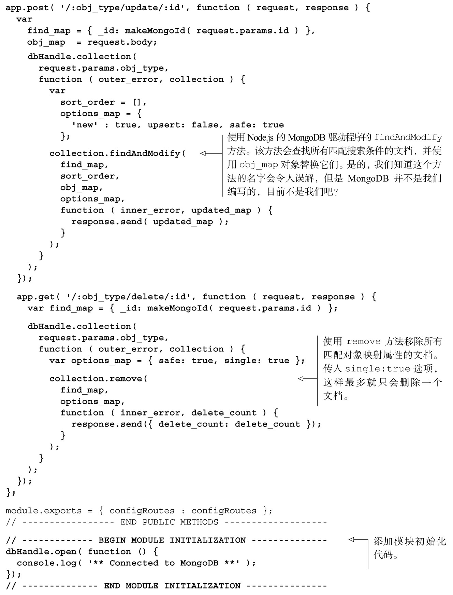

#### 
  8.3.4 向服务器应用添加CRUD操作

因为我们使用的是Node.js，而JavaScript是基于事件的，所以操作MongoDB会和其他很多语言有所不同。现在数据库中已经有了一些文档可供测试，我们来更新路由，使用 MongoDB 获取用户对象的列表，如代码清单 8-10 所示。更改部分以粗体显示。

代码清单8-10 更新路由，获取用户列表——webapp/routes.js

在浏览器中查看结果之前，你可能需要安装浏览器扩展或者附加组件，以便更容易阅读JSON。我们在Chrome 中使用JSONView 0.0.32，在Firefox 中使用JSONovich 1.9.5。两者都可以在各自浏览器厂商的附加组件网站上获取到。

可以在终端输入node app.js来启动应用。当在浏览器中打开http://localhost:3000/user/list的时候，将看到和图8-3类似显示的JSON文档。

现在可以添加剩余的CRUD操作，如代码清单8-11所示。更改部分以粗体显示。

代码清单8-11 在路由模块中添加MongoDB 驱动程序和CRUD——routes.js

现在有了用户的CRUD操作，从客户端经由Node.js服务器再到MongoDB然后再返回，都能走通。现在我们想让应用验证接收来自客户端的数据。

