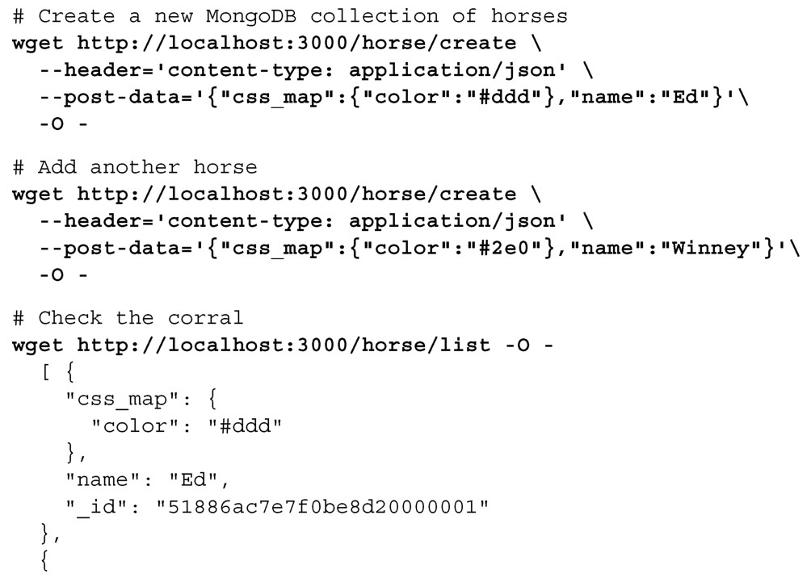
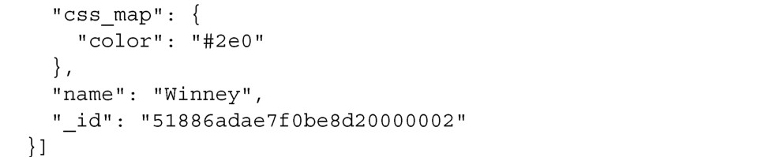
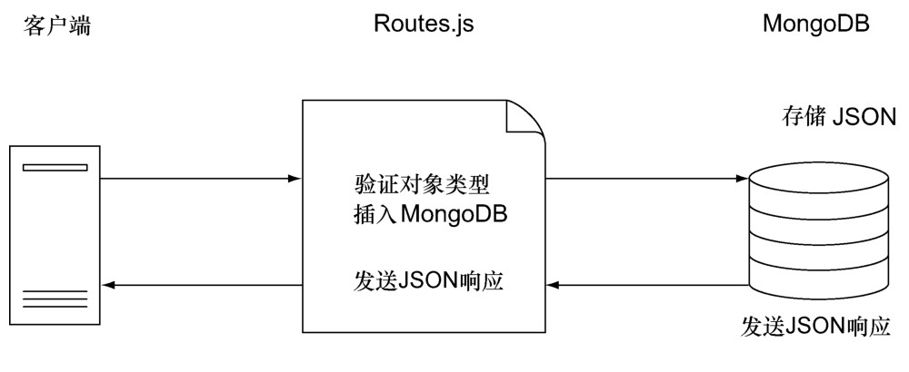
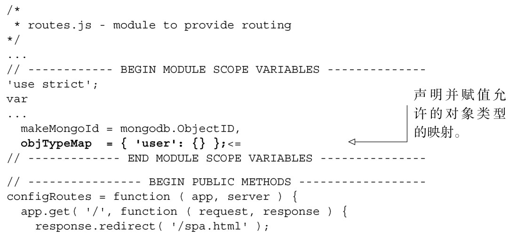
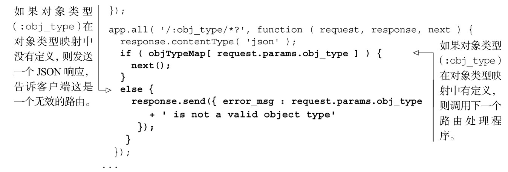

#### 
  8.4.1 验证对象类型

现在的情况是，我们会接受任何路由，甚至没有验证是否为允许的类型，就直接把对象传给了MongoDB。比如，POST一个创建horse的请求也是有效的。下面是使用wget的示例。输入以粗体显示。

实际情况比看上去要更糟。MongoDB不仅仅是存储了文档，而且还创建了一个全新的集合（就像在示例中所做的一样），消耗了大量的资源。我们不能就这样发布上线，因为一个普通的脚本黑客就能够很容易地通过运行一段脚本，创建成千上万的新MongoDB集合，在几分钟之内就能把服务器拖垮掉 <a class="my_markdown" href="['#anchor10']">[10]</a>。我们应该只允许通过验证的对象类型进入，如图8-5所示。

这很容易实现。可以创建一个允许对象类型的映射，然后在路由中进行检查。为此，我们来修改routes.js文件，如代码清单8-12所示。更改部分以粗体显示。

代码清单8-12 验证进入的路由——routes.js

上面只是确保了对象类型是被允许的，我们不想就此打住。我们也希望确保客户端数据是预期的结构。下面就来加上这层验证。

