#### 
  8.4.2 验证对象

浏览器客户端发送给服务器的 JSON 文档代表一个对象。很多读者肯定知道，很多Web API都使用JSON，JSON已经取代了XML，因为它更简洁，更容易处理。

XML 提供的一个主要功能是定义 DTD(Document Type Definition，文档类型定义)， DTD描述允许的内容。JSON有类似的功能，然而还不够成熟，没有确保和DTD类似的文档内容的标准。它叫做JSON schema。

JSV 是一款使用JSON schema的验证器。浏览器和服务器都可以使用，所以不必编写或者维护两份单独的（总是会产生难以捉摸的冲突）验证库。下面是验证对象需要的步骤。

安装JSV的node模块。

创建JSON schema。

加载JSON schema。

创建验证函数。

验证进入的数据。

第一步是安装JSV。

1．安装JSV的node模块

更新package.json 文件，引入JSV 4.0.2，如代码清单8-13所示。

代码清单8-13 更新清单，引入JSV——webapp/package.json

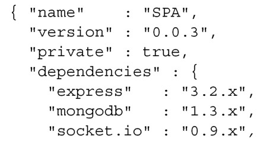
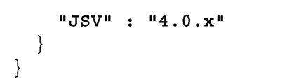
在运行npm install 时，npm会检测到更改并安装JSV。

2．创建JSON schema

在可以验证用户对象之前，必须决定什么属性是允许的，它们的值可能是什么。JSON schema提供了很好的标准机制来描述这些约束，如代码清单8-14所示。请一定要仔细地注意注释，因为它们说明了约束的内容。

代码清单8-14 创建用户schema——webapp/user.json

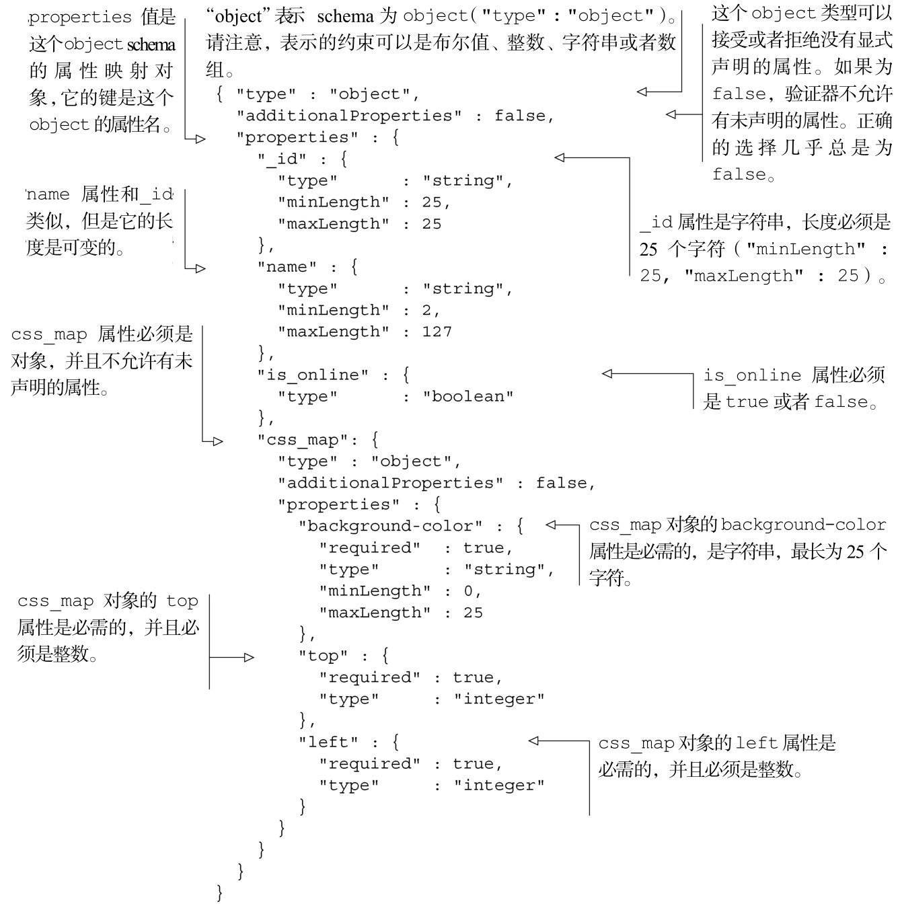
你可能已经注意到，我们定义了一个约束对象以及约束这个对象中的对象的schema。这说明了JSON schema 是可以无限递归的。JSON schema 也可以扩展其他的schema，很像XML。若想了解更多关于JSON schema 的信息，请查看官方网站json-schema.org。现在可以加载schema，确保接收到的任何用户对象只包含我们允许的数据。

3．加载JSON schema

在启动服务器的时候，把schema文档加载到内存里面。这将避免在服务器应用运行期间，进行昂贵的文件查找操作。可以为在对象类型映射（objTypeMap）中定义的每个对象类型加载一个schema，如代码清单8-15所示。更改部分以粗体显示。

代码清单8-15 在路由中加载schema——webapp/routes.js

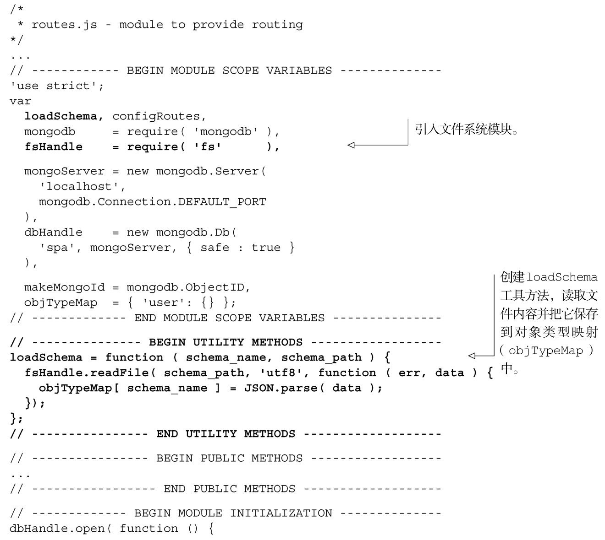
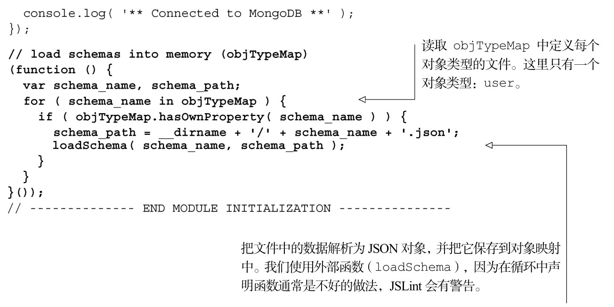
现在已经加载了schema，我们可以来创建验证函数。

4．创建验证函数

现在已经加载了user的JSON schema，我们想把来自客户端的数据与之进行比较。代码清单8-16演示了使用一个简单的函数来完成这个功能。更改部分以粗体显示。

代码清单8-16 添加函数来验证文档——webapp/routes.js

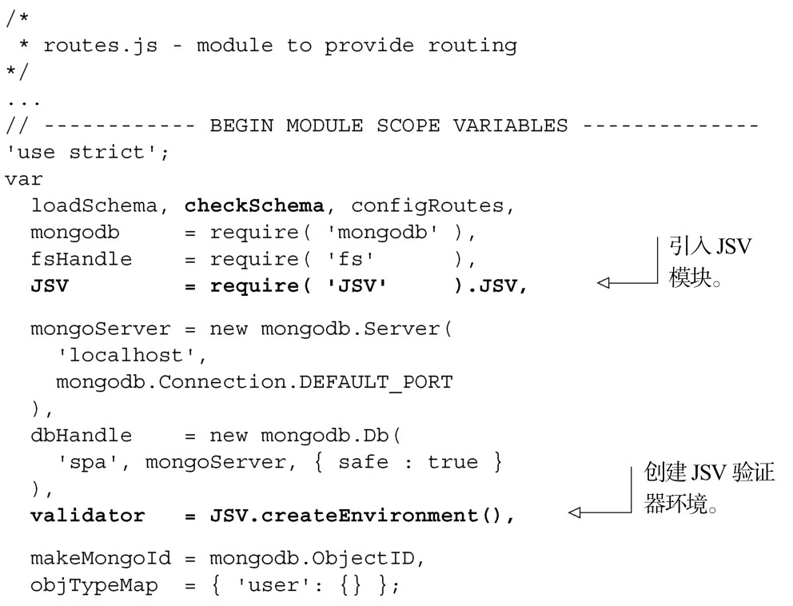
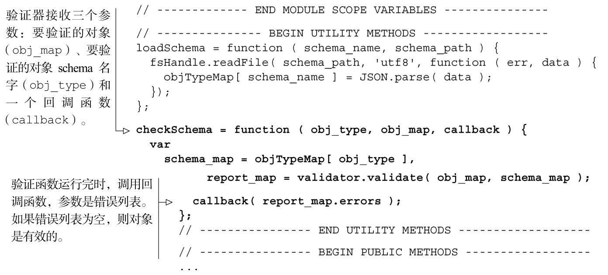
现在已经加载了JSON schema 并且创建了验证函数，我们可以验证来自客户端的数据了。

5．验证来自客户端的数据

现在可以来完成验证程序。只需要修改路由（创建和更新部分），对来自客户端的数据进行验证即可。在每一种情况下，如果错误列表是空的，则执行请求操作，否则返回错误报告，如代码清单8-17所示。更改部分以粗体显示。

代码清单8-17 给创建和更新的路由加上验证——webapp/routes.js

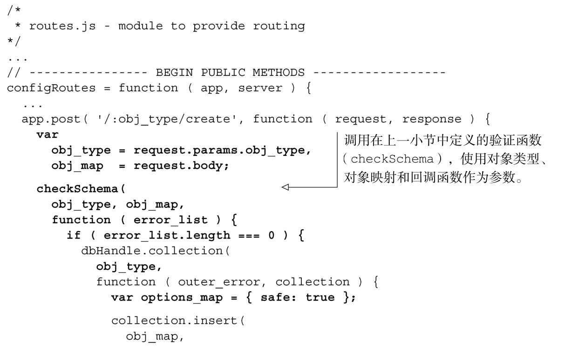
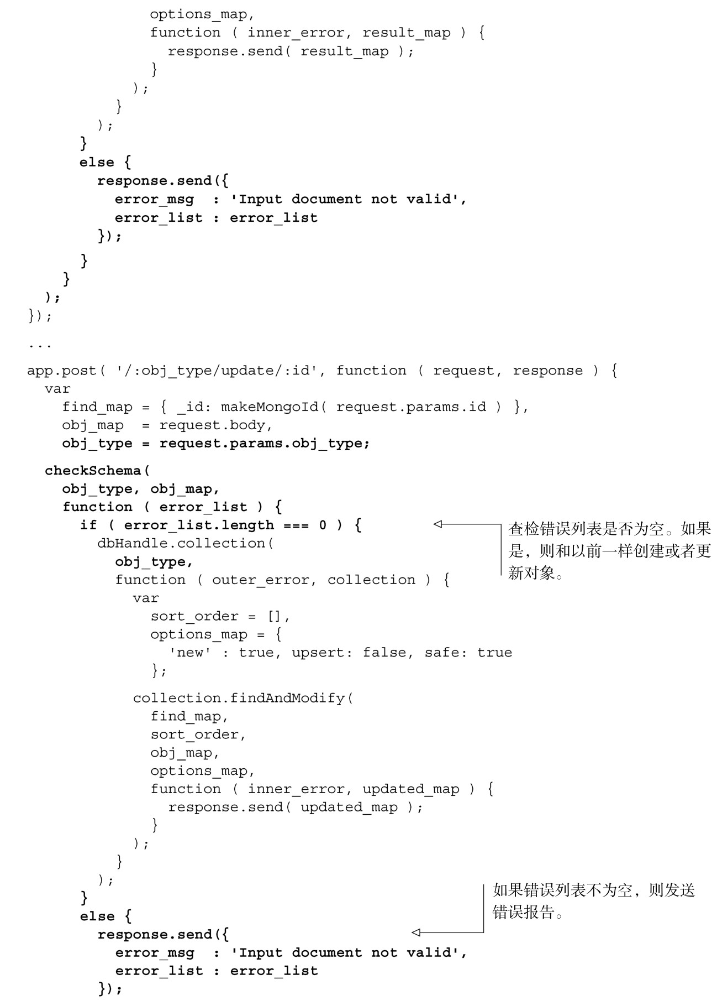
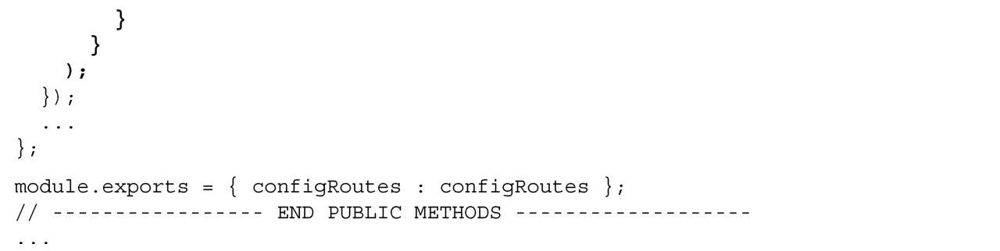
现在已经完成了验证程序，来看一下我们所做的成果。首先要确保所有的模块通过JSLint（jslint user.json app.js routes.js），然后启动应用（node app.js）。然后可以使用灵巧的wget技术POST错误的和正确的数据，如代码清单8-18所示。输入以粗体显示。

代码清单8-18 使用灵巧的wget 技术POST 错误的和正确的数据

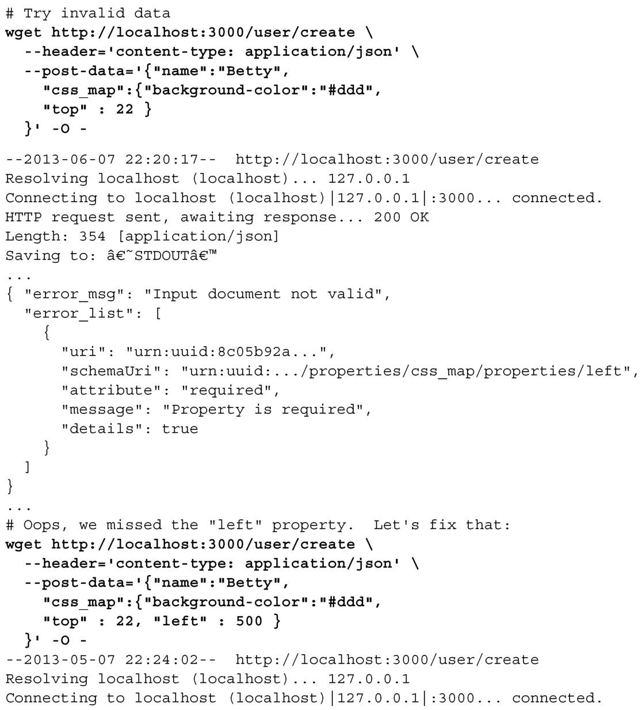
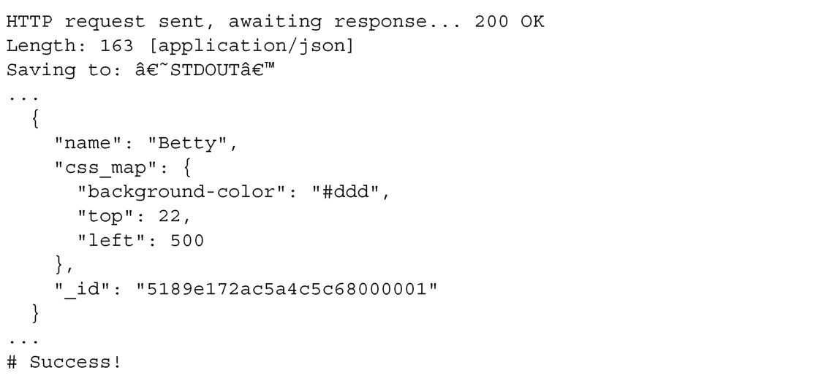
使用wget更新用户，这个留给读者作为练习。

在下一小节，我们将会把 CRUD 功能移到单独的模块里面。这样就会更整洁，更容易理解，代码也更容易维护。

