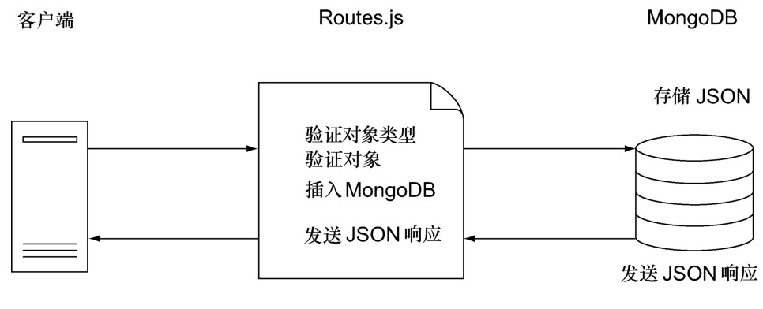
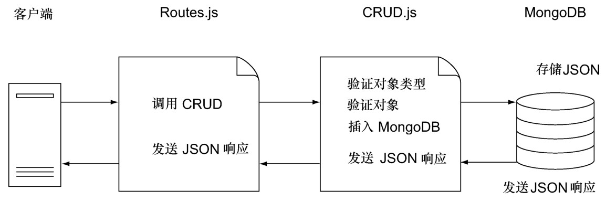

### 
  8.5 创建单独的CRUD模块

到现在为止，routes.js文件包含了CRUD操作和路由，如图8-6所示。

服务器接收来自客户端的请求、验证数据并把数据保存到数据库中。验证和保存数据的唯一方法是使用HTTP请求来调用路由。如果这就是应用所需的，那么不用进一步的抽象，到此收手是说得过去的。但是我们的单页应用也需要创建和修改来自Web socket 连接的对象。因此，我们会创建一个 CRUD 模块，它拥有验证和管理数据库中文档的所有逻辑。然后路由会使用CRUD模块，用于必需的CRUD操作。

在创建CRUD模块之前，想强调一下为什么要等到现在才来创建这个模块。我们想让代码尽可能的直观和简单，但不能过于简单 <a class="my_markdown" href="['#anchor11']">[11]</a>。如果代码中的操作是一次性的，通常倾向使用内联函数（inline function），或者至少是局部函数。但当发现某个操作需要执行两次或者两次以上时，我们就想把它提取出来。尽管这不会节省开始时的编码时间，但通常会节省维护时间，因为把逻辑都集中到一个程序里面了，避免了更改实现而导致的细微错误。当然，决定把这一哲学执行到何种程度，需要正确的判断力。比如，我们觉得把所有的for循环提取出来，这通常不是很好的想法，尽管这在JavaScript中完全可以做到。

在把MongoDB的连接和验证程序移到单独的CRUD模块之后，路由将不再关心数据存储的实现，表现得更像控制器：它把请求调度给其他模块，而不是自己来执行操作，如图8-7所示。

创建CRUD模块的第一步是组织文件结构。

