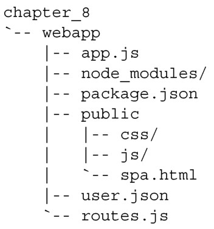
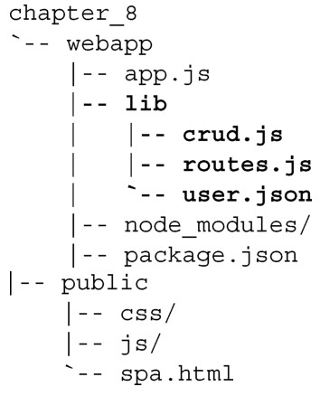
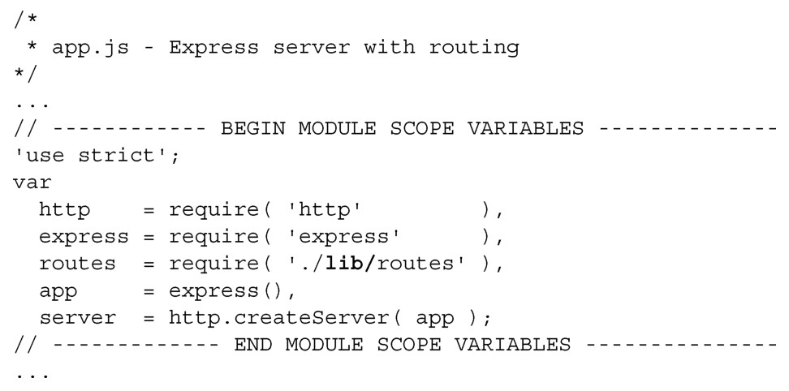
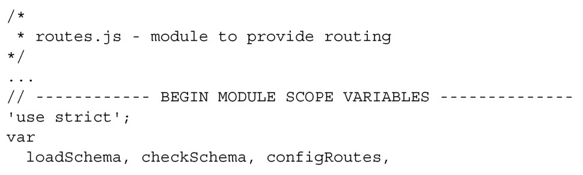
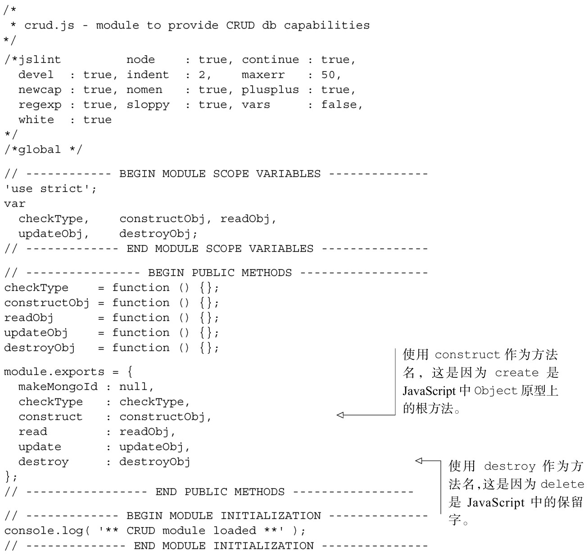

#### 
  8.5.1 组织文件结构

自本章开始以来，文件结构始终如一，还没有改变过。现在需要添加额外的模块，因此需要重新思考一下。当前的文件结构如代码清单8-19所示。

代码清单8-19 当前的文件结构

我们喜欢把模块放到单独的lib目录里面。这会使webapp目录显得整洁，把我们的模块和node_modules 目录分隔开来。node_modules 目录应该只包含使用npm install 命令添加的外部模块，这样删除和重新构建外部模块就不会影响我们的模块。代码清单8-20演示了如何组织文件。更改部分以粗体显示。

代码清单8-20 改进后新的文件结构

对文件结构的第一步改进是把路由文件移到了 webapp/lib 里面。做了这个更改之后，需要更新服务器应用程序，以便指向新的路径，如代码清单8-21所示。更改部分以粗体显示。

代码清单8-21 修改app.js，引入移动后的routes.js——webapp/app.js

下一步是在路由模块中引入CRUD模块，如代码清单8-22所示。更改部分以粗体显示。

代码清单8-22 修改路由模块，引入CRUD 模块——webapp/lib/routes.js

我们可以创建CRUD模块，并简略地列出它的API。使用 module.exports来共享CRUD方法，如代码清单8-23所示。

代码清单8-23 创建CRUD模块——webapp/lib/crud.js

当使用node app.js 命令启动服务器时，应该不会有任何错误：

请注意，除了基本的 CRUD 操作之外，我们还添加了两个公开方法。第一个是makeMongoId，提供创建MongoDB ID 对象的功能。第二个是checkType，打算用来查检允许的对象类型。现在文件已经有了，可以把CRUD逻辑移动到它自己的模块里面。

