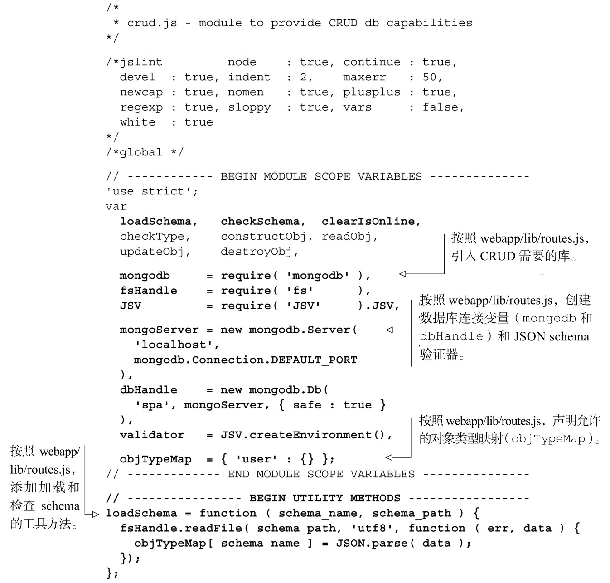
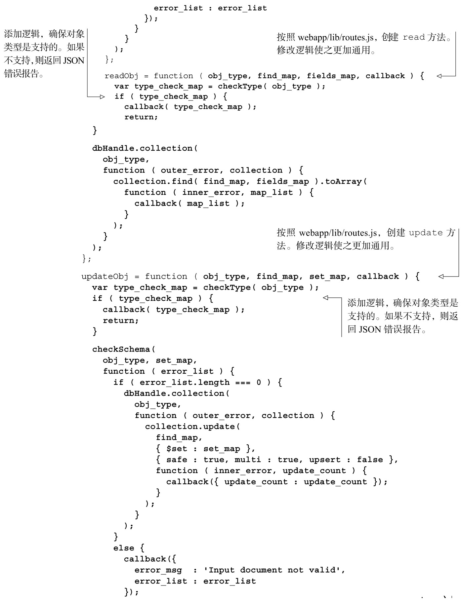
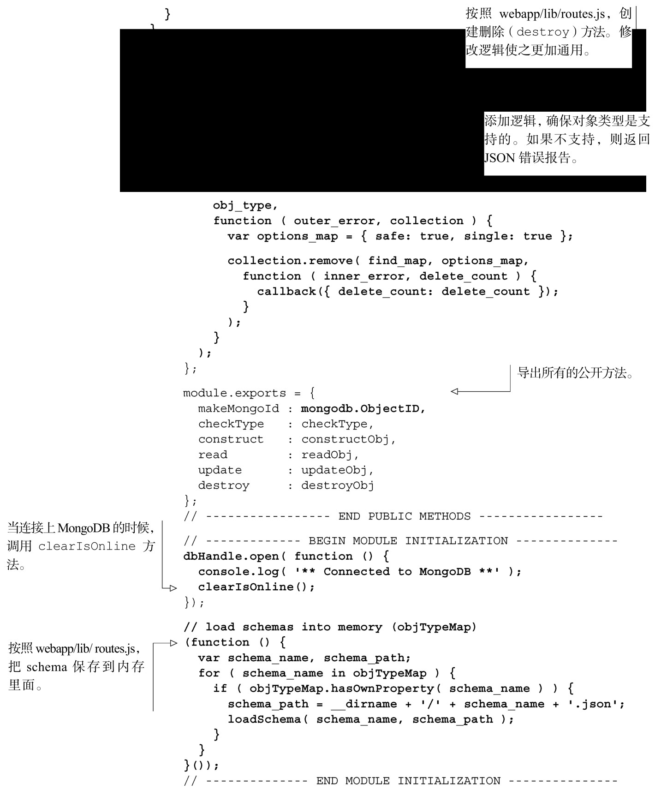
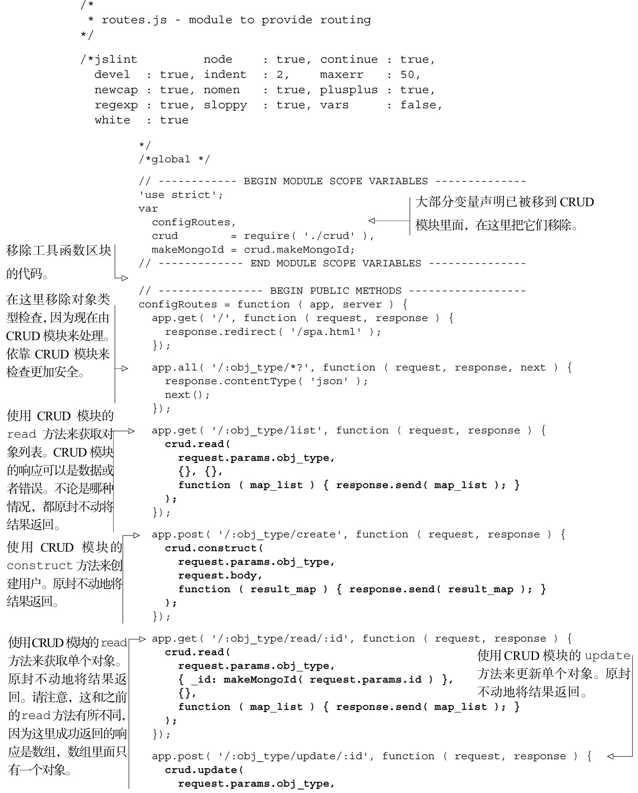
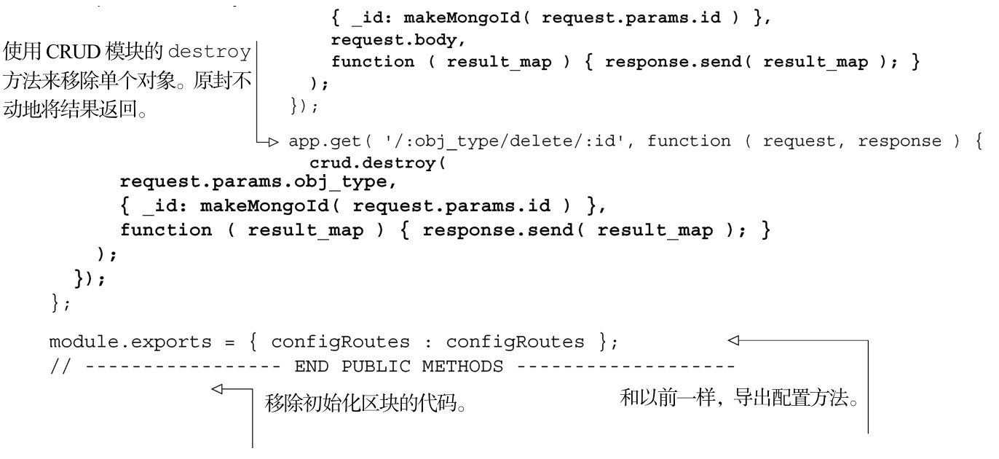

#### 
  8.5.2 把CRUD移到它自己的模块里面

可以把路由模块中的方法复制到 CRUD 模块里面，然后使用通用的参数来替换特定的HTTP参数。我们不会讲解细节，因为我们觉得转移是浅显易懂的。完整的模块如代码清单8-24所示。请注意注释部分，它们提供了一些额外的见解。

代码清单8-24 把逻辑移到CRUD 模块——webapp/lib/crud.js

现在的路由模块看上去要简单得多了，因为大多数的逻辑和很多依赖已经移到CRUD模块里面。代码清单8-25是修改后的路由文件。更改部分以粗体显示。

代码清单8-25 修改后的路由模块——webapp/lib/routes.js

现在的路由模块更加小了，它使用 CRUD 模块来提供路由服务。并且更重要的是， CRUD模块已经可以用于chat模块，下一小节我们就来构建chat模块。

