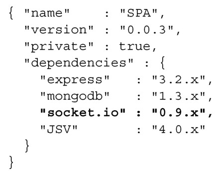
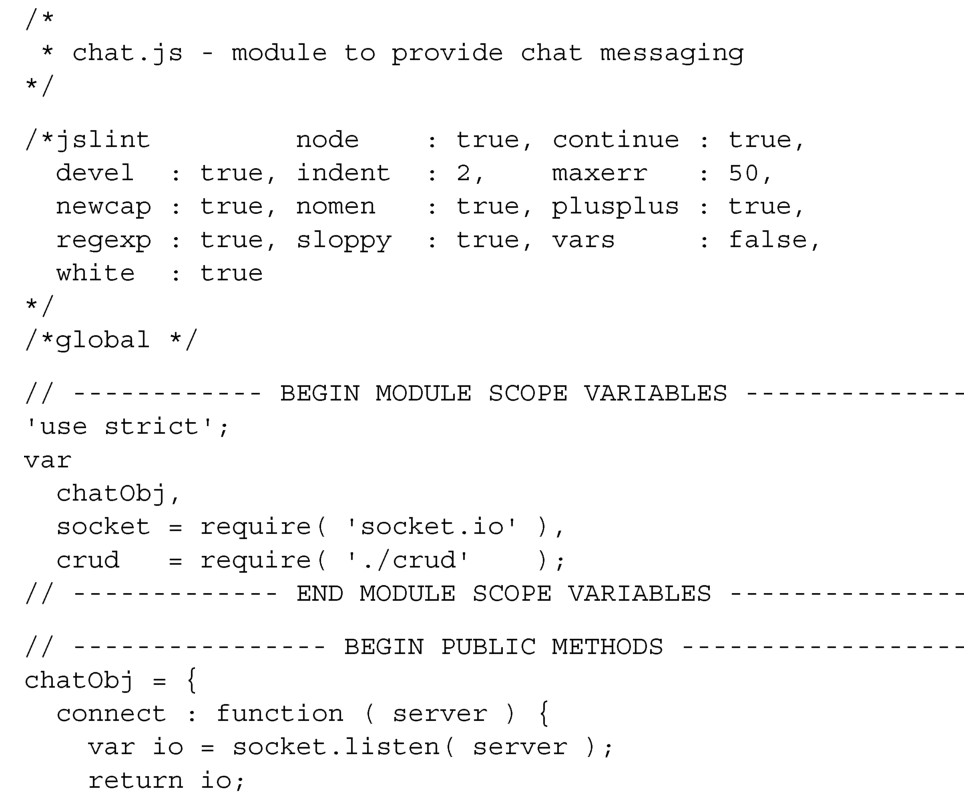
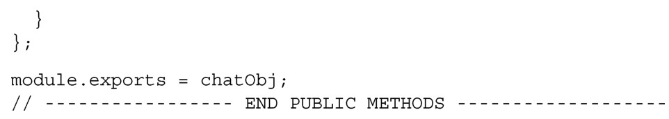
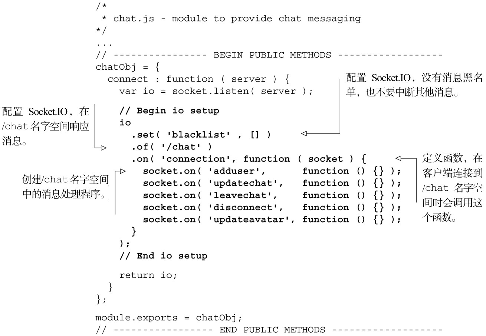
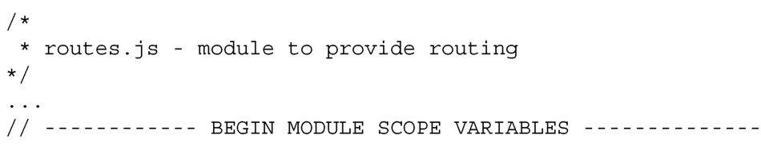
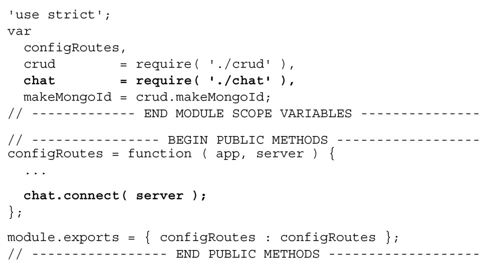

#### 
  8.6.1 开始创建chat模块

webapp目录应该已经安装了Socket.IO。确保你的webapp/package.json清单有下面列出来的正确模块：

在确保清单和上面的示例一致时，可以运行 npm install，npm 会确保安装socket.io和所有其他必需的模块。

现在可以构建chat消息模块。我们想引入CRUD模块，因为我们确定消息模块是需要它的。我们将构建一个chatObj对象，并使用module.exports来导出这个对象。开始时这个对象只有一个叫做 connect 的方法，它接收的参数是 http.Server 实例（server），会开始监听socket连接。第一轮如代码清单8-26所示。

代码清单8-26 chat 消息模块（第一轮）——webapp/lib/chat.js

你可能记得在第6章，客户端向服务器发送消息（adduser、updatechat、leavechat、disconnect和updateavatar），使用的是/chat名字空间。我们来设置处理这些消息的chat服务端，如代码清单8-27所示。更改部分以粗体显示。

代码清单8-27 设置应用，简单地列出消息处理程序——webapp/lib/chat.js

我们回到路由模块，在其中引入 chat 模块，然后使用 chat.connect 方法来初始化Socket.IO连接。参数是http.Server实例（server），如代码清单8-28所示。更改部分以粗体显示。

代码清单8-28 更新路由模块，初始化chat——webapp/lib/routes.js

当使用 node app.js 启动服务器的时候，在 Node.js 服务器日志里面会看到info–socket.io started。也可以和以前一样，在浏览器中访问http://localhost:3000，来管理用户对象，或者是查看应用。

我们已经声明了所有的消息处理程序，现在需要让它们能进行响应。我们先来创建adduser消息处理程序。

为什么使用Web socket？

和其他一些在浏览器端使用的近实时通信技术相比，Web socket有一些显著的优点。

为维持数据连接，Web socket的数据帧（data frame）只需要两个字节，而AJAX HTTP调用（用于长轮询）的每一帧经常要发送上千字节的信息（实际数据量取决于cookie的数量和大小）。

Web socket比长轮询有优势。通常情况下，Web socket使用的网络带宽是长轮询的1%～2%，延迟时间是长轮询的三分之一。Web socket也往往是更加“防火墙友好”的。

Web socket是全双工的，而大多数的其他解决方法并不是，它们相当于需要两个连接。

不像Flash socket，Web socket几乎在所有平台的所有现代浏览器上都能工作，包括像智能手机和平板电脑这样的移动设备。

尽管Socket.IO喜欢Web socket，但令人欣慰的是，如果不支持Web socket，它会尽可能地选择最佳的连接方式。

