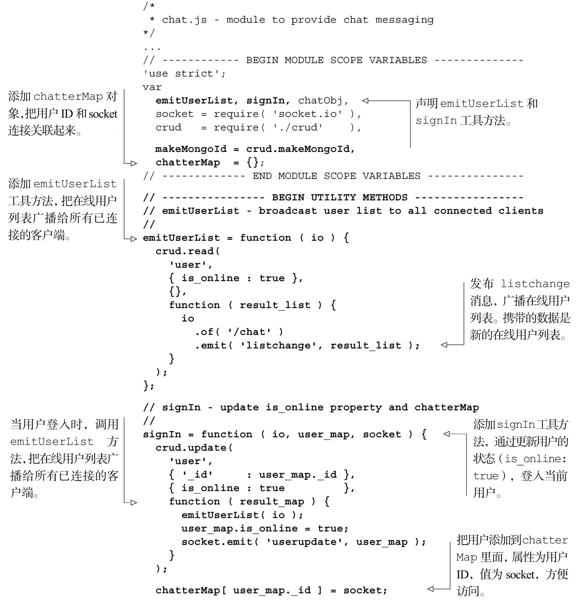
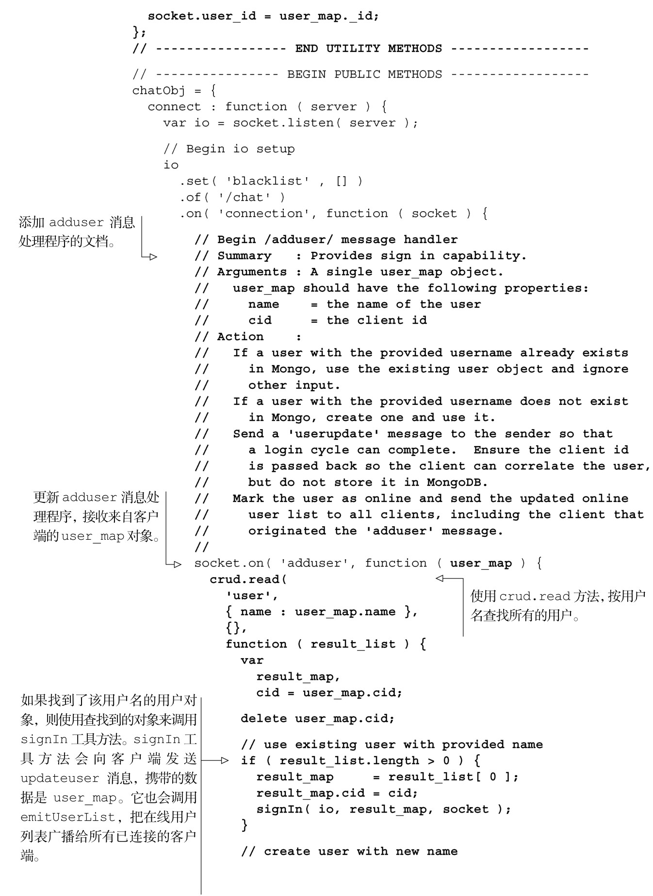
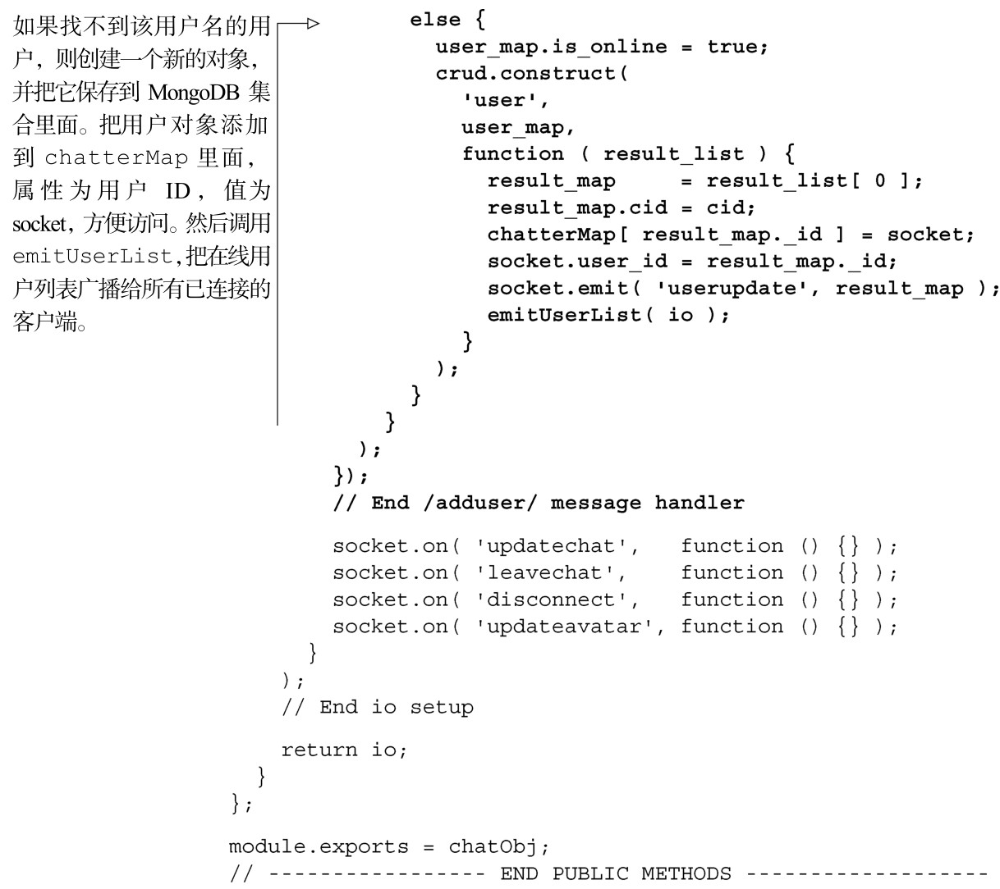
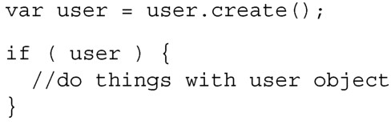
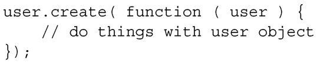
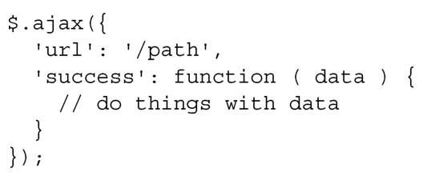

#### 
  8.6.2 创建adduser消息处理程序

当用户尝试登入的时候，客户端会向服务器应用发送 adduser 消息和用户数据。adduser消息处理程序应该：

使用CRUD模块，尝试在MongoDB中按提供的用户名查找用户对象；

如果找到请求用户名的对象，则使用找到的对象；

如果没找到请求用户名的对象，则使用提供的用户名，创建一个新的用户对象，并把它插入到数据库里面，然后使用这个新创建的对象；

在MongoDB中更新用户对象，提示用户在线（is_online:true）；

更新chatterMap，以键-值对的形式保存用户ID和socket连接。

我们来实现上面的逻辑，如代码清单8-29所示。更改部分以粗体显示。

代码清单8-29 创建adduser 消息处理程序——webapp/lib/chat.js

适应回调函数的思想可能需要一点时间，通常是调用一个方法，在方法完成时，就会执行传入的回调函数。其实它是把下面这种过程式的代码：

转变成了下面这种“事件驱动”式的代码：

我们使用回调函数，这是因为在Node.js中的很多函数都是异步的。在前一个示例中，在调用user.create的时候，JavaScript引擎不会等到调用结束，它会继续执行后续的代码。能保证在结果可用时就立即使用该结果的方法就是使用回调函数 <a class="my_markdown" href="['#anchor12']">[12]</a>。如果你熟悉jQuery的AJAX调用，它就是使用了回调函数机制：

现在可以在浏览器中访问localhost:3000进行登入。我们鼓励读者试着运行一下示例。现在我们让用户可以互相聊天。

