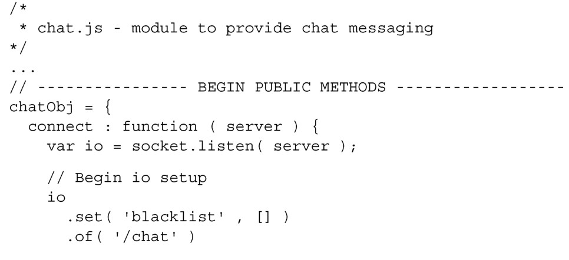
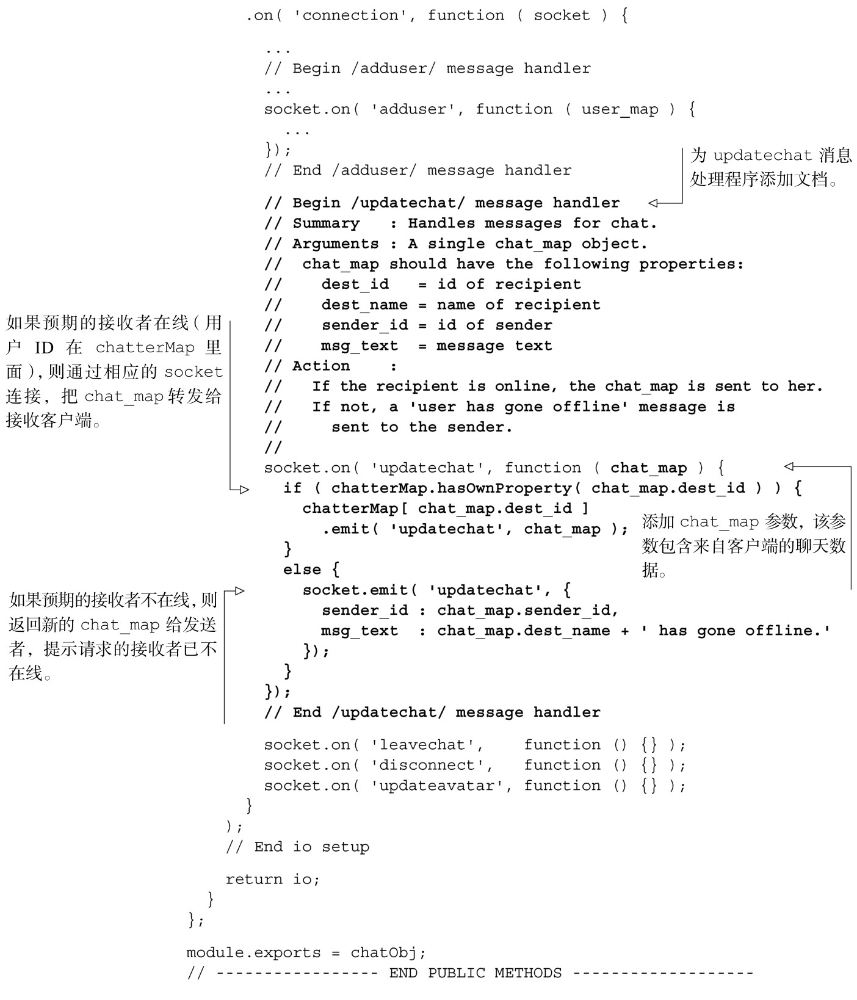

#### 
  8.6.3 创建updatechat消息处理程序

实现登入功能需要大量的代码。我们现在的应用程序在MongoDB里面记录了用户，管理着他们的状态，并把所有在线用户列表广播给所有已连接的客户端。处理聊天消息比较简单，尤其现在已经完成了登入的逻辑。

当客户端向服务器应用发送updatechat消息的时候，它请求把消息传送给某个人。updatechat消息处理程序应该：

检查聊天数据，检索接收者；

确定预期接收者是否在线；

如果接收者在线，则在接收者的socket连接上，向接收者发送聊天数据；

如果接收者不在线，则在发送者的socket连接上，向发送者发送新的聊天数据；新的聊天数据要通知发送者：预期的接收者不在线。

我们来实现这一逻辑，如代码清单8-30所示。更改部分以粗体显示。

代码清单8-30 添加updatechat 消息处理程序——webapp/lib/chat.js

现在可以在浏览器中访问 localhost:3000 进行登入。如果在另外一个浏览器窗口登入另外一个用户，就可以来回传输消息了。一如既往，我们鼓励读者试着运行一下示例。只剩下断开连接和头像的功能还不能用。下一小节来完成断开连接的功能。

