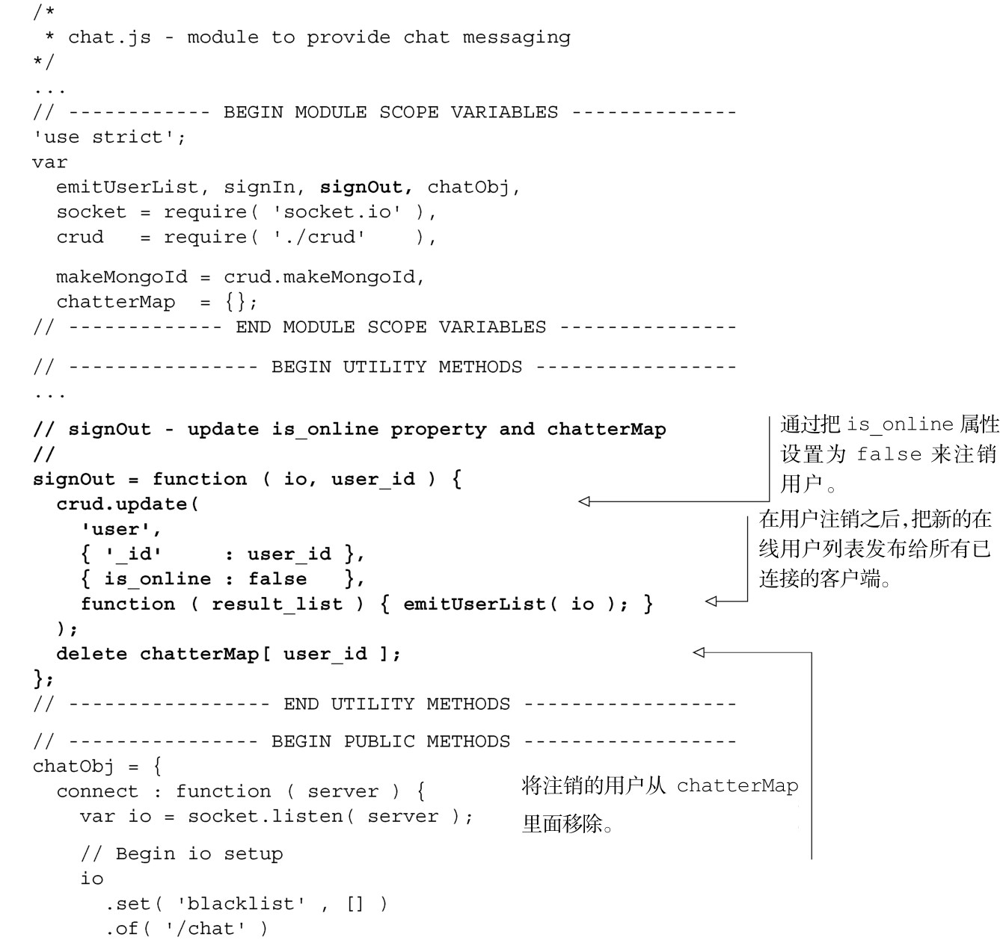
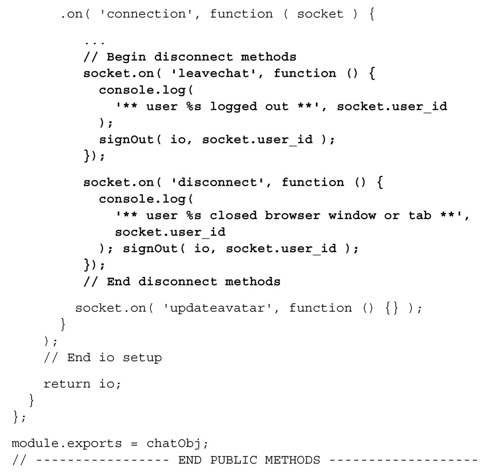

#### 
  8.6.4 创建disconnect消息处理程序

客户端可以使用两种方式来关闭会话（session）。第一种，用户可以点击浏览器窗口右上角的用户名进行注销。这会向服务器发送leavechat消息。第二种，用户可以关闭浏览器窗口。这会向服务器发送disconnect消息。不论哪种情况，Socket.IO都能很好地完成关闭socket连接的任务。

当服务器应用接收到leavechat或者disconnect消息的时候，它应该执行同样的两步操作。第一步，把客户端用户标记为离线状态（is_online:false）。第二步，需要把更新后的在线用户列表广播给所有已连接的客户端。逻辑如代码清单8-31所示。更改部分以粗体显示。

代码清单8-31 添加disconnect 方法——webapp/lib/chat.js

现在可以打开多个浏览器窗口，访问 http://localhost:3000，点击每个窗口的右上角，登入不同的用户。然后就可以在两个用户之间发送消息了。我们故意将一个漏洞留给读者当作练习：服务器应用允许相同的用户登入多个客户端。不应该是这样的。在 adduser消息处理程序中查检chatterMap就能够修复这个问题。

还有一个功能没有实现：同步头像。

