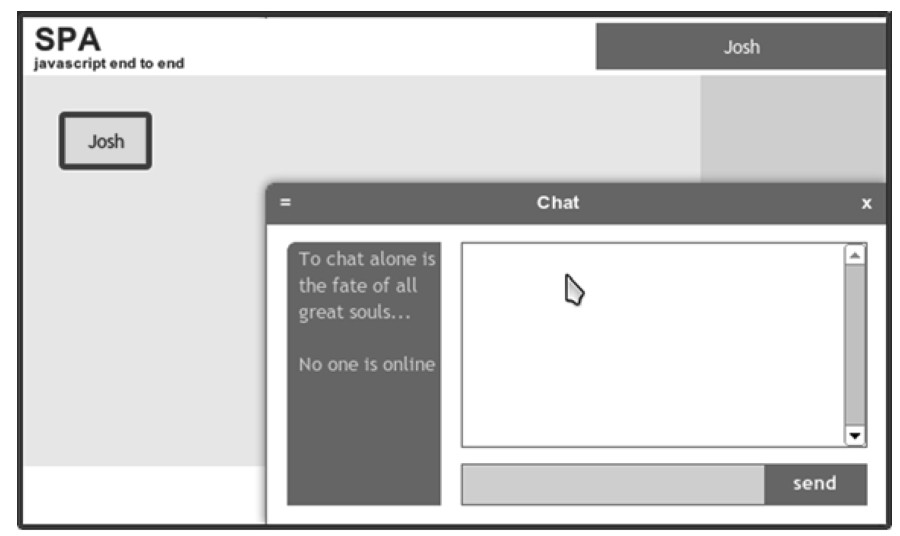
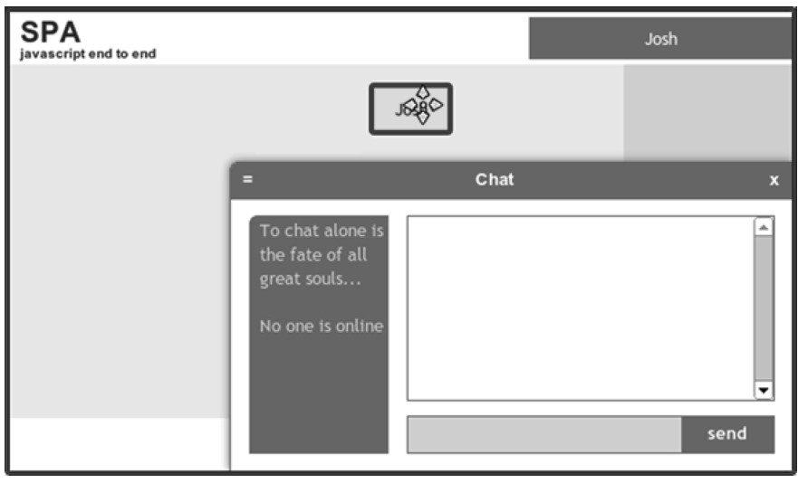
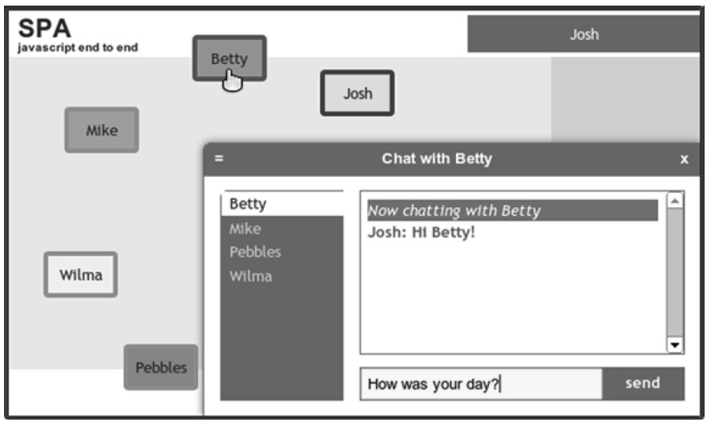
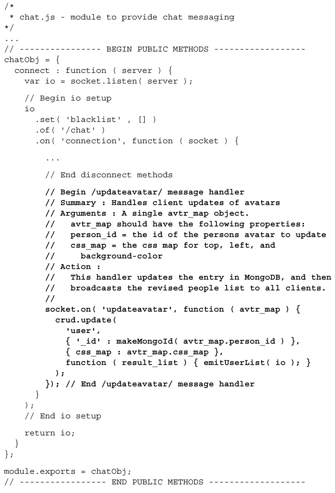

#### 
  8.6.5 创建updateavatar消息处理程序

Web socket 的消息传输技术，可用于各种各样的服务器和客户端之间的通信。当需要和浏览器近实时地通信时，它通常是最佳选择。为演示Socket.IO的另外一种用途，我们已经在聊天应用里面创建了头像，用户可以在屏幕上移动头像以及更改它的颜色。当有用户更改了头像，Socket.IO 会立即把这些更改推送给其他的用户。我们来看一下这一过程是怎样的，如图8-9、图8-10和图8-11所示。

第6章已经演示了这个功能的客户端代码，那时已经把所有相关的功能都整合在了一起。现在实现这个功能只需很少的服务端代码，因为我们已经有了Node.js 服务器、MongoDB和Socket.IO。只要在lib/chat.js中的其他功能旁边找个位置添加消息处理程序即可，如代码清单8-32所示。

代码清单8-32 监视头像——webapp/lib/chat.js

使用node app.js 来启动服务器，在浏览器中访问http://localhost:3000/并登入。再打开第二个浏览器窗口并用不同的用户名登入。这时我们只看到一个头像，因为两个头像重叠在了一起。可以使用“长按拖曳”动作来移动头像。点击或者轻击头像可以更改它的颜色。这在桌面和移动设备上都有效果。不管是哪种情况，服务器应用都会近实时地同步头像。

消息传输是近实时协作的关键所在。有了Web socket，我们可以创建这样的应用：相距很远的人们一起努力解决难题、一起设计引擎或者是一起画画，可能性是无限的。这是实时Web的希望，我们每天都能看到更多的应用。

